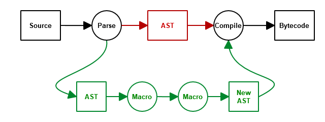

.. -*- coding: utf-8 -*-
.. :Project:   macropy3 -- overview
.. :Created:   gio 01 mar 2018 00:36:26 CET
.. :Author:    Alberto Berti <alberto@metapensiero.it>
.. :License:   GNU General Public License version 3 or later
.. :Copyright: © 2018 Alberto Berti
..

.. _overview:

30,000ft Overview
=================

Macro functions are defined in three ways:

.. code:: python

  from macropy.core.macros import Macros

  macros = Macros()

  @macros.expr
  def my_expr_macro(tree, **kw):
      ...
      return new_tree

  @macros.block
  def my_block_macro(tree, **kw):
      ...
      return new_tree

  @macros.decorator
  def my_decorator_macro(tree, **kw):
      ...
      return new_tree

The line ``macros = Macros()`` is required to mark the file as
providing macros, and the ``macros`` object then provides the methods
``expr``, ``block`` and ``decorator`` which can be used to decorate
functions to mark them out as the three different kinds of macros.

Each macro function is passed a ``tree``.  The ``tree`` is an ``AST``
object, the sort provided by Python's `ast module
<http://docs.python.org/3/library/ast.html>`_. The macro is able to do
whatever transformations it wants, and it returns a modified (or even
an entirely new) ``AST`` object which MacroPy will use to replace the
original macro invocation. The macro also takes ``**kw``, which
contains :ref:`other useful things` which you may need.

These three types of macros are called via:

.. code:: python

  from my_macro_module import macros, my_expr_macro, my_block_macro, my_decorator_macro

  val = my_expr_macro[...]

  with my_block_macro:
      ...

  @my_decorator_macro
  class X():
      ...

Where the line ``from my_macro_module import macros, ...`` is
necessary to tell MacroPy which macros these module relies
on. Multiple things can be imported from each module, but ``macros``
must come first for macros from that module to be used.

Any time any of these syntactic forms is seen, if a matching macro
exists in any of the packages from which ``macros`` has been imported
from, the abstract syntax tree captured by these forms (the ``...`` in
the code above) is given to the respective macro to handle. The tree
(new, modified, or even unchanged) which the macro returns is
substituted into the original code in-place.

MacroPy intercepts the module-loading workflow, via the functionality
provided by `PEP 302: New Import Hooks
<http://www.python.org/dev/peps/pep-0302/>`_. The workflow is roughly:

- Intercept an import
- Parse the contents of the file into an AST
- Walk the AST and expand any macros that it finds
- Compile the modified AST and resume loading it as a module

Note that this means **you cannot use macros in a file that is run
directly**, as it will not be passed through the import hooks. Hence
the minimum viable setup is:

.. code:: python

  # run.py
  import macropy.activate     # sets up macro import hooks
  import other                # imports other.py and passes it through import hooks

  # my_macro_module.py
  from macropy.core.macros import Macros

  macros = Macros()

  ... define some macros ...

  # other.py
  from macropy.macros.my_macro_module import macros, ...

  ... do stuff with macros ...

Where you run ``run.py`` instead of ``other.py``.  For the same
reason, you cannot directly run MacroPy's own unit tests directly
using ``unittest`` or ``nose``: you need to run the
``macropy/run_tests.py`` file from the project root for the tests to
run. See the `runnable, self-contained no-op example`__ to see exactly
what this looks like, or the example for `using existing macros`__.

__ //github.com/azazel75/macropy/tree/master/docs/examples/first_macro/nop
__ //github.com/azazel75/macropy/tree/master/docs/examples/using_macros

MacroPy also works in the REPL:

.. code:: python

  ~/wip/macropy$ python
  Python 3.6.4 (default, Jan  5 2018, 02:13:53)
  [GCC 7.2.0] on linux
  Type "help", "copyright", "credits" or "license" for more information.
  >>> import macropy.console
  0=[]=====> MacroPy Enabled <=====[]=0
  >>> from macropy.tracing import macros, trace
  >>> trace[[x*2 for x in range(3)]]
  range(3) -> range(0, 3)
  x*2 -> 0
  x*2 -> 2
  x*2 -> 4
  [x*2 for x in range(3)] -> [0, 2, 4]
  [0, 2, 4]

This example demonstrates the usage of the `Tracing`_ macro, which
helps trace the evaluation of a Python expression. Although support
for the REPL is still experimental, most examples on this page will
work when copied and pasted into the REPL verbatim.

.. warning::

   As of MacroPy3 the following statement is untested

MacroPy also works in the PyPy and `IPython <http://ipython.org/>`_
REPLs.
