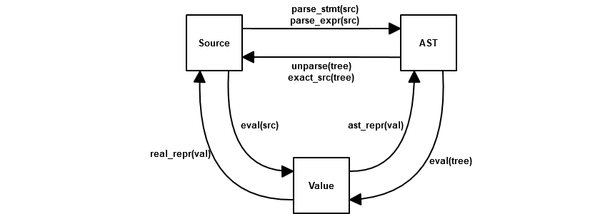

.. -*- coding: utf-8 -*-
.. :Project:   macropy3 -- reference
.. :Created:   gio 01 mar 2018 01:50:51 CET
.. :Author:    Alberto Berti <alberto@metapensiero.it>
.. :License:   GNU General Public License version 3 or later
.. :Copyright: © 2018 Alberto Berti
..

Reference
=========

This section contains reference documentation on various facets of
MacroPy:

Data Model
----------

As mentioned earlier, MacroPy uses PEP 302 for much of its
functionality. It looks out in particular for the syntactic forms
(``import macros, ...``, ``my_macro[...]``, ``with my_macro:``,
``@my_macro``) to decide which parts of the AST need to be expanded by
which macros. MacroPy uses the inbuilt Python infrastructure for
`parsing the source`__ and `representing it as an AST`__. You should
familiarize yourself with the classes which make up the Python AST,
since you will be interacting with them a great deal while writing
macros.

__ http://docs.python.org/3/library/ast.html#ast.parse
__ http://docs.python.org/3/library/ast.html#abstract-grammar

Once you have an AST, there are a few possible forms that code can
take:

- a **String**;
- an **AST**;
- a computed **Value**.

This map maps out how to convert from form to form:

Except for ``eval``, these are all functions defined in the
`macropy/core/__init__.py`__. For instance,
in order to convert from a AST back into source code (for example if
you want to print out the code which is being run), you would use the
``unparse()`` method. These transformations will be used throughout this
documentation, to convert from one form to another or to print out the
AST for inspection.

__ https://github.com/azazel75/macropy/tree/master/macropy/core/__init__.py

``parse_stmt(src)`` & ``parse_expr(src)``
~~~~~~~~~~~~~~~~~~~~~~~~~~~~~~~~~~~~~~~~~

Thin wrappers around `ast.parse`__, these functions simplify the
common case where you want to convert a code snippet into a list of
``stmt`` or a single ``expr``.

__ https://docs.python.org/3/library/ast.html#ast.parse

``unparse(tree)``
~~~~~~~~~~~~~~~~~

This function performs the conversion of the Python AST back into
semantically equivalent source code; using ``parse_stmt`` or
``parse_expr`` on the generated should return the original AST.

Although the generated code preserves semantic equivalence, this
function does not preserve ``lineno``, ``col_offset`` or syntactic
equivalence in general.  Hence your indentation may change, there may
be extra parentheses added, etc..  The code is not obfuscated (It's
typically straightforward to see what its doing, even with the
syntactic changes) but you will not get back the exact original
source.

``exact_src(tree)``
~~~~~~~~~~~~~~~~~~~

This function differs from ``unparse`` in that instead of generating
source code from the AST, it searches the original source of the file
being macro-expanded for the exact original source code which
generated this AST, using the ``lineno`` and ``col_offset`` as a
guide. This means that it will generally fail on synthetic ASTs (which
will not have a matching snippet in the source code) and raise an
``ExactSrcException``. Unlike the rest of these functions, which are
global, ``exact_src`` is provided to your macro as an `argument`_ as
the ``exact_src`` for the same AST could vary between macro
expansions.

``real_repr``
~~~~~~~~~~~~~

A combination of ``repr`` and ``ast.dump``, this function generally
does the right thing in converting arbitrary values into Python source
code which can be evaluated to re-create those values.

``ast_repr``
~~~~~~~~~~~~

Similar to ``real_repr``, ``ast_repr`` directly generates a Python AST
instead of generating strings. This AST can be unparsed and evaled, or
just directly evaled, to re-create the original value.

``eval``
~~~~~~~~

Unlike the rest of the functions listed here, ``eval`` is the
standard Python function provided as a builtin. It evaluates either
source code or an AST to produce a value.

.. _argument:
.. _below:
.. _other useful things:

Arguments
---------

Any macro which is called receives a number of things from MacroPy in
order to perform its duties (the syntax transformation). A simple
macro may just require

.. code:: python

  @macros.expr
  def my_simple_macro(tree, **kw):
      ...

While a more complex macro may require more of the functionality
provided by MacroPy:

.. code:: python

  @macros.expr
  def my_complex_macro(tree, args, gen_sym, target, **kw):
      ...

These additional arguments given to the macro as keyword
arguments. The macro can declare the arguments as part of its
parameter list in order to use it directly, otherwise it gets chucked
into the ``**kw`` dict at the end of the macro's parameter list. This
section details what each argument means and why it is useful.

``tree``
~~~~~~~~

This is, the AST provided to the macro, which it can
transform/replace. It contains the code captured by the macro, which
varies depending on the macro used:

- The right hand side of an **expression macro**: ``my_macro(A + B)``
  captures the tree for ``(A + B)``;

- The body of a **block macro**:

  .. code:: python

    with my_macro:
        do_stuff()
        return blah

will capture the statements in the body of the ``with``: in this case a
list containing the AST for ``do_stuff()`` and ``return blah``.

- the entire class or function definition for a **decorator macro**,
  including *any decorators below the macro itself*:

  .. code:: python

    @dec
    @my_macro
    @inner_dec
    class Cls():
        blah

Captures the AST for:

.. code:: python

  @inner_dec
  class Cls():
      blah

``args``
~~~~~~~~

Macros can take addition arguments when invoked, apart from the
primary tree that it receives. For example a macro can be invoked as
follows:

.. code:: python

  my_macro(a)[...]

  with my_macro(a):
      ...

  @my_macro(a)
  def func():
      ...

In these cases, ``args`` contains a list of additional arguments, a
length-1 list containing the AST for ``a``. Multiple arguments works
as you would expect, although named arguments, ``*args`` and
``**kwargs`` are not supported. This is used in `pattern matching`_'s
switch macro to indicate what value to switch on.

``gen_sym``
~~~~~~~~~~~

As `described below`_, ``gen_sym`` provides a mechanism for
creating identifiers that are guaranteed not to clash with any other
identifier in the same source file. ``gen_sym`` is a 0-argument
function, which when called via:

.. code:: python

  gen_sym()

Will produce a new identifier (as a string) which does not exist in
the source code, and has not been provided before. This is used in the
(quick lambda macro)[#quick-lambda) to ensure that the new arguments
do not collide.

``target``
~~~~~~~~~~

This argument is only provided for **block macros**. It provides a way
to capture the bound name in the ``with`` statement:

.. code:: python

  with my_macro as blah:
      ...

``target`` will contain the AST for ``blah``. This is used in the
`quasiquotes`_ macro.

``exact_src``
~~~~~~~~~~~~~

This is a function that attempts to retrieve the source code of the
target AST, exactly as written in the source code. This is in contrast
to ``unparse``, which produces semantically correct code that may
differ in syntax from what was originally parsed, for example it may
have extra parentheses, be missing comments, and have the whitespace
and layout modified, and a variety of other syntactic changes:

.. code:: python

  (1 + 2 + 3 + 4) -> (((1 + 2) + 3) + 4)
  "lol", 'rofl' -> ('lol', 'rofl')

In contrast ``exact_src(tree)`` promises that you get exactly what was
written in the source code, down to the choice of single quotes vs
double quotes:

.. code:: python

  "lol", 'rofl' -> "lol", 'rofl'

It does this by analyzing the ``lineno`` and ``col_offset`` values on
the AST it is passed, comparing those against the known values within
the source file the AST originates from and making a best-effort
attempt to extract the corresponding snippet of code. This obviously
only really works on ASTs that originated directly from the source
code, and will fail on ASTs you synthesized manually.

``expand_macros``
~~~~~~~~~~~~~~~~~

``expand_macros`` is a function that can be called by a macro to
expand any macros in the target AST. For example, the ``tracing``
module's ``show_expanded`` macro uses it to print out what the
captured AST looks like after expansion:

.. code:: python

  @macros.expr
  def show_expanded(tree, expand_macros, **kw):
      expanded_tree = expand_macros(tree)
      new_tree = q[wrap_simple(log, u[unparse(expanded_tree)], ast_literal[expanded_tree])]
      return new_tree

Note that macro expansion *mutates the tree being expanded*. In the
case of the ``show_expanded`` macro, it doesn't really matter (since
the tree was going to get expanded anyway). However, if you want to
preserve the original AST for any reason, you should `deepcopy
<http://docs.python.org/3/library/copy.html#copy.deepcopy>`_ the
original AST and do your expansion on the copy.

.. _quasiquote:

Quasiquotes
-----------

.. code:: python

  from macropy.core.quotes import macros, q, name, ast

  a = 10
  b = 2
  tree = q[1 + u[a + b]]
  print ast.dump(tree)
  #BinOp(Num(1), Add(), Num(12))

Quasiquotes are the foundation for many macro systems, such as that
found in `LISP`_. Quasiquotes save you from having to manually
construct code trees from the nodes they are made of. For example, if
you want the code tree for

.. LISP: //en.wikipedia.org/wiki/LISP

.. code:: python

  (1 + 2)

Without quasiquotes, you would have to build it up by hand:

.. code:: python

  tree = BinOp(Num(1), Add(), Num(2))

But with quasiquotes, you can simply write the code ``(1 + 2)``, quoting
it with ``q`` to lift it from an expression (to be evaluated) to a tree
(to be returned):

.. code:: python

  tree = q[1 + 2]

Furthermore, quasiquotes allow you to _unquote_ things: if you wish to
insert the **value** of an expression into the tree, rather than the
**tree** making up the expression, you unquote it using ``u``. In the
example above:

.. code:: python

  tree = q[1 + u[a + b]]
  print ast.dump(tree)
  #BinOp(Num(1), Add(), Num(12))

the expression ``(a + b)`` is unquoted. Hence ``a + b`` gets evaluated
to the value of ``12``, which is then inserted into the tree, giving
the final tree.

Apart from interpolating values in the AST, you can also interpolate:

Other ASTs
~~~~~~~~~~

.. code:: python

  a = q[1 + 2]
  b = q[ast_literal[a] + 3]
  print ast.dump(b)
  #BinOp(BinOp(Num(1), Add(), Num(2)), Add(), Num(3))

This is necessary to join together ASTs directly, without converting
the interpolated AST into its `repr`. If we had used the `u`
interpolator, it fails with an error

Names
~~~~~

.. code:: python

  n = "x"
  x = 1
  y = q[name[n] + name[n]]
  print ast.dump(y)
  #BinOp(Name('x'), Add(), Name('x'))

This is convenient in order to interpolate a string variable as an
identifier, rather than interpolating it as a string literal. In this
case, I want the syntax tree for the expression ``x + x``, and not
``'x' + 'x'``, so I use the ``name`` macro to unquote it.

Overall, quasiquotes are an incredibly useful tool for assembling or
manipulating the ASTs, and are used in the implementation in all of
the following examples. See the `String Interpolation
<macropy/string_interp.py>`_ or `Quick Lambda
<macropy/quick_lambda.py>`_ macros for short, practical examples of
their usage.

.. _walker:

Walkers
-------

The Walker is a uniform abstraction to use for recursively traversing
a Python AST. Defined in `macropy/core/walkers.py`__, it is used
throughout MacroPy, both in the core logic as well as the
implementation of most of the macros.

__ //github.com/azazel75/macropy/tree/master/macropy/core/walkers.py

In its most basic form, a Walker is used as follows:

.. code:: python

  @Walker
  def transform(tree, **kw):
      ...
      return new_tree

This walker applies the ``transform`` function to every node in the AST
it recurses over, and is called via:

.. code:: python

  new_tree = transform.recurse(old_tree)

The ``transform`` function can either mutate the given ``tree``
(e.g. by changing its attributes, swapping out children, etc.) or
replace it by returning a new one (like in the example
above). Returning ``None`` leaves the tree as-is without replacing it
(although it still could have been mutated).

Apart from receiving and returning a ``tree``, the ``transform``
function can receive a range of other arguments. By default, these all
go into the ``**kw``, but can be explicitly declared for ease of use:

.. code:: python

  @Walker
  def transform(tree, ctx, set_ctx, **kw):
      ... do stuff with ctx ...
      set_ctx(...)
      return new_tree

This section documents what each one does.

``ctx``
~~~~~~~

The Walker allows the programmer to provide a *context*:

.. code:: python

  @Walker
  def transform(tree, ctx, **kw):
      ... do stuff with ctx ...
      return new_tree

  new_tree = transform.recurse(old_tree)
  new_tree = transform.recurse(old_tree, init_ctx)

If the ``transform`` function takes an additional argument, it will be
given the ``init_ctx`` that is passed in as the second argument to the
``.recurse()`` method (default ``None``).

``set_ctx``
~~~~~~~~~~~

Apart from using the ``ctx`` passed in to the ``recurse`` method,
``transform`` can request for the ``set_ctx`` function:

.. code:: python

  @Walker
  def transform(tree, ctx, set_ctx, **kw):
      ... do stuff with ctx ...
      set_ctx(new_ctx)
      return new_tree

This will cause all children of the current ``tree`` to receive
``new_ctx`` as their ``ctx`` argument.

``collect``
~~~~~~~~~~~

The Walker provides an easy way for the programmer to aggregate data
as it recurses over the AST. This is done by requesting the
``collect`` argument:

.. code:: python

  @Walker
  def transform(tree, collect, **kw):
      ...
      collect(value)
      return new_tree

  new_tree, collected = transform.recurse_collect(old_tree)
  collected = transform.collect(old_tree)

Using the ``recurse_collect`` instead of the ``recurse`` method to return
both the new ``tree`` as well as the collected data, as a list. This is
a simple way of aggregating values as you traverse the AST.

``stop``
~~~~~~~~

Lastly, the Walker provides a way to end the recursion, via the
``stop`` function:

.. code:: python

  @Walker
  def transform(tree, stop, **kw):
      ...
      if ...:
          return new_tree
      else:
          stop()

Calling ``stop`` prevents the ``Walker`` from recursing over the children
of the current node. This is useful, for example, if you know that the
current node's AST subtree does not contain anything of interest to
you and wish to save some computation. Another use case would be if
you wish to delimit your transformation: if you want any code within a
certain construct to be passed over by ``transform``, you can simply
have ``transform`` return ``stop`` when it sees that construct.

A Flexible Tool
~~~~~~~~~~~~~~~

The ``transform`` function can take any combination of the above
arguments. For example, you could have a walker such as:

.. code:: python

  @Walker
  def transform(tree, ctx, set_ctx, collect, stop, **kw):
      ...
      return new_tree

  new_tree, collected = transform.recurse_collect(old_tree, initial_ctx)

This provides it a large amount of versatility, and lets you use the
``Walker`` to recursively traverse and transform Python ASTs in
interesting ways. If you inspect the source code of the macros in the
`macropy <macropy>`_ and `macropy/experimental
<macropy/experimental>`_ folders, you will see most of them make
extensive use of Walkers in order to concisely perform their
transformations. If you find yourself needing a recursive traversal,
you should think hard about why you cannot use a Walker before writing
the recursion yourself.

.. _described below:

Hygiene
-------

MacroPy provides a number of tools for writing Hygienic macros:

``gen_sym``
~~~~~~~~~~~

``gen_sym`` is a function MacroPy provides to your macro as an
`argument`_ that generates a new, un-used name every time
it is called:

.. code:: python

  from macropy.core.macros import *

  macros = Macros()

  @macros.expr
  def f(tree, gen_sym, **kw):
      print gen_sym() # sym0
      print gen_sym() # sym1
      print gen_sym() # sym2
      print gen_sym() # sym3
      # skipping sym4 because it's already used in the target file
      print gen_sym() # sym5

This works by first scanning the entire macro-using file to see which
names are currently in use, and thereafter providing names which do
not appear on that list. This should generally work, for a name that
is neither defined nor referenced in a file is almost certainly not
used. However, due to Python's dynamic nature, this cannot be
guaranteed, and there are cases where ``gen_sym`` will fail:

.. code:: python

  # module_a.py
  from macro_module import macros, my_macro

  with my_macro: # a macro which uses gen_sym()
      ...

.. code:: python

  # module_b.py
  import module_a
  module_a.sym0 = 10
  ...
  do_stuff_with(module_a.sym0)

In this case, a separate file ``module_b`` is using ``module_a`` as a
convenient namespace to store the value 10. ``module_a`` has no way of
knowing this, and ``gen_sym`` does not see ``sym0`` used anywhere in
that file, and so assumes ``sym0`` is safe to use. If ``my_macro``
ends up writing to and reading from ``sym0`` in module-scope, this
could cause ``my_macro``'s and ``module_b``'s read/writes to conflict,
resulting in the weird bugs that ``gen_sym`` is meant to
avoid. Another unfortunate scenario is:

.. code:: python

  # module_a.py
  sym0 = 10

.. code:: python

  # module_b.py
  from module_a import *
  from macro_module import macros, my_macro

  with my_macro: # a macro which uses gen_sym()
      ...

.. code:: python

  # module_c.py
  from module_b import sym0
  do_stuff_with(sym0)

Again, due to the nature of ``import *``, ``module_c`` can rely on ``sym0``
being present in ``module_b`` while ``module_b`` itself is completely
unaware.

These edge cases are unavoidable, but luckily this sort of code is
frowned upon in general (not just in Python!). Although Python's
philosophy of "We're all adults" means that it's always possible to go
out of your way and cause ``gen_sym`` to fail, this is the case for
other code too, and in practice this should not be a problem.

Hygienic Quasiquotes
~~~~~~~~~~~~~~~~~~~~

Hygienic quasiquotes, created using the ``hq[...]`` macro, are
quasiquotes who automatically bind identifiers from the lexical scope
of the macro definition, rather than from that of the macro expansion
point. Thus, in the following ``log`` macro:

.. code:: python

  # macro_module.py
  from macropy.core.macros import Macros
  from macropy.core.quotes import macros, ast_literal
  from macropy.core.hquotes import macros, hq, u

  macros = Macros()

  @macros.expr
  def log(tree, exact_src, **kw):
      new_tree = hq[wrap(u[exact_src(tree)], ast_literal[tree])]
      return new_tree

  def wrap(txt, x):
      print(txt + " -> " + repr(x))
      return x

.. code:: python

  # test.py
  from macro_module import macros, log

  wrap = 3 # try to confuse it

  log[1 + 2 + 3]
  # 1 + 2 + 3 -> 6
  # it still works despite trying to confuse it with the ``wrap``
  # local variable

We can be sure that the ``wrap`` we referred to inside the ``hq[...]``
macro is guaranteed to be the ``wrap`` you see in ``macro_module.py``,
and not some other ``wrap`` that a user may have created in
``test.py``.

This is accomplished by having the ``hq[...]`` macro save and later
expand each identifier it finds. It does that by wrapping each
identifier into an instance of a special marker class, called
``Captured`` and later, when the module ``test.py`` is
*post-processed* at the end of the macro expansion, the identifier is
injected in a way that is guaranteed to be secure or, we can say,
*hygienic*.

One thing to note is that ``hq`` pickles all captured names and saves
them in the expanded module, which unpickles them for usage. This is
done in order to ensure consistency of behavior with `exported`_ code,
but it comes with a small number of caveats:

- unpickleable values (e.g. module objects, nested functions, lambdas)
  can't be captured in a ``hq``;

- Values get copied in the pickling/unpickling process. If a macro's
  ``hq`` capture the same mutable object when the macro is used to
  expand different modules, each module gets its own version of that
  mutable object.

Although this behavior is slightly unintuitive, in general they should
only affect you in the edge cases. In the vast majority of use cases,
you will not bump into these issues at all, and when you do, they are
easy enough to work around.

``expose_unhygienic``
~~~~~~~~~~~~~~~~~~~~~

Annotating something with ``@expose_unhygienic`` simply synthesizes an
import in the macro-expanded module to pull in the name from the
macro's own module. E.g. in the case of the ``log`` macro, it converts

.. code:: python

  from macropy.core.hquotes import macros, hq, u, ast_literal

of ``macro_module.py`` into:

.. code:: python

  from macropy.core.hquotes import macros, u, ast_literal, ast as ast, ast_repr as ast_repr, Captured as Captured, Literal as Literal

because the ``macropy.core.hquotes`` declares a number of unhygienic identifiers.

Thus, the imported name (e.g. ``ast_repr``) is subject to shadowing
and name collisions just like any other import, with the caveat that
unlike other imports, ``ast_repr`` doesn't appear anywhere in the
source code of the original module! This adds a certain amount of
potential implicitness, and thus confusion to the system. On the other
hand, the implicitness is a boon in cases like the ``log``
macro. ``@expose_unhygienic`` is therefore best use sparingly, and
only after thinking carefully about whether the convenience is worth
the added confusion.

-------------------------------------------------------------------------------

In general, MacroPy does not enforce hygiene on the macros you write;
it is entirely possible to write macros which require manual
importing, or whose identifiers collide with identifiers in the
macro-expanded file with unpredictable results. At any time, the
entire AST of the Python code fragment is directly available to you,
and you can stich together raw quasiquotes any way you like.

Nonetheless, by providing ``gen_sym`` and the ``hq`` hygienic
quasiquote macro, MacroPy makes it trivially easy to have
hygiene. ``gen_sym`` provides a way of creating temporary names which
are guaranteed not to collide with names already in use, and hygienic
quasiquotes take it a step further and allow you to directly reference
anything in scope at the macro definition point without having to
worry about things like name collisions or fiddling with
imports. These tools should be sufficient to make your macros
hygienic, and are used throughout the suite of macros bundled with
MacroPy.

Expansion Failures
------------------

.. code:: python

  >>> import macropy.console
  0=[]=====> MacroPy Enabled <=====[]=0
  >>> from macropy.case_classes import macros, enum
  >>> @enum
  ... class X:
  ...     1 + 2
  ...
  Traceback (most recent call last):
    File "<console>", line 1, in <module>
    File "macropy\core\failure.py", line 13, in raise_error
      raise ex
  MacroExpansionError: Can't have `(1 + 2)` in body of enum

Macros can fail for a variety of reasons. Chief among them is that the
macro contains a bug, which causes an uncaught exception to occur at
run-time, but there are other scenarios, for example the user of the
macro violating the contract of that macro. In the above example, the
``enum`` macro only allows instance definitions and method definitions
in the body of the enumeration, and the macro therefore fails with a
helpful error message to allow the user to rectify the problem.

The errors thrown by failed macros are just normal exceptions, and can
be caught just like any others:

.. code:: python

  >>> try:
  ...     @enum
  ...     class X:
  ...         1 + 2
  ... except:
  ...     print "caught!"
  ...
  caught!

Macros that fail "naturally", e.g. because of an uncaught exception,
have an added benefit: their error message will contain the stack
trace of both the original error (deep within the code of the macro)
and the point where the macro was used, to help in the debugging
effort:

.. code:: python

  # macropy/core/test/failure_macro.py
  from macropy.core.failure import MacroExpansionError
  from macropy.core.macros import Macros

  macros = Macros()

  @macros.expr
  def f(tree, gen_sym, **kw):
      raise Exception("i am a cow")

.. code:: python

  >>> from macropy.core.test.failure_macro import macros, f
  >>> def failing_func():
  ...     return f[10]
  ...
  >>> failing_func()
  Traceback (most recent call last):
    File "<console>", line 1, in <module>
    File "<console>", line 2, in failing_func
    File "macropy\core\failure.py", line 13, in raise_error
      raise ex
  MacroExpansionError: i am a cow
  Caused by Macro-Expansion Error:
  Traceback (most recent call last):
    File "macropy\core\macros.py", line 117, in expand_if_in_registry
      **dict(kwargs.items() + file_vars.items())
    File "macropy\core\macros.py", line 28, in __call__
      return self.func(*args, **kwargs)
    File "macropy\core\test\failure_macro.py", line 8, in f
      raise Exception("i am a cow")
  Exception: i am a cow

Implementation of Failures
~~~~~~~~~~~~~~~~~~~~~~~~~~

MacroPy accomplishes this by performing a wrapping a catch-all block
around every macro invocation. This block intercepts the exception,
and rather than allowing it to terminate the import process,
serializes and returns a snippet in place of the expanded AST (the
expansion failed afterall) that will re-raise the exception at
run-time. This is what allows the magical transfer of exceptions from
expansion-time to run-time, so they can be dealt with by normal means
at the macro call-site instead of bubbling up from the import-site of
the error-inducing file.

MacroPy also appends the expansion-time stack-trace of the exception
onto the exception's ``message``, providing much more information to
help the programmer debug the problem. In order to avoid swamping the
programmer with irrelevant details when the macro's failure is
expected, MacroPy special cases exceptions of the form:

.. code:: python

  AssertionError("...")

That is, ``AssertionError`` with a non-empty ``message``, to ignore the
expansion-time stack trace and only provide the run-time stack trace
when the exception is finally thrown. This means that the macro-writer
can use statements like:

.. code:: python

  assert False, "Can't have `%s` in body of enum" % unparse(stmt).strip("\n")

To provide friendly, custom error messages to the macro-user in the
cases where the failure of the macro was anticipated.

Expansion Order
---------------

Macros are expanded in an outside-in order, with macros higher up in
the AST being expanded before their children. Hence, if we have two
macros inside each other, such as:

.. code:: python

  from macropy.quick_lambda import macros, f
  from macropy.tracing import macros, trace
  trace[map(f[_ + 1], [1, 2, 3])]
  # f[_ + 1] -> <function <lambda> at 0x00000000021F9128>
  # _ + 1 -> 2
  # _ + 1 -> 3
  # _ + 1 -> 4
  print map(f[_ + 1], [1, 2, 3]) -> [2, 3, 4]
  # [2, 3, 4]
  >>>

As you can see, the ``trace`` macro is expanded first, and hence the
when it prints out the expressions being executed, we see the
un-expanded ``f[_ + 1]`` rather than the expanded ``(lammbda arg0:
arg0 + 1)``. After the tracing is inserted, the ``f`` is finally
expanded into a ``lambda`` and the final output of this expression is
``[2, 3, 4]``.

If your macro needs to perform an operation *after* all macros in its
sub-tree have been expanded, simply use the `expand_macros
<#expand_macros>`_ function on the sub-tree. This recursively expands
all the macros in that sub-tree before returning, after which your
macro can then do what it needs to do. The implementation of the
``show_expanded`` macro illustrates this:

.. code:: python

  @macros.expr
  def show_expanded(tree, expand_macros,  **kw):
      expanded_tree = expand_macros(tree)
      new_tree = hq[wrap_simple(unhygienic[log], u[unparse(expanded_tree)], ast_literal[expanded_tree])]
      return new_tree

Line Numbers
------------

MacroPy makes a best-effort attempt to preserve the line numbers
inside the macro-expanded code; generally, line numbers which are not
within macros should be unchanged:

.. code:: python

  # target.py
  from my_macros import macros, expand

  with expand:
      x = x + 1

  raise Exception("lol")

  # my_macros.py
  from macropy.core.macros import *

  macros = Macros()

  @macros.block
  def expand(tree, **kw):
      import copy
      return tree.body * 10

This prints:

.. code:: python

  Traceback (most recent call last):
    File "target.py", line 22, in <module>
      raise e
  Exception: lol

As you can see, even though the line ``x = x + 1`` is expanded into 10
equivalent lines, the traceback for the ``Exception("lol")`` is
unchanged. On the other hand, if the exception happens within the
macro expanded code:

.. code:: python

  #target.py
  from macropy.core.test.macros.line_number_macro import macros, expand

  y = 0
  with expand:
      x = x - 1
      y = 1 / x

The error messages can be rather silly:

.. code:: python

  Traceback (most recent call last):
    File "target.py", line 2311, in <module>
  ZeroDivisionError: integer division or modulo by zero

Line 2311! In a 7 line file! This may improve in the future, but
that's the current state of error reporting in MacroPy.
