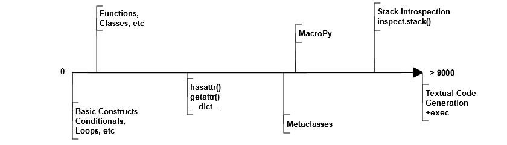

MacroPy
=======
**MacroPy** is an implementation of [Syntactic Macros](http://tinyurl.com/cmlls8v) in the [Python Programming Language](http://python.org/). MacroPy provides a mechanism for user-defined functions (macros) to perform transformations on the [abstract syntax tree](http://en.wikipedia.org/wiki/Abstract_syntax_tree) (AST) of Python code at _module import time_. This is an easy way to modify the semantics of a python program in ways which are otherwise impossible, for example providing an extremely concise way of declaring classes:

```python
@case
class Point(x, y)

p = Point(1, 2)
print p.x   # 1
print p     # Point(1, 2)
```

MacroPy has been used to implement features such as:

- [Case Classes](#case-classes), easy Algebraic Data Types from Scala
- [Pattern Matching](#pattern-matching) from the Functional Programming world
- [Tail-call Optimization](#tail-call-optimization)
- [String Interpolation](#string-interpolation), a common feature, and [Pyxl](#pyxl-integration), which is basically XML interpolation.
- [Tracing](#tracing) and [Smart Asserts](#smart-asserts), from every programmer's wildest dreams.
- [PINQ to SQLAlchemy](#pinq-to-sqlalchemy), a clone of LINQ to SQL from C#
- [Quick Lambdas](#quick-lambdas) from Scala and Groovy
- [Parser Combinators](#parser-combinators), inspired by Scala's
- [JS Snippets](#js-snippets), cross compiling snippets of Python into equivalent Javascript

The [Rough Overview](#rough-overview) will give a birds eye view of how it works, and the [Detailed Guide](#detailed-guide) will go into greater detail and walk you through creating a simple macro ([Quick Lambdas](#quick-lambdas)) as well as containing documentation for [Tools](#tools) such as

- [Quasiquotes](#quasiquotes), a quick way to manipulate AST fragments
- The [Walker](#walker), a flexible tool to traverse and transform ASTs

Or just skip ahead to the [Subtleties](#macro-subtleties), [Lessons](#lessons) and [Conclusion](#macropy-the-last-refuge-of-the-competent).

MacroPy is tested to run on [CPython 2.7.2](http://en.wikipedia.org/wiki/CPython) and [PyPy 2.0](http://pypy.org/), but does not yet work on [Jython](http://www.jython.org/) and does not work on older versions of PyPy. MacroPy is also available on [PyPI](https://pypi.python.org/pypi/MacroPy). It uses `setup.py` to manage dependencies and other things, check out [this gist](https://gist.github.com/lihaoyi/5577609) for an example of setting it up on a clean system.

Rough Overview
==============
Macro functions are defined in three ways:

```python

macros = Macros()

@macros.expr
def my_expr_macro(tree):
    ...
    return new_tree

@macros.block
def my_block_macro(tree):
    ...
    return new_tree

@macros.decorator
def my_decorator_macro(tree):
    ...
    return new_tree
```

The line `macros = Macros()` is required to mark the file as providing macros, and the `macros` object then provides the methods `expr`, `block` and `decorator` which can be used to decorate functions to mark them out as the three different kinds of macros.

Each macro function is passed a `tree`. The `tree` is an `AST` object, the sort provided by Python's [ast module](http://docs.python.org/2/library/ast.html). The macro is able to do whatever transformations it wants, and it returns a modified (or even an entirely new) `AST` object which MacroPy will use to replace the original macro invocation.

These three types of macros are called via:

```python
from my_macro_module import macros, ...

val = my_expr_macro%(...)

with my_block_macro:
    ...

@my_decorator_macro
class X():
    ...
```

Where the line `from my_macro_module import macros, ...` is necessary to tell MacroPy which macros these module relies on. Multiple things can be imported from each module (the `...`) but `macros` must come first for macros from that module to be used.

Any time any of these syntactic forms is seen, if a matching macro exists in any of the packages from which `macros` has been imported from, the abstract syntax tree captured by these forms (the `...` in the code above) is given to the respective macro to handle. The tree (new, modified, or even unchanged) which the macro returns is substituted into the original code in-place.

MacroPy intercepts the module-loading workflow, via the functionality provided by [PEP 302: New Import Hooks](http://www.python.org/dev/peps/pep-0302/). The workflow is roughly:

- Intercept an import
- Parse the contents of the file into an AST
- Walk the AST and expand any macros that it finds
- Compile the modified AST and resume loading it as a module


Note that this means **you cannot use macros in a file that is run directly**, as it will not be passed through the import hooks. Hence the minimum viable setup is:

```python
# run.py
import macropy.core.macros  # sets up macro import hooks
import other                # imports other.py and passes it through import hooks


# my_macro_module.py
from macropy.core.macros import *

macros = Macros()

... define some macros ...


# other.py
from macropy.macros.my_macro_module import macros, ...

... do stuff with macros ...
```

Where you run `run.py` instead of `other.py`. For the same reason, you cannot directly run MacroPy's own unit tests directly using `unittest` or `nose`: you need to run the [macropy/run_tests.py](macropy/run_tests.py) file from the project root for the tests to run.

MacroPy also works in the REPL:

```python
PS C:\Dropbox\Workspace\6.945\Project> python
Python 2.7 (r27:82525, Jul  4 2010, 07:43:08) [MSC v.1500 64 bit (AMD64)] on win32
Type "help", "copyright", "credits" or "license" for more information.
>>> import macropy.core.macros
0=[]=====> MacroPy Enabled <=====[]=0
>>> from macropy.macros2.tracing import macros, trace
>>> trace%[x*2 for x in range(3)]
range(3) -> [0, 1, 2]
(x * 2) -> 0
(x * 2) -> 2
(x * 2) -> 4
[(x * 2) for x in range(3)] -> [0, 2, 4]
[0, 2, 4]
```

Although support for the REPL is still experimental, most of the examples on this page will work when copied and pasted into the REPL verbatim, except those with blank lines in class and function definitions (those seem to confuse it).

Examples
========
Below are a few example uses of macros that are implemented (together with test cases!) in the [macropy/macros](macropy/macros) and [macropy/macros2](macropy/macros2) folders. These are also the ideal places to go look at to learn to write your own macros: check out the source code of the [String Interpolation](macropy/macros/string_interp.py) or [Quick Lambda](macropy/macros/quicklambda.py) macros for some small (<30 lines), self contained examples. Their [unit](macropy/macros/string_interp_test.py) [tests](macropy/macros/quicklambda_test.py) demonstrate how these macros are used.

Note that all of these examples are **macros**; that is, they hold no special place in MacroPy. They are placed in [macropy/macros](macropy/macros) and [macropy/macros2](macropy/macros2), separate from the Macropy core in [macropy/core](macropy/core). Thus they are on even footing with any macro you may want to write yourself.

All of these are advanced language features that each would have been a massive effort to implement in the [CPython](http://en.wikipedia.org/wiki/CPython) interpreter. Using macros, the implementation of each feature fits in a single file, often taking less than 100 lines of code.

Case Classes
------------
```python
from macropy.macros.adt import macros, case

@case
class Point(x, y): pass

p = Point(1, 2)

print str(p)    #Point(1, 2)
print p.x       #1
print p.y       #2
print Point(1, 2) == Point(1, 2)
#True
```

[Case classes](http://www.codecommit.com/blog/scala/case-classes-are-cool) are classes with extra goodies:

- Nice `__str__` and `__repr__` methods autogenerated
- An autogenerated constructor
- Structural equality by default
- A Copy-constructor, for creating modified copies of instances

The reasoning being that although you may sometimes want complex, custom-built classes with custom features and fancy inheritance, very (very!) often you want a simple class with a constructor, pretty `__str__` and `__repr__` methods, and structural equality which doesn't inherit from anything. Case classes provide you just that, with an extremely concise declaration:

```python
@case
class Point(x, y): pass
```

As opposed to the equivalent class, written manually:

```python
class Point(object):
    def __init__(self, x, y):
        self.x = x
        self.y = y

    def __str__(self):
        return "Point(" + self.x + ", " + self.y + ")"

    def __repr__(self):
        return self.__str__()

    def __eq__(self, other):
        return self.x == other.x and self.y == other.y

    def __ne__(self, other):
        return not self.__eq__(other)
```

Whew, what a lot of boilerplate! This is clearly a pain to do, error prone to deal with, and violates [DRY](http://en.wikipedia.org/wiki/Don't_repeat_yourself) in an extreme way: each member of the class (`x` and `y` in this case) has to be repeated _6_ times, with loads and loads of boilerplate. It is also *buggy*, and will fail at runtime when the above example is run, so see if you can spot the bug in it! Given how tedious writing all this code is, it is no surprise that most python classes do not come with proper `__str__` or useful `__eq__` functions! With case classes, there is no excuse, since all this will be generated for you.

Case classes also provide a convenient *copy-constructor*, which creates a shallow copy of the case class with modified fields, leaving the original unchanged:

```python
a = Point(1, 2)
b = a.copy(x = 3)
print a #Point(1, 2)
print b #Point(3, 2)
```

Like any other class, a case class may contain methods in its body:

```python
@case
class Point(x, y):
    def length(self):
        return (self.x ** 2 + self.y ** 2) ** 0.5

print Point(3, 4).length() #5
```

or class variables. The only restrictions are that only the `__init__`, `__repr__`, `___str__`, `__eq__` methods will be set for you, and it may not manually inherit from anything. Instead of manual inheritence, inheritence for case classes is defined by _nesting_, as shown below:

```python
@case
class List():
    def __len__(self):
        return 0

    def __iter__(self):
        return iter([])

    class Nil:
        pass

    class Cons(head, tail):
        def __len__(self):
            return 1 + len(self.tail)

        def __iter__(self):
            current = self

            while len(current) > 0:
                yield current.head
                current = current.tail

print isinstance(Cons(None, None), List)    # True
print isinstance(Nil(), List)               # True

my_list = Cons(1, Cons(2, Cons(3, Nil())))
empty_list = Nil()

print my_list.head              # 1
print my_list.tail              # Cons(2, Cons(3, Nil()))
print len(my_list)              # 5
print sum(iter(my_list))        # 6
print sum(iter(empty_list))     # 0
```

This is an implementation of a singly linked [cons list](http://en.wikipedia.org/wiki/Cons), providing both `head` and `tail` ([LISP](https://en.wikipedia.org/wiki/LISP)'s `car` and `cdr`) as well as the ability to get the `len` or `iter` for the list.

As the classes `Nil` are `Cons` are nested within `List`, both of them get transformed into top-level classes which inherit from it. This nesting can go arbitrarily deep.

Overall, case classes are similar to Python's [`namedtuple`](http://docs.python.org/2/library/collections.html#collections.namedtuple), but on steroids (methods, inheritence, etc.), and provides the programmer with a much better experience.

Pattern Matching
----------------
One important thing you might want to do with case classes is match them against some patterns.
For example, suppose that you are writing a function to transform an AST.  You want to try to macro-expand
with-blocks which represent macro invocation, but not affect anything else.

The code for this without pattern matching might look something like:
```python
def expand_macros(node):
    if (isinstance(node, With) and isinstance(node.context_expr, Name)
        and node.context_expr.id in macros.block_registry:
        return macros.block_registry[node.context_expr.id](node)
    else:
        return node
```

With pattern matching (specifically, using the switch macro), we could instead write:

```python
def expand_macros(node):
    with switch(node):
        if With(Name(macro_name)):
            return macros.block_registry[macro_name](node)
        else:
            return node
```

Once you're used to this, it is much simpler both to read and to write,
and the benefits of pattern matching only grow as the matched data structures get more complex.

Here is another, more self-contained example of an implementation of a <a href="http://en.wikipedia.org/wiki/Fold_(higher-order_function)">
left fold</a> from functional programming:

```python
@case
class List:
    class Nil():
        pass

    class Cons(x, xs):
        pass

def foldl1(my_list, op):
    with switch(my_list):
        if Cons(x, Nil()):
            return x
        elif Cons(x, xs):
            return op(x, foldl1(xs, op))
```

The switch macro is actually just syntactic sugar for using the more general patterns macro.
`foldl1` is approximately desugared into the following, with one important
caveat: the bodies of the if statements are not subject to pattern matching,
in case you actually want to use bitshifts in your code.

```python
def foldl1(my_list, op):
    with patterns:
        tmp = my_list
        try:
            Cons(x, Nil()) << tmp
            return x
        except PatternMatchException:
            try:
                Cons(x, xs) << tmp
                return op(x, foldl1(xs, op))
            except PatternMatchException:
                pass
```

I think you can agree that the first version is much easier to read, and the
second version hasn't even been fully expanded yet!

It's also possible to do away with the if statements if you know what the structure 
of your input will be.  This also has the benefits of throwing an exception if your 
input doesn't match the expected form. 

```python
from macropy.macros.adt import macros, patterns

def area(rect):
    with patterns:
        Rect(Point(x1, y1), Point(x2, y2)) << rect
        return (x2 - x1) * (y2 - y1)
```

If the match fails, a `PatternMatchException` will be thrown.
```python
    # Throws a PatternMatchException
    area(Line(Point(1, 2), Point(3, 4)))
```

###Class Matching Details

When you pattern match `Foo(x, y)` against a value `Foo(3, 4)`, what happens behind the
scenes is that the constructor of `Foo` is inspected.  We may find that it takes
two parameters `a` and `b`.  We assume that the constructor then contains lines
like:
```python
self.a = a
self.b = b
```
(We don't have access to the source of Foo, so this is the best we can do).
Then `Foo(x, y) << Foo(3, 4)` is transformed roughly into

```python
tmp = Foo(3,4)
tmp_matcher = ClassMatcher(Foo, [NameMatcher('x'), NameMatcher('y')])
tmp_matcher.match(tmp)
x = tmp_matcher.getVar('x')
y = tmp_matcher.getVar('y')
```

In some cases, constructors will not be so standard.  In this case, we can use
keyword arguments to pattern match against named fields.  For example, an
equivalent to the above which doesn't rely on the specific implementation of th constructor is `Foo(a=x, b=y)
<< Foo(3, 4)`.  Here the semantics are that the field `a` is extracted from
`Foo(3,4)` to be matched against the simple pattern `x`.  We could also replace
`x` with a more complex pattern, as in `Foo(a=Bar(z), b=y) << Foo(Bar(2), 4)`.


###Custom Patterns
It is also possible to completely override the way in which a pattern is matched
by defining an `__unapply__` class method of the class which you are pattern
matching.  The 'class' need not actually be the type of the matched object, as
in the following example borrowed from Scala.  The `__unapply__` method takes as
arguments the value being matched, as well as a list of keywords.

The method should then return a tuple of a list of positional matches, and a
dictionary of the keyword matches.

```python
class Twice(object):
    @classmethod
    def __unapply__(clazz, x, kw_keys):
        if not isinstance(x, int) or x % 2 != 0:
            raise PatternMatchException()
        else:
            return ([x/2], {})

with patterns:
    Twice(n) << 8
    print n     # 4
```

Tail-call Optimization
-----------
We have also implemented a macro which will optimize away the stack usage of
functions which are actually implemented in a tail-recursive fashion.  This even
works for mutually recursive functions by using trampolining.

The 'hello world' of tail-recursive functions is a factorial function, so I'll
show that first.
```python
@tco
def fact(n, acc):
    if n == 0:
        return acc
    else:
        return fact(n-1, n * acc)

print fact(10000)  # doesn't stack overflow
```

More complicated mutually recursive examples also work too.
```python
from macropy.macros.tco import macros, tco

@tco
def odd(n):
if n < 0:
    return odd(-n)
elif n == 0:
    return False
else:
    return even(n - 1)

@tco
def even(n):
    if n == 0:
        return True
    else:
        return odd(n-1)

assert(even(100000))  # No stack overflow
```

Note that both `odd` and `even` were both decorated with `@tco`.  All functions
which would ordinarily use too many stack frames must be decorated.

###Trampolining
How is tail recursion implemented?  The idea is that if a function `f` would
return the result of a recursive call to some function `g`, it could instead
return `g`, along with whatever arguments it would have passed to `g`.  Then
instead of running `f` directly, we run `trampoline(f)`, which will call `f`,
call the result of `f`, call the result of that `f`, etc. until finally some
call returns an actual value.

A transformed (and simplified) version of the tail-call optimized factorial
would look like this
```python
def trampoline_decorator(func):
    def trampolined(*args):
        if not in_trampoline():
            return trampoline(func, args)
        return func(*args)
    return trampolined

def trampoline(func, args):
  _enter_trampoline()
  while True:
        result = func(*args)
        with patterns:
            if ('macropy-tco-call', func, args) << result:
                pass
            else:
                if ignoring:
                    _exit_trampoline()
                    return None
                else:
                    _exit_trampoline()
                    return result

@trampoline_decorator
def fact(n, acc):
    if n == 0:
        return 1
    else:
        return ('macropy-tco-call', fact, [n-1, n * acc])
```


String Interpolation
--------------------

```python
from macropy.macros.string_interp import macros, s

a, b = 1, 2
c = s%"%{a} apple and %{b} bananas"
print c
#1 apple and 2 bananas
```

Unlike the normal string interpolation in Python, MacroPy's string interpolation allows the programmer to specify the variables to be interpolated _inline_ inside the string. The macro `s%` then takes the string literal

```python
"%{a} apple and %{b} bananas"
```

and expands it into the expression

```python
"%s apple and %s bananas" % (a, b)
```

Which is evaluated at run-time in the local scope, using whatever the values `a` and `b` happen to hold at the time. The contents of the `%{...}` can be any arbitrary python expression, and is not limited to variable names.

###Pyxl Integration

```python
from macropy.macros2.pyxl_strings import macros, p

image_name = "bolton.png"
image = p%''

text = "Michael Bolton"
block = p%'<div>{image}{text}</div>'

element_list = [image, text]
block2 = p%'<div>{element_list}</div>'

assert block2.to_string() == '<div>Michael Bolton</div>'
```

[Pyxl](https://github.com/dropbox/pyxl) is a way of integrating XML markup into your Python code. By default, pyxl hooks into the python UTF-8 decoder in order to transform the source files at load-time. In this, it is similar to how MacroPy transforms source files at import time.

A major difference is that Pyxl by default leaves the HTML fragments directly in the source code:

```python
image_name = "bolton.png"
image = 

text = "Michael Bolton"
block = <div>{image}{text}</div>

element_list = [image, text]
block2 = <div>{element_list}</div>
```

While the MacroPy version requires each snippet to be wrapped in a `p%"..."` wrapper. This [three-line-of-code macro](https://github.com/lihaoyi/macropy/blob/master/macropy/macros2/pyxl_strings.py) simply uses pyxl as a macro (operating on string literals), rather than hooking into the UTF-8 decoder. In general, this demonstrates how easy it is to integrate an "external" DSL into your python program: MacroPy handles all the intricacies of hooking into the interpreter and intercepting the import workflow. The programmer simply needs to provide the source-to-source transformation, which in this case was already provided.

Tracing
-------

```python
from macropy.macros2.tracing import macros, trace, log, require

log%(1 + 2)
#(1 + 2) -> 3

log%("omg" * 3)
#('omg' * 3) -> 'omgomgomg'
```

Tracing allows you to easily see what is happening inside your code. Many a time programmers have written code like

```python
print "value", value
print "sqrt(x)", sqrt(x)
```

and the `log%` macro (shown above) helps remove this duplication by automatically expanding `log%(1 + 2)` into `wrap("(1 + 2)", (1 + 2))`. `wrap` then evaluates the expression, printing out the source code and final value of the computation.

In addition to simple logging, MacroPy provides the `trace%` macro. This macro not only logs the source and result of the given expression, but also the source and result of all sub-expressions nested within it:

```python
trace%[len(x)*3 for x in ["omg", "wtf", "b" * 2 + "q", "lo" * 3 + "l"]]
#('b' * 2) -> 'bb'
#(('b' * 2) + 'q') -> 'bbq'
#('lo' * 3) -> 'lololo'
#(('lo' * 3) + 'l') -> 'lololol'
#['omg', 'wtf', (('b' * 2) + 'q'), (('lo' * 3) + 'l')] -> ['omg', 'wtf', 'bbq', 'lololol']
#len(x) -> 3
#(len(x) * 3) -> 9
#len(x) -> 3
#(len(x) * 3) -> 9
#len(x) -> 3
#(len(x) * 3) -> 9
#len(x) -> 7
#(len(x) * 3) -> 21
#[(len(x) * 3) for x in ['omg', 'wtf', (('b' * 2) + 'q'), (('lo' * 3) + 'l')]] -> [9, 9, 9, 21]
```

As you can see, `trace%` logs the source and value of all sub-expressions that get evaluated in the course of evaluating the list comprehension.

Lastly, `trace` can be used as a block macro:


```python
with trace:
    sum = 0
    for i in range(0, 5):
        sum = sum + 5

    square = sum * sum
#sum = 0
#for i in range(0, 5):
#   sum = (sum + 5)
#range(0, 5) -> [0, 1, 2, 3, 4]
#sum = (sum + 5)
#(sum + 5) -> 5
#sum = (sum + 5)
#(sum + 5) -> 10
#sum = (sum + 5)
#(sum + 5) -> 15
#sum = (sum + 5)
#(sum + 5) -> 20
#sum = (sum + 5)
#(sum + 5) -> 25
#square = (sum * sum)
#(sum * sum) -> 625
```

Used this way, `trace` will print out the source code of every _statement_ that gets executed, in addition to tracing the evaluation of any expressions within those statements.

Apart from simply printing out the traces, you can also redirect the traces wherever you want by having a `log()` function in scope:

```python
result = []

def log(x):
    result.append(x)
```

The tracer uses whatever `log()` function it finds, falling back on printing only if none exists. Instead of printing, this `log()` function appends the traces to a list, and is used in our unit tests.

###Smart Asserts
```python
require%(3**2 + 4**2 != 5**2)
#AssertionError: Require Failed
#(3 ** 2) -> 9
#(4 ** 2) -> 16
#((3 ** 2) + (4 ** 2)) -> 25
#(5 ** 2) -> 25
#(((3 ** 2) + (4 ** 2)) != (5 ** 2)) -> False
```

MacroPy provides a variant on the `assert` keyword called `require%`. Like `assert`, `require%` throws an `AssertionError` if the condition is false.

Unlike `assert`, `require%` automatically tells you what code failed the condition, and traces all the sub-expressions within the code so you can more easily see what went wrong. Pretty handy!

`require% can also be used in block form:

```python
a = 10
b = 2
with require:
    a > 5
    a * b == 20
    a < 2
#AssertionError: Require Failed
#(a < 2) -> False
```

This requires every statement in the block to be a boolean expression. Each expression will then be wrapped in a `require%`, throwing an `AssertionError` with a nice trace when a condition fails.

If you want to write your own custom logging, tracing or debugging macros, take a look at the [100 lines of code](https://github.com/lihaoyi/macropy/blob/master/macropy/macros2/tracing.py) that implements all the functionality shown above.

PINQ to SQLAlchemy
------------------
```python
from macropy.macros2.linq import macros, sql, query, generate_schema

db = generate_schema(engine)

# Countries in Europe with a GNP per Capita greater than the UK
results = query%(
    x.name for x in db.country
    if x.gnp / x.population > (
        y.gnp / y.population for y in db.country
        if y.name == 'United Kingdom'
    ).as_scalar()
    if (x.continent == 'Europe')
)
for line in results: print line
# (u'Austria',)
# (u'Belgium',)
# (u'Switzerland',)
# (u'Germany',)
# (u'Denmark',)
# (u'Finland',)
# (u'France',)
# (u'Iceland',)
# (u'Liechtenstein',)
# (u'Luxembourg',)
# (u'Netherlands',)
# (u'Norway',)
# (u'Sweden',)
```

PINQ (Python INtegrated Query) to SQLAlchemy is inspired by [C#'s LINQ to SQL](http://msdn.microsoft.com/en-us/library/bb386976.aspx). In short, code used to manipulate lists is lifted into an AST which is then cross-compiled into a snippet of [SQL](http://en.wikipedia.org/wiki/SQL). In this case, it is the `query%` macro which does this lifting and cross-compilation. Instead of performing the manipulation locally on some data structure, the compiled query is sent to a remote database to be performed there.

This allows you to write queries to a database in the same way you would write queries on in-memory lists, which is really very nice. The translation is a relatively thin layer of over the [SQLAlchemy Query Language](http://docs.sqlalchemy.org/ru/latest/core/tutorial.html), which does the heavy lifting of converting the query into a raw SQL string:. If we start with a simple query:

```python
# Countries with a land area greater than 10 million square kilometers
print query%((x.name, x.surface_area) for x in db.country if x.surface_area > 10000000)
# [(u'Antarctica', Decimal('13120000.0000000000')), (u'Russian Federation', Decimal('17075400.0000000000'))]
```

This is to the equivalent SQLAlchemy query:

```python
print engine.execute(select([country.c.name, country.c.surface_area]).where(country.c.surface_area > 10000000)).fetchall()
```

To verify that PINQ is actually cross-compiling the python to SQL, and not simply requesting everything and performing the manipulation locally, we can use the `sql%` macro to perform the lifting of the query without executing it:

```python
query_string = sql%((x.name, x.surface_area) for x in db.country if x.surface_area > 10000000)
print type(query_string)
# <class 'sqlalchemy.sql.expression.Select'>
print query_string
# SELECT country_1.name, country_1.surface_area 
# FROM country AS country_1 
# WHERE country_1.surface_area > ?
```

As we can see, PINQ converts the python list-comprehension into a SQLAlchemy `Select`, which when stringified becomes a valid SQL string. The `?`s are there because SQLAlchemy uses [parametrized queries](http://en.wikipedia.org/wiki/Prepared_statement), and doesn't interpolate values into the query itself.

Consider a less trivial example: we want to find all countries in europe who have a [GNP per Capita](http://en.wikipedia.org/wiki/Gross_national_product) greater than the United Kingdom. This is the SQLAlchemy code to do so:

```python
query = select([db.country.c.name]).where(
    db.country.c.gnp / db.country.c.population > select(
        [(db.country.c.gnp / db.country.c.population)]
    ).where(
            db.country.c.name == 'United Kingdom'
    ).as_scalar()
).where(
    db.country.c.continent == 'Europe'
)
```

The SQLAlchemy query looks pretty odd, for somebody who knows python but isn't familiar with the library. This is because SQLAlchemy cannot "lift" Python code into an AST to manipulate, and instead have to construct the AST manually using python objects. Although it works pretty well, the syntax and semantics of the queries is completely different from python.

Already we are bumping into edge cases: the `db.country` in the nested query is referred to the same way as the `db.country` in the outer query, although they are clearly different! One may wonder, what if, in the inner query, we wish to refer to the outer query's values? Naturally, there will be solutions to all of these requirements. In the end, SQLAlchemy ends up effectively creating its own mini programming language, with its own concept of scoping, name binding, etc., basically duplicating what Python already has but with messier syntax and subtly different semantics.

In the equivalent PINQ code, the scoping of which `db.country` you are referring to is much more explicit, and in general the semantics are identical to a typical python comprehension:

```python
query = sql%(
    x.name for x in db.country
    if x.gnp / x.population > (
        y.gnp / y.population for y in db.country
        if y.name == 'United Kingdom'
    ).as_scalar()
    if (x.continent == 'Europe')
)
```

As we can see, rather than mysteriously referring to the `db.country` all over the place, we clearly bind it in two places: once to the variable `x` in the outer query, once to the variable `y` in the inner query. Overall, we make use of Python's syntax and semantics (scoping, names, etc.) rather than having to re-invent our own, which is a big win for anybody who already understands Python.

Executing either of these will give us the same answer:

```python
print query
# SELECT country_1.name
# FROM country AS country_1
# WHERE country_1.gnp / country_1.population > (SELECT country_2.gnp / country_2.population AS anon_1
# FROM country AS country_2
# WHERE country_2.name = ?) AND country_1.continent = ?

results = engine.execute(query).fetchall()

for line in results: print line
# (u'Austria',)
# (u'Belgium',)
# (u'Switzerland',)
# (u'Germany',)
# (u'Denmark',)
# (u'Finland',)
# (u'France',)
# (u'Iceland',)
# (u'Liechtenstein',)
# (u'Luxembourg',)
# (u'Netherlands',)
# (u'Norway',)
# (u'Sweden',)
```

Although PINQ does not support the vast capabilities of the SQL language, it supports a useful subset, like `JOIN`s:

```python
# The number of cities in all of Asia
query = sql%(
    func.count(t.name)
    for c in db.country
    for t in db.city
    if t.country_code == c.code
    if c.continent == 'Asia'
)
print query
# SELECT count(city_1.name) AS count_1
# FROM city AS city_1, country AS country_1
# WHERE city_1.country_code = country_1.code AND country_1.continent = ?

result = engine.execute(query).fetchall()

print result
[(1766,)]
```

As well as `ORDER BY`, with `LIMIT` and `OFFSET`s:

```python
# The top 10 largest countries in the world by population
query = sql%(
    c.name for c in db.country
).order_by(c.population.desc()).limit(10)

print query
# SELECT country_1.name
# FROM country AS country_1
# ORDER BY country_1.population DESC
# LIMIT ? OFFSET ?

res = engine.execute(query).fetchall()
for line in res:
    print line
# (u'China',)
# (u'India',)
# (u'United States',)
# (u'Indonesia',)
# (u'Brazil',)
# (u'Pakistan',)
# (u'Russian Federation',)
# (u'Bangladesh',)
# (u'Japan',)
# (u'Nigeria',)
```

In general, apart from the translation of generator expressions (and their guards) into `SELECT` an `WHERE` clauses, the rest of the functionality of SQL (like the `.order_by()`, `.limit()`, etc. functions shown above) is accessed as in the [SQLAlchemy Expression Language](http://docs.sqlalchemy.org/ru/latest/core/tutorial.html#ordering-grouping-limiting-offset-ing). See the [unit tests](https://github.com/lihaoyi/macropy/blob/master/macropy/macros2/linq_test.py) for a fuller set of examples of what PINQ can do, or browse the SQLAlchemy docs mentioned earlier.

PINQ demonstrates how easy it is to use macros to lift python snippets into an AST and cross-compile it into another language, and how nice the syntax and semantics can be for these embedded DSLs. PINQ's entire implementation comprises about [100 lines of code](https://github.com/lihaoyi/macropy/blob/master/macropy/macros2/linq.py), which really isn't much considering how much it does for you!

Quick Lambdas
-------------
```python
from macropy.macros.quicklambda import macros, f, _

map(f%(_ + 1), [1, 2, 3])
#[2, 3, 4]

reduce(f%(_ + _), [1, 2, 3])
#6
```

Macropy provides a syntax for lambda expressions similar to Scala's [anonymous functions](http://www.codecommit.com/blog/scala/quick-explanation-of-scalas-syntax). Essentially, the transformation is:

```python
f%(_ + _) -> lambda a, b: a + b
```

where the underscores get replaced by identifiers, which are then set to be the parameters of the enclosing `lambda`. This works too:

```python
map(f%_.split(' ')[0], ["i am cow", "hear me moo"])
#["i", "hear"]
```

Quick Lambdas can be also used as a concise, lightweight, more-readable substitute for `functools.partial`

```python
import functools
basetwo = functools.partial(int, base=2)
basetwo('10010')
#18
```

is equivalent to

```python
basetwo = f%int(_, base=2)
basetwo('10010')
#18
```

Quick Lambdas can also be used entirely without the `_` placeholders, in which case they wrap the target in a no argument `lambda: ...` thunk:

```python
from random import random
thunk = f%random()
print thunk()
#0.5497242707566372
print thunk()
#0.3068253802774531
```

This cuts out reduces the number of characters needed to make a thunk from 7 to 2, making it much easier to use thunks to do things like emulating [by name parameters](http://locrianmode.blogspot.com/2011/07/scala-by-name-parameter.html). The implementation of quicklambda is about [30 lines of code](https://github.com/lihaoyi/macropy/blob/master/macropy/macros/quicklambda.py), and is worth a look if you want to see how a simple (but extremely useful!) macro can be written.

Parser Combinators
------------------
```python
from macropy.macros2.peg import macros, peg

def reduce_chain(chain):
    chain = list(reversed(chain))
    o_dict = {
        "+": f%(_+_),
        "-": f%(_-_),
        "*": f%(_*_),
        "/": f%(_/_),
    }
    while len(chain) > 1:
        a, [o, b] = chain.pop(), chain.pop()
        chain.append(o_dict[o](a, b))
    return chain[0]

"""
PEG Grammer:
Value   <- [0-9]+ / '(' Expr ')'
Op      <- "+" / "-" / "*" / "/"
Expr <- Value (Op Value)*
"""
with peg:
    value = '[0-9]+'.r // int | ('(', expr, ')') // (f%_[1])
    op = '+' | '-' | '*' | '/'
    expr = (value is first, (op, value).rep is rest) >> reduce_chain([first] + rest)

print expr.parse_all("123")             #[123]
print expr.parse_all("((123))")         #[123]
print expr.parse_all("(123+456+789)")   #[1368]
print expr.parse_all("(6/2)")           #[3]
print expr.parse_all("(1+2+3)+2")       #[8]
print expr.parse_all("(((((((11)))))+22+33)*(4+5+((6))))/12*(17+5)") #[1804]
```

[Parser Combinators](http://en.wikipedia.org/wiki/Parser_combinator) are a really nice way of building simple recursive descent parsers, when the task is too large for [regexes](http://en.wikipedia.org/wiki/Regex) but yet too small for the heavy-duty [parser generators](http://en.wikipedia.org/wiki/Comparison_of_parser_generators). These parser combinators are inspired by [Scala's](http://www.suryasuravarapu.com/2011/04/scala-parser-combinators-win.html), utilizing macros to make the syntax as clean as possible.

The above example describes a simple parser for arithmetic expressions, using our own parser combinator library which roughly follows the [PEG](http://en.wikipedia.org/wiki/Parsing_expression_grammar) syntax. Note how that in the example, the bulk of the code goes into the loop that reduces sequences of numbers and operators to a single number, rather than the recursive-descent parser itself!

Anything within a `with peg:` block is transformed into a *parser*. A parser is something with a `.parse_all(input)` method that attempts to parse the given `input` string. This method returns:

- `None`, if the parser failed to parse the input
- `[result]` if the parser succeeded with the value `result`

###Basic Combinators

Parsers are generally built up from a few common building blocks:

- String literals like `'+'` match the input to their literal value (e.g. '+') and return it as the parse result, or fails (returns `None`) if it does not match.
- Regexes like `'[0-9]+'.r` match the regex to the input if possible, and return it. Otherwise it fails.
- Tuples like `('(', expr, ')')` match each of the elements within sequentially, and return a list containing the result of each element. It fails if any of its elements fails.
- Elements separated by `|`, for example `'+' | '-' | '*' | '/'`, attempt to match each of the options from left to right, and return the result of the first success.
- Elements separated by `&`, for example `'[1234]'.r & '[3456]'.r`, require both sides succeed, and return the result of the left side.
- `parser.rep` attempts to match the `parser` 0 or more times, returning a list of the results from each successful match.
- `parser.rep1` attempts to match the `parser` 1 or more times, returning a list of the results from each successful match. If `parser` does not succeed at least once, `parser.rep1` fails.
- `-parser` negates the `parser`: if `parser` succeeded (with any result), `-parser` fails. If `parser` failed, `-parser` succeeds with the result `""`, the empty string.
- `parser * n` attempts to match the `parser` exactly `n` times, returning a list of length `n` containing the result of the `n` successes. Fails otherwise.
- `parser.opt` matches the `parser` 0 or 1 times, returning either `[]` or `[result]` where `result` is the result of `parser`.

###Transformers

So far, these building blocks all return the raw parse tree: all the things like whitespace, curly-braces, etc. will still be there. Often, you want to take a parser e.g.

```python
with peg:
    num = '[0-9]+'.r

print num.parse_all("123") # ["123"]
```

which returns a string of digits, and convert it into a parser which returns an `int` with the value of that string. This can be done with the `//` operator:

```python
with peg:
    num = '[0-9]+'.r // int

print num.parse_all("123") # [123]
```

The `//` operator takes a function which will be used to transform the result of the parser: in this case, it is the function `int`, which transforms the returned string into an integer. Another example is:

```python
with peg:
    laugh = 'lol'
    laughs1 = 'lol'.rep1
    laughs2 = lots_of_laughs_1 // "".join

print laughs1.parse_all("lollollol") # [['lol', 'lol', 'lol]]
print laughs2.parse_all("lollollol") # ['lollollol]
```

Where the function `"".join"` is used to join together the list of results from `laughs1` into a single string.

Although `//` is sufficient for everyone's needs, it is not always convenient. In the example above, a `value` is defined to be:

```python
value = ... | ('(', expr, ')') // (lambda x: x[1])
```

As you can see, we need to strip off the unwanted parentheses from the parse tree, and we do it with a `lambda` that only selects the middle element, which is the result of the `expr` parser. An alternate way of representing this is:

```python
value = ... | ('(', expr is result, ')') >> result
```

In this case, the `is` keyword is used to bind the result of `expr` to the name `result`. The `>>` operator can be used to transform the parser by only operating on the *bound* results within the parser. This goes a long way to keep things neat. For example, a JSON parser may define an array to be:

```python
with peg:
    ...
    # parses an array and extracts the relevant bits into a Python list
     array = ('[', (json_exp, (',', json_exp).rep), opt(space), ']')//(lambda x: [x[1][0]] + [y[1] for y in x[1][1]])
    ...
```

Where the huge `lambda` is necessary to pull out the necessary parts of the parse tree into a Python list. Although it works, it's difficult to write correctly and equally difficult to read. Using the `is` operator, this can be rewritten as:

```python
array = ('[', json_exp is first, ~(',', json_exp is rest), opt(space), ']') >> [first] + rest
```

Now, it is clear that we are only interested in the result of the two `json_exp` parsers. The `>>` operator allows us to use those, while the rest of the parse tree (`[`s, `,`s, etc.) are conveniently discarded.

###Full Example
These parser combinators are not limited to toy problems, like the arithmetic expression parser above. Below is the full source of the JSON parser, along with it's PEG grammer:

```python
"""
JSON <- S? ( Object / Array / String / True / False / Null / Number ) S?

Object <- "{"
             ( String ":" JSON ( "," String ":" JSON )*
             / S? )
         "}"

Array <- "["
            ( JSON ( "," JSON )*
            / S? )
        "]"

String <- S? ["] ( [^ " \ U+0000-U+001F ] / Escape )* ["] S?

Escape <- [\] ( [ " / \ b f n r t ] / UnicodeEscape )

UnicodeEscape <- "u" [0-9A-Fa-f]{4}

True <- "true"
False <- "false"
Null <- "null"

Number <- Minus? IntegralPart FractionalPart? ExponentPart?

Minus <- "-"
IntegralPart <- "0" / [1-9] [0-9]*
FractionalPart <- "." [0-9]+
ExponentPart <- ( "e" / "E" ) ( "+" / "-" )? [0-9]+
S <- [ U+0009 U+000A U+000D U+0020 ]+
"""
with peg:
    json_exp = (space.opt, (obj | array | string | true | false | null | number) is exp, space.opt) >> exp

    pair = (string is k, ':', json_exp is v) >> (k, v)
    obj = ('{', pair is first, (',', pair is rest).rep, space.opt, '}') >> dict([first] + rest)
    array = ('[', json_exp is first, (',', json_exp is rest).rep, space.opt, ']') >> [first] + rest

    string = (space.opt, '"', ('[^"]'.r | escape).rep // ("".join) is body, '"') >> "".join(body)
    escape = '\\', ('"' | '/' | '\\' | 'b' | 'f' | 'n' | 'r' | 't' | unicode_escape)
    unicode_escape = 'u', '[0-9A-Fa-f]'.r * 4

    true = 'true' >> True
    false = 'false' >> False
    null = 'null' >> None

    number = (minus.opt, integral, fractional.opt, exponent.opt) // (f%float("".join(_)))
    minus = '-'
    integral = '0' | '[1-9][0-9]*'.r
    fractional = ('.', '[0-9]+'.r) // "".join
    exponent = (('e' | 'E'), ('+' | '-').opt, "[0-9]+".r) // "".join

    space = '\s+'.r

test_string = """
    {
        "firstName": "John",
        "lastName": "Smith",
        "age": 25,
        "address": {
            "streetAddress": "21 2nd Street",
            "city": "New York",
            "state": "NY",
            "postalCode": 10021
        },
        "phoneNumbers": [
            {
                "type": "home",
                "number": "212 555-1234"
            },
            {
                "type": "fax",
                "number": "646 555-4567"
            }
        ]
    }
"""

import json
print json_exp.parse_all(test_string)[0] == json.loads(test_string)
# True

import pprint
pp = pprint.PrettyPrinter(4)
pp.pprint(parser.parse_all(string)[0])
#{   'address': {   'city': 'New York',
#                   'postalCode': 10021.0,
#                   'state': 'NY',
#                   'streetAddress': '21 2nd Street'},
#    'age': 25.0,
#    'firstName': 'John',
#    'lastName': 'Smith',
#    'phoneNumbers': [   {   'number': '212 555-1234', 'type': 'home'},
#                        {   'number': '646 555-4567', 'type': 'fax'}]}
```

As you can see, the full parser parses that non-trivial blob of JSON into an identical structure as the in-built `json` package. In addition, the source of the parser looks almost identical to the PEG grammar it is parsing, shown above. Pretty neat!

JS Snippets
------------
```python
from macropy.macros2.javascript import macros, pyjs

code, javascript = pyjs%(lambda x: x > 5 and x % 2 == 0)

print code
# <function <lambda> at 0x0000000003515C18>

print javascript
# $def(function $_lambda(x) {return $b.bool($b.do_ops(x, '>', 5)) && $b.bool($b.do_ops($b.mod(x, 2), '==', 0));})

for i in range(10):
    print i, code(i), self.exec_js_func(javascript, i)

# 0 False False
# 1 False False
# 2 False False
# 3 False False
# 4 False False
# 5 False False
# 6 True True
# 7 False False
# 8 True True
# 9 False False
```

JS Snippets is a macro that allows you to mark out sections of code that will be cross-compiled into Javascript at module-import time. This cross-compilation is done using [PJs](https://github.com/jabapyth/PJs). The generated Javascript is incredibly ugly, thanks in part to the fact that in order to preserve semantics in the presence of features that Python has but JS lacks (such as [operator overloading](http://en.wikipedia.org/wiki/Operator_overloading)), basically every operation in the Javascript program has to be virtualized into a method call. Furthermore, the translation is not very good, and breaks down around the fringes of the Python language.

Nonetheless, as the above example demonstrates, the translation is entirely acceptable for simple logic. Furthermore, with macros, marking out snippets of Python code to be translated is as simple as prepending either:

- `js%`, if you only want to translate the enclosed python expression into Javascript
- `pyjs%`, if you want both the original expression as well as the translated Javascript (as in the example above). This is given to you as a tuple.

`pyjs%` is particularly interesting, because it brings us closer to the holy grail of HTML form validation: having validation run on both client and server, but still only be expressed once in the code base. With `pyjs%`, it is trivial to fork an expression (such as the conditional function shown above) into both Python and Javascript representations. Rather than using a [menagerie](https://developer.mozilla.org/en-US/docs/Web/Guide/HTML/Forms/Data_form_validation?redirectlocale=en-US&redirectslug=HTML%2FForms%2FData_form_validation) of [ad-hoc](http://docs.jquery.com/Plugins/validation) [mini-DSLs](https://code.google.com/p/validation-js/wiki/MainDocumentation), this lets you write your validation logic in plain Python.

As mentioned earlier, JS Snippets isn't very robust, and the translation is full of bugs:

```python
# these work
assert self.exec_js(js%10) == 10
assert self.exec_js(js%"i am a cow") == "i am a cow"

# these literals are buggy, and it seems to be PJs' fault
# ??? all the results seem to turn into strings ???
assert self.exec_js(js%3.14) == 3.14 # Fails
assert self.exec_js(js%[1, 2, 'lol']) == [1, 2, 'lol'] # Fails
assert self.exec_js(js%{"moo": 2, "cow": 1}) == {"moo": 2, "cow": 1} # Fails

# set literals aren't supported so this throws an exception at macro-expansion time
# self.exec_js(js%{1, 2, 'lol'})
```

Even as such basic things fail, other, more complex operations work flawlessly:

```python
script = js%sum([x for x in range(10) if x > 5])
print script
# "$b.sum($b.listcomp([$b.range(10)], function (x) {return x;}, [function (x) { return $b.do_ops(x, '>', 5); }]))"
print self.exec_js(script)
# 30
```

Here's another, less trivial use case: cross compiling a function that searchs for the [prime numbers](http://en.wikipedia.org/wiki/Prime_number):

```python
code, javascript = pyjs%(lambda n: [
    x for x in range(n)
    if 0 == len([
        y for y in range(2, x-2)
        if x % y == 0
    ])
])
print code(20)
# [0, 1, 2, 3, 4, 5, 7, 11, 13, 17, 19]
print self.exec_js_func(javascript, 20)
# [0, 1, 2, 3, 4, 5, 7, 11, 13, 17, 19]
```

These examples are all taken from the [unit tests](macropy/macros2/javascript_test.py).

Like [PINQ to SQLAlchemy](#pinq-to-sqlalchemy), JS Snippets demonstrates the feasibility, the convenience of being able to mark out sections of code using macros, to be cross-compiled into another language and run remotely. Unlike PINQ, which is built on top of the stable, battle-tested and widely used [SQLAlchemy](http://www.sqlalchemy.org/) library, JS Snippets is built on top of an buggy, unknown and untested Python to Javascript cross-compiler, making it far from production ready.

Nonetheless, JS Snippets demonstrate the promise of being able to cross-compile bits of your program and being able to run parts of it remotely. The code which performs the integration of PJs and MacroPy is a scant [25 lines long](macropy/macros2/javascript.py). If a better, more robust Python to Javascript cross-compiler appears some day, we could easily make use of it to provide a stable, seamless developer experience of sharing code between (web) client and server.

Detailed Guide
==============

As mentioned earlier, MacroPy uses PEP 302 for much of its functionality. It looks out in particular for the syntactic forms (`import macros, ...`, `my_macro%...`, `with my_macro:`, `@my_macro`) to decide which parts of the AST need to be expanded by which macros. MacroPy uses the inbuilt Python infrastructure for [parsing the source](http://docs.python.org/2/library/ast.html#ast.parse) and [representing it as an AST](http://docs.python.org/2/library/ast.html#abstract-grammar). You should familiarize yourself with the classes which make up the Python AST, since you will be interacting with them a great deal while writing macros.

Once you have an AST, there are a few possible forms that code can take:

- A **String**
- An **AST**
- A computed **Value**

This map maps out how to convert from form to form:


Except for `eval`, these are all functions defined in the [macropy/core/__init__.py](macropy/core/__init__.py). For instance, in order to convert from a AST back into source code (for example if you want to print out the code which is being run), you would use the `unparse_ast()` method. These transformations will be used throughout this guide, to convert from one form to another or to print out the AST for inspection.

Writing Your First Macro
------------------------
Now, we will go through what it takes to write a simple macro. To begin, we need three files

```python
# run.py
# target.py
# macro_module.py
```

As mentioned earlier, you cannot use macros in the `__main__` module (the file that is run directly via `python ...`) and so we have to have a separate bootstrap file `run.py`, which will then execute `target.py`, which contains macros defined in `macro_module.py`.

```python
# run.py
import macropy.core.macros
import target

# target.py
# macro_module.py
```

Now, let us define a simple macro, in `macro_module.py`

```python
# run.py
import macropy.core.macros
import target

# target.py
from macro_module import macros, expand

print expand%(1 + 2)

# macro_module.py
from macropy.core.macros import *

macros = Macros()

@macros.expr
def expand(tree):
    return tree
```

Running this via `python run.py` will print out `3`; so far `expand` is a simple no-op macro which does not do anything to the tree it is passed. At this point, you can print out the tree you are receiving in various forms just to see what you're getting:

```python
# macro_module.py
from macropy.core.macros import *

macros = Macros()

@macros.expr
def expand(tree):
    print tree
    print real_repr(tree)
    print unparse_ast(tree)
    return tree
```

When you run `run.py`, This will print:

```python
<_ast.BinOp object at 0x000000000206BBA8>
BinOp(Num(1), Add(), Num(2))
(1 + 2)
3
```

As you can see, the AST objects don't have a nice `__repr__`, but if you use the MacroPy function `real_repr`, you can see that it's made up of the  `BinOp` `Add`, which adds the two numbers `Num(1)` and `Num(1)`. Unparsing it into source code via `unparse()` gives you `(1 + 1)`, which is what you would expect. In general, unparsing may not give you exactly the source of the original file (it may have more or fewer parentheses or have the indentation changed) but it should be semantically equivalent when executed.

One (trivial) example of modifying the tree is to simply replace it with a new tree, for example:

```python
# macro_module.py
from macropy.core.macros import *

macros = Macros()

@macros.expr
def expand(tree):
    return Num(100)
```
When you run `run.py`, this will print out `100`, as the original expression `(1 + 1)` has now been replaced by the literal `100`. Another possible operation would be to replace the expression with the square of itself:

```python
# macro_module.py
from macropy.core.macros import *

macros = Macros()

@macros.expr
def expand(tree):
    newtree = BinOp(tree, Mult(), tree)
    return newtree
```

This will replace the expression `(1 + 2)` with `((1 + 2) * (1 + 2))`; you can similarly print out newtree via `unparse` or `real_repr` to see what's it looks like.

Using Quasiquotes
-----------------
Building up the new tree manually, as shown above, works reasonably well. However, it can quickly get unwieldy, particularly for more complex expressions. For example, let's say we wanted to make `expand` wrap the expression `(1 + 1)` in a lambda, like `lambda x: x * (1 + 2) + 10`. Ignore, for the moment, that this transform is not very useful. Doing so manually is quite a pain:

```python
# macro_module.py
from macropy.core.macros import *

macros = Macros()

@macros.expr
def expand(tree):
    return Lambda(arguments([Name("x", Param())], None, None, []), BinOp(BinOp(Name('x', Load()), Mult(), tree), Add(), Num(10)))
```

This works, and when you run `run.py` it prints out:

```python
<function <lambda> at 0x00000000020A3588>
```

Because now `target.py` is printing out a lambda function. If we modify `target.py` to call the expanded `lambda` with an argument:

```python
# target.py
from macro_module import macros, expand

print (expand%(1 + 2))(5)
```

It prints `25`, as you would expect.

[Quasiquotes](#quasiquotes) are a special structure that lets you quote sections of code as ASTs, letting us substitute in sections dynamically. Quasiquotes let us turn the above code into:

```python
# macro_module.py
from macropy.core.macros import *
from macropy.core.lift import macros, q, ast

macros = Macros()

@macros.expr
def expand(tree):
    return q%(lambda x: x * (ast%tree) + 10)
```

the `q%(..)` syntax means that the section following it is quoted as an AST, while the unquote `ast%` syntax means to place the *value* of `tree` into that part of the quoted AST, rather than simply the node `Name("tree")`. Running `run.py`, this also prints `25`. 

Another unquote `u%` allow us to dynamically include the value `10` in the AST at run time:

```python
# macro_module.py
from macropy.core.macros import *
from macropy.core.lift import macros, q, ast, u

macros = Macros()

@macros.expr
def expand(tree):
    addition = 10
    return q%(lambda x: x * (ast%tree) + u%addition)
```

This will insert the a literal representing the value of `addition` into the position of the `u%addition`, in this case `10`. This *also* prints 25. For a more detailed description of how quoting and unquoting works, and what more you can do with it, check out the documentation for [Quaasiquotes](#quasiquotes).

Apart from using the `%u` and `%ast` unquotes to put things into the AST, good old fashioned assignment works too:

```python
# macro_module.py
from macropy.core.macros import *
from macropy.core.lift import macros, q

macros = Macros()

@macros.expr
def expand(tree):
    newtree = q%(lambda x: x * None + 10)
    newtree.body.left.right = tree          # replace the None in the AST with the given tree
    return newtree
```

If you run this, it will also print `25`.

Walking the AST
---------------
Quasiquotes make it much easier for you to manipulate sections of code, allowing you to quickly put together snippets that look however you want. However, they do not provide any support for a very common use case: that of recursively traversing the AST and replacing sections of it at a time.

Now that you know how to make basic macros, I will walk you through the implementation of a less trivial (and extremely useful!) macro: [quicklambda](#quick-lambdas).

If we look at what [quicklambda](#quick-lambdas) does, we see want to take code which looks like this:

```python
f%(_ + (1 * _))
```

and turn it into:

```python
(arg0 + (1 * arg1))
```

and wrap it in a lambda to give:

```python
lambda arg0, arg1: (arg0 + (1 * arg1))
```

Let's accomplish the first transform first: we need to replace all the `_`s with variables `arg0`, `arg1`, etc.. To do this, we need to recurse over the AST in order to search for the uses of `_`. A simple attempt may be:

```python
# macro_module.py

from macropy.core.macros import *

macros = Macros()

@macros.expr
def f(tree):
    names = ('arg' + str(i) for i in xrange(100))

    def rec(tree):
        if type(tree) is Name and tree.id == '_':
            tree.id = names.next()
        if type(tree) is BinOp:
            rec(tree.left)
            rec(tree.right)
        if type(tree) is List:
            map(rec, tree.elts)
        if type(tree) is UnaryOp:
            rec(tree.operand)
        if type(tree) is BoolOp:
            map(rec, tree.values)
        ...

    newtree = rec(tree)
    return newtree
````

Note that we use `f` instead of `expand`. Also note that writing out the recursion manually is pretty tricky, there are a ton of cases to consider, and it's easy to get wrong. It turns out that this behavior, of walking over the AST and doing something to it, is an extremely common operation, common enough that MacroPy provides the `Walker` class to do this for you:

```python
# macro_module.py
from macropy.core.macros import *

macros = Macros()

@macros.expr
def f(tree):
    names = ('arg' + str(i) for i in xrange(100))

    @Walker
    def underscore_search(tree):
        if type(tree) is Name and tree.id == '_':
            tree.id = names.next()

    newtree = underscore_search.recurse(tree)
    print unparse_ast(newtree) # (arg0 + (1 * arg1))
    return newtree
```

This snippet of code is equivalent to the one earlier, except that with a [Walker](#walkers), you only need to specify the AST nodes you are interested in (in this case `Name`s) and the Walker will do the recursion automatically. As you can see, when we print out the unparsed newtree, we can see that the transformed code looks like what we expect. This code then fails with a 

```
NameError: name 'arg0' is not defined
```

At runtime, because the names we put into the tree (`arg0` and `arg1`) haven't actually been defined in `target.py`! We will see how we can fix that.

More Walking
------------
The function being passed to the Walker can return a variety of things. In this case, let's say we want to collect the names we extracted from the `names` generator, so we can use them to populate the arguments of the `lambda`.

The Walker function can return `collect(item)`, in addition to a `new_tree`. This will hand `item` over to the Walker, which will aggregate them all in one large list which you can extract by using `recurse_real` instead of `real`:

```python
from macropy.core.macros import *
from macropy.core.lift import macros, q, u

macros = Macros()

@macros.expr
def f(tree):
    names = ('arg' + str(i) for i in xrange(100))

    @Walker
    def underscore_search(tree):
        if isinstance(tree, Name) and tree.id == "_":
            name = names.next()
            tree.id = name
            return tree, collect(name)

    new_tree, used_names = underscore_search.recurse_real(tree)
    print used_names # ['arg0', 'arg1']
    return new_tree
```

Now we have available both the `new_tree` as well as a list of `used_names`. When we print out `used_names`, we see it is the names that got substituted in place of the underscores within the AST. If you're wondering about how the return values (tuple? AST? None?) of the `underscore_search` function are interpreted, check out the section on [Walkers](#walkers).

This still fails at runtime, but now all we need now is to wrap everything in a `lambda`, set the arguments properly:

```python
from macropy.core.macros import *
from macropy.core.lift import macros, q, u

_ = None  # makes IDE happy

macros = Macros()

@macros.expr
def f(tree):
    names = ('arg' + str(i) for i in xrange(100))

    @Walker
    def underscore_search(tree):
        if isinstance(tree, Name) and tree.id == "_":
            name = names.next()
            tree.id = name
            return tree, collect(name)

    tree, used_names = underscore_search.recurse_real(tree)

    new_tree = q%(lambda: ast%tree)
    new_tree.args.args = [Name(id = x) for x in used_names]
    print unparse_ast(new_tree) # (lambda arg0, arg1: (arg0 + (1 * arg1)))
    return new_tree
```

And we're done! The printed `new_tree` looks exactly like what we want. The original code:

```python
# target.py
from macro_module import macros, f

print f%(_ + (1 * _))
```

spits out 

```
<function <lambda> at 0x000000000203D198>
```

Showing we have successfully replaced all the underscores with variables and wrapped the expression in a lambda! Now when we try to run it:

```python
# target.py
from macro_module import macros, f

my_func = f%(_ + (1 * _))
print my_func(10, 20) # 30
```

It works! We can also use it in some less trivial cases, just to verify that it indeed does what we want:

```python
# target.py
print reduce(f%(_ + _), [1, 2, 3])  # 6
print filter(f%(_ % 2 != 0), [1, 2, 3])  # [1, 3]
print map(f%(_  * 10), [1, 2, 3])  # [10, 20, 30]
```

Mission Accomplished! You can see the completed macro defined in [macropy/macros/quicklambda.py](macropy/macros/quicklambda.py), along with a suite of [unit tests](macropy/macros/quicklambda_test.py). It is also used throughout the implementation of the other macros.

Tools
=====
This section describes tools that can be used to help you define your macros and their transformations. Although it is perfectly possible to write macros which only use conditionals and for-loops, life gets so much easier using these abstractions that I would consider them a "must have".

Quasiquotes
-----------

```python
from macropy.core.lift import macros, q, name, ast

a = 10
b = 2
tree = q%(1 + u%(a + b))
print ast.dump(tree)
#BinOp(Num(1), Add(), Num(12))
```

Quasiquotes are the foundation for many macro systems, such as that found in [LISP](http://en.wikipedia.org/wiki/LISP). Quasiquotes save you from having to manually construct code trees from the nodes they are made of. For example, if you want the code tree for 

```python
(1 + 2)
```

Without quasiquotes, you would have to build it up by hand:

```python
tree = BinOp(Num(1), Add(), Num(2))
```

But with quasiquotes, you can simply write the code `(1 + 2)`, quoting it with `q%` to lift it from an expression (to be evaluated) to a tree (to be returned):

```python
tree = q%(1 + 2)
```

Furthermore, quasiquotes allow you to _unquote_ things: if you wish to insert the **value** of an expression into the tree, rather than the **tree** making up the expression, you unquote it using `u%`. In the example above:

```python
tree = q%(1 + u%(a + b))
print ast.dump(tree)
#BinOp(Num(1), Add(), Num(12))
```

the expression `(a + b)` is unquoted. Hence `a + b` gets evaluated to the value of `12`, which is then inserted into the tree, giving the final tree.

Apart from interpolating values in the AST, you can also interpolate:

###Other ASTs

```python
a = q%(1 + 2)
b = q%(ast%a + 3)
print ast.dump(b)
#BinOp(BinOp(Num(1), Add(), Num(2)), Add(), Num(3))
```

This is necessary to join together ASTs directly, without converting the interpolated AST into its `repr`. If we had used the `u%` interpolator, it fails with an error

###Names
```python
n = "x"
x = 1
y = q%(name%n + name%n)
print ast.dump(y)
#BinOp(Name('x'), Add(), Name('x'))
```

This is convenient in order to interpolate a string variable as an identifier, rather than interpolating it as a string literal. In this case, I want the syntax tree for the expression `x + x`, and not `'x' + 'x'`, so I use the `name%` macro to unquote it.

Overall, quasiquotes are an incredibly useful tool for assembling or manipulating the ASTs, and are used in the implementation in all of the following examples. See the [String Interpolation](macropy/macros/string_interp.py) or [Quick Lambda](macropy/macros/quicklambda.py) macros for short, practical examples of their usage.

Walkers
-------

The Walker is a uniform abstraction to use for recursively traversing a Python AST. Defined in [macropy/core/walkers.py](macropy/core/walkers.py), it is used throughout MacroPy, both in the core logic as well as the implementation of most of the macros.

In its most basic form, a Walker is used as follows:
```python
@Walker
def transform(tree):
    ...
    return new_tree
```

This walker applies the `transform` function to every node in the AST it recurses over, and is called via:

```python
new_tree = transform.recurse(old_tree)
```

The `transform` function can either mutate the given `tree` (e.g. by changing its attributes, swapping out children, etc.) or replace it by returning a new one (like in the example above). Returning `None` leaves the tree as-is without replacing it (although it still could have been mutated).

###Contexts

The Walker allows the programmer to provide a *context*:

```python
@Walker
def transform(tree, ctx):
    ...
    return new_tree
    or
    return new_tree, set_ctx(new_ctx)

new_tree = transform.recurse(old_tree)
new_tree = transform.recurse(old_tree, init_ctx)
```

If the `transform` function takes an additional argument, it will be given the `init_ctx` that is passed in as the second argument to the `.recurse()` method. This defaults to `None` if no `init_ctx` is given. Furthermore, the `transform` function can return a tuple including a `set_ctx(new_ctx)` object, and the Walker will provide the `new_ctx` to all descendents (children, grandchildren, et.c) of the current AST node.

###Collections

The Walker provides an easy way for  the programmer to aggregate data as it recurses over the AST. This is done by returning an *additional* value: a `collect(value)` object:

```python
@Walker
def transform(tree, ctx):
    ...
    return new_tree, collect(value)
new_tree, collected = transform.recurse_real(old_tree)
```

Using the `recurse_real` instead of the `recurse` method to return both the new `tree` as well as the collected data, as a list. This is a simple way of aggregating values as you traverse the AST.

###Stop

Lastly, the Walker provides a way to end the recursion, via the `stop` value:

```python
@Walker
def transform(tree, ctx):
    ...
    if ...:
        return new_tree
    else:
        return stop
```

Returning `stop` prevents the `Walker` from recursing over the children of the current node. This is useful, for example, if you know that the current node's AST subtree does not contain anything of interest to you and wish to save some computation. Another use case would be if you wish to delimit your transformation: if you want any code within a certain construct to be passed over by `transform`, you can simply have `transform` return `stop` when it sees that construct.

###A Flexible Tool
As shown in some of the examples, the `transform` function given to a Walker can return multiple of values together. For example, you could have a walker such as:

```python
@Walker
def transform(tree, ctx):
    ...
    return new_tree, set_ctx(new_ctx), collect(value), stop

new_tree, collected = transform.recurse_real(old_tree, initial_ctx)
```

Which will do all of:

- Replacing the current AST node with new_tree
- Setting the `ctx` that all its children will receive
- Collecting some value that will get returned in `collected`
- Preventing recursion on sub-trees

It is a bit silly to have both the second and fourth items, since if it doesn't recurse on sub-trees then setting the new `ctx` is moot. Nonetheless, the point is that you can return any combination of these results from `transform`, and in any order, in order to gain some control about how the recursive traversal is performed.

The Walker is an incredibly versatile tool, used to recursively traverse and transform Python ASTs. If you inspect the source code of the macros in the [macropy/macros](macropy/macros) and [macropy/macros2](macropy/macros2) folders, you will see most of them make extensive use of Walkers in order to concisely perform their transformations. If you find yourself needing a recursive traversal, you should think hard about why you cannot use a Walker before writing the recursion yourself.

Macro Subtleties
================
When writing AST-transforming macros, there are some edge cases and subtleties which you don't notice at first, but eventually you will have to come around to. Here are some of them:

Expansion Order
---------------
Macros are expanded in an outside-in order, with macros higher up in the AST being expanded before their children. Hence, if we have two macros inside each other, such as:

```python
>>> from macropy.macros.quicklambda import macros, f
>>> from macropy.macros2.tracing import macros, trace
>>> trace%(map(f%(_ + 1), [1, 2, 3])
... )
(f % (_ + 1)) -> <function <lambda> at 0x00000000021F9128>
(_ + 1) -> 2
(_ + 1) -> 3
(_ + 1) -> 4
map((f % (_ + 1)), [1, 2, 3]) -> [2, 3, 4]
[2, 3, 4]
>>>
```

As you can see, the `trace` macro is expanded first, and hence the when it prints out the expressions being executed, we see the un-expanded `(f%(_ + 1))` rather than the expanded `(lammbda arg0: arg0 + 1)`. After the tracing is inserted, the `f%` is finally expanded into a `lambda` and the final output of this expression is `[2, 3, 4]`.

This decision is arbitrary; in the case of [tracing](#tracing), having it outside-in makes things easier, for we generally desire to see the original code being traced, rather than the macro-expanded code. However, there are cases (such as the [tail-call macro](#tail-call-optimization)) where you want the order to be reversed: you want the children of an expression to be macro-expanded first before the macro itself. In this case, you can add an `inside_out` flag to the macro decorator, turning this:

```python
@macros.expr()
```

into

```python
@macros.expr(inside_out=True)
```

Hygiene
-------
[Hygienic](http://en.wikipedia.org/wiki/Hygienic_macro) macros are macros which will not accidentally shadow an identifier, or have the identifiers they introduce shadowed by user code. For example, the [quicklambda](#quick-lambdas) macro takes this:

```python
>>> func = f%(_ + 1)
>>> func(1)
2
```

and expands it into this:

```python
>>> func = lambda arg0: arg0 + 1
>>> func(1)
2
```

However, if we introduce a variable called `arg0` in the enclosing scope:

```python
>>> arg0 = 10
>>> func = f%(_ + arg0)
>>> func(1)
2
```

It does not behave as we may expect; we probably want it to produce `11`. this is because the `arg0` identifier introduced by the `f%` macro shadows the `arg0` in our enclosing scope. This could cause weird bugs, for

```python
>>> arg1 = 10
>>> func = f%(_ + arg1)
>>> func(1)
11
```

prints `11` as you expect! Hygienic macros would avoid this by choosing a different name if the one desired is already used, but `MacroPy` does not (as of yet) provide any support in making your macros hygienic.


Line Numbers
------------
MacroPy makes a best-effort attempt to preserve the line numbers inside the macro-expanded code; generally, line numbers which are not within macros should be unchanged:

```python
# target.py
from my_macros import macros, expand

with expand:
    x = x + 1

raise Exception("lol")


# my_macros.py
from macropy.core.macros import *

macros = Macros()

@macros.block()
def expand(tree):
    import copy
    return tree.body * 10
```

This prints

```python
Traceback (most recent call last):
  File "target.py", line 22, in <module>
    raise e
Exception: lol
```

As you can see, even though the line `x = x + 1` is expanded into 10 equivalent lines, the traceback for the `Exception("lol")` is unchanged. On the other hand, if the exception happens within the macro expanded code:

```python
#target.py
from macropy.core_tests.line_number_macro import macros, expand

y = 0
with expand:
    x = x - 1
    y = 1 / x
```

The error messages can be rather silly:

```python
Traceback (most recent call last):
  File "target.py", line 2311, in <module>
ZeroDivisionError: integer division or modulo by zero
```

Line 2311! In a 7 line file! This may improve in the future, but that's the current state of error reporting in MacroPy.

Lessons
=======
Writing macros is not easy, to say the least. Thus, although you could theoretically "do whatever the hell you want" when writing macros, you probably don't want to. Here are some of the lessons learned in creating the suite of demos included with MacroPy.

Minimize Macro Magic
--------------------
This may seem counter-intuitive, but just because you have the ability to do AST transformations does not mean you should use it! In fact, you probably should do as little as is humanely possible in order to hand over control to traditional functions and objects, who can then take over.

For example, let us look at the [Parser Combinator](#parser-combinators) macro, shown in the examples above. You may look at the syntax:

```python
value = '[0-9]+'.r // int | ('(', expr, ')') // (f%_[1])
op = '+' | '-' | '*' | '/'
expr = (value is first, (op, value).rep is rest) >> reduce_chain([first] + rest)
```

And think this may be an ideal situation to go all-out, just handle the whole thing using AST transforms and do some code-generation to create a working parser! It turns out, the `peg` module does none of this. It has about 30 lines of code which does a very shallow transform from the above code into:

```python
value = Lazy(lambda: Raw('[0-9]+').r // int | Seq(Raw('('), expr, Raw(')')) // (lambda x: x[1]))
op = Lazy(lambda: Raw('+') | Raw('-') | Raw('*') | Raw('/'))
expr = Lazy(lambda: Seq(value.bind_to("first"), Seq(op, value).rep.bind_to("rest")) >> (lambda first, rest: reduce_chain([first] + rest)))
```

That's the extent of the macro! It just wraps the raw strings in `Raw`s, tuples in `Seq`s, converts the `a is b` syntax into `a.bind_to("b")` and wraps everything in a lazy memoizing thunk to allow circular references between them. The rest, all the operators `|` `//` `>>`, the `.r` syntax for regexes and `.rep` syntax for repetitions, that's all just implemented on the `Raw` objects using plain-old operator overloading and properties.

Why do this, instead of simply implementing the behavior of `|` `//` and friends as macros? There are a few reasons

- **Maintainability**: tree transforms are messy, methods and operators are pretty simple. If you want to change what `.r` does, for example, you'll have a much easier time if it's a `@property` rather than some macro-defined transform
- **Consistency**: methods already have a great deal of pre-defined semantics built in: how the arguments are evaluated (eagerly, left to right, by-value), whether they can be assigned to or monkey-patched. All this behavior is what people already come to expect when programming in Python. By greatly limiting the macro transforms, you leave the rest up to the Python language which will behave as people expect.

It's not just the [Parser Combinators](#parser-combinators) which work like this; [PINQ](#pinq-to-sqlalchemy), [Tracing](#tracing), [Pattern Matching](#pattern-matching) all work like this, doing the minimal viable transform and delegating the functionality to objects and functions as soon as possible.

No Macros Necessary
-------------------
Python is a remarkably dynamic language. Not only that, but it is also a relatively *large* language, containing many things already built in. A large amount of feedback has been received from the online community, and among it suggestions to use macros for things such as:

- Before and After function advice: code snippets to hook into the function call process
- Auto parallelizing functions, which run in a forked process

This [stackoverflow question](http://stackoverflow.com/questions/764412/python-macros-use-cases) also explores the use cases of Macros in Python, and comes up with a large number of unimaginative suggestions:

- An `unless blah:` statement, equivalent to an `if not blah:`
- A `repeat` macro, to replace for-loops
- A `do while` loop

The last three examples are completely banal: they really don't add anything, don't make anything easier, and add a lot of indirection to no real gain. The first two suggestions, on the other hand, sound impressive, but are actually entirely implementable without Macros.

###Function Advice
Function advice, part of [AOP](http://en.wikipedia.org/wiki/Aspect-oriented_programming), is a technique of register code snippets to run before or after function calls occur. These could be used for debugging (printing whenever a function is run), caching (intercepting the arguments and returning the value from a cache if it already exists), authentication (checking permissions before the function runs) and a host of other use cases.

Although in the Java world, such a technique requires high-sorcery with [AspectJ](http://www.eclipse.org/aspectj/) and other tools, in Python these are as simple as defining a decorator. For example, here is a decorator that logs invocations and returns of a generic python function:

```python
def trace(func):
    def new_func(*args, **kwargs):
        print "Calling", func.func_name, "with", args, kwargs
        result = func(*args, **kwargs)
        print "func.func_name, "returned", result
        return result
    return new_func

@trace
my_func(arg0, arg1):
    ... do stuff ...
```

Similar things could be done for the other use cases mentioned. This is not a complete example (it would need a `functools.wraps` or similar to preserve the `argspec` etc.) but the point is that writing such a decorator really is not very difficult. No macros necessary!

###Auto-Forking
Another suggestion was to make a decorator macro that ships the code within the function into a separate process to execute. While this sounds pretty extreme, it really is not that difficult, for in Python you can easily introspect a function object and retrieve it's `code` attribute. This can pretty easily [be pickled and sent to a child process](http://stackoverflow.com/questions/1253528/is-there-an-easy-way-to-pickle-a-python-function-or-otherwise-serialize-its-cod) to be executed there. Perhaps you may want some sort of Future container to hold the result, or some nice helpers for fork-join style code, but these are all just normal python functions: no macros necessary!

Whither MacroPy
---------------
When, then, do you need macros? It turns out you only need macros when *you want access to the syntax tree of a python program*. Whether it be for cross-compilation (like in PINQ) or for debugging (like in Tracing) or for enforcing brand-new python semantics (like in Quick Lambda), it has to be about the AST for you to need macros.

This may seem obvious, but this rules out a lot of things, such as those mentioned earlier. If you need to pass functions around, you can do so without macros. Similarly, if you want to introspect a function and see how many arguments it takes, you can go ahead using `inspect`. `getattr`, `hasattr` and friends are sufficient for all sorts of reflective metaprogramming, dynamically setting and getting attributes.

###Levels of Magic
MacroPy is an extreme measure; there is no doubting that. Intercepting the raw source code as it is being imported, parsing it and performing AST transforms just before loading it is not something to be taken lightly! However, macros are not the most extreme thing that you can do! If you look at an Magic Scale for the various things you can do in Python, it may look something like this:



Where basic language constructs are at **0** in the scale of magic, functions and classes can be mildly confusing. `hasattr` and `getattr` are at another level, letting you treat things objects as dictionaries and do all sorts of incredibly dynamic things.

I would place MacroPy about on par with Metaclasses in terms of their magic-level: pretty knotty, but still ok. Past that, you are in the realm of `stack.inspect()`, where your function call can look at *what files are in the call stack* and do different things depending on what it sees! And finally, at the **Beyond 9000** level of magic, is the act of piecing together code via string-interpolation or concatenation and just calling `eval` or `exec` on the whole blob, maybe at import time, maybe at run-time.

###Skeletons in the Closet
Many profess to shun the higher levels of magic "I would *never* do textual code generation!" you hear them say. "I will do things the simple, Pythonic way, with minimal magic!". But if you dig a little deeper, and see the code they use on a regular basis, you may notice some `namedtuple`s in their code base. Looking up the implementation of `namedtuple` brings up this:

```python
template = '''class %(typename)s(tuple):
    '%(typename)s(%(argtxt)s)' \n
    __slots__ = () \n
    _fields = %(field_names)r \n
    def __new__(_cls, %(argtxt)s):
        'Create new instance of %(typename)s(%(argtxt)s)'
        return _tuple.__new__(_cls, (%(argtxt)s)) \n
    @classmethod
    def _make(cls, iterable, new=tuple.__new__, len=len):
```

Runtime code-generation as strings! It turns out they piece together the class declaration textually and then just `exec` the whole lot. Similar things take place in the new `Enum` that's going to enter the standard library. [Case Classes](#case-classes) may be magical, but are they really any worse than the status quo?

Even looking at the `_ast` module, where all the `ast` nodes are nicely defined in plain old python. We may replace them, too, with case classes, perhaps at a cost of extra magic due to the macros. We may believe this until we see the comment at the top of `_ast.py`:

```python
# encoding: utf-8
# module _ast
# from (built-in)
# by generator 1.124
```

It turns out that they, too, are generated programmatically! Concatenated together as a bunch of strings and `exec`ed, except this is done at build time rather than import time. The plain old Python, apparently at a *Functions and Classes* level of magic, is revealed to actually be at a _Textual Code Generation_ level of magic.

Beyond Python, you have the widely used [.NET](http://en.wikipedia.org/wiki/.NET_Framework)'s [T4 Text Templates](http://msdn.microsoft.com/en-us/library/bb126445.aspx) and [Ruby on Rails](http://rubyonrails.org/) code-generation tools. This demonstrates that in any language, there will be situations where dynamic generation/compilation/execution of source code begin to look attractive, or even necessary. In these situations, syntactic macros provide a safer, easier to use and more maintainable alternative to this kind of string-trickery.

MacroPy: The Last Refuge of the Competent
=========================================
Macros are always a contentious issue. On one hand, we have the [LISP](https://en.wikipedia.org/wiki/LISP) community, which seems to using macros for everything. On the other hand, most mainstream programmers shy away from them, believing them to be extremely powerful and potentially confusing, not to mention extremely difficult to execute.

With MacroPy, we believe that we have a powerful, flexible tool that makes it trivially easy to write AST-transforming macros with any level of complexity. We have a [compelling suite of use cases](#examples) demonstrating the utility of such transforms, and
 all of it runs perfectly fine on alternative implementations of Python such as PyPy.

We have a few major takeaways:

- Being a non-LISP does not make macros any harder; having an AST made of objects isn't any harder than an AST made of lists. With an inbuilt parser and unparser, the human-friendly computer-unfriendly syntax of Python (whitespace, etc.) is not an issue at all.
- Python in particular, and other languages in general, do not need macros for many of the use cases the LISPs do. Thanks to inbuilt support for first class functions, dynamism and mutability, simple things like [looping](http://www.gigamonkeys.com/book/loop-for-black-belts.html) can be done pretty easily without resorting to AST rewrites. Macros [should only be used if all these tools have proven inadequete](https://github.com/lihaoyi/macropy#no-macros-necessary), and even then [used as little as possible](https://github.com/lihaoyi/macropy#minimize-macro-magic).
- In Python, there are use cases which require macros, which are not only completely impossible without macros, but also extremely compelling. Not "here's [another syntax for an if-statement](http://stackoverflow.com/a/16174524/871202)" but "here's [cross-compiling list-comprehensions into SQL queries to be executed on a remote database](#pinq-to-sqlalchemy)". These should be the use cases that macros target.
- Macros stand to *reduce* the amount of [magic](#levels-of-magic) in a code base, not increase it. The use cases we propose for macros are at present not satisfied by boring, normal code which macros serve to complicate. They are satisfied by [code being generated by stitching together strings and `exec`ed at runtime](#skeletons-in-the-closet). They are served by special build stages which generate whole blobs of code at build-time to be used later. Replacing these with macros will reduce the total amount of complexity and magic.

Macros may be difficult to write, difficult to compose, difficult to reason about, especially compared to "plain old" Python code. But macros are not meant to replace "plain old" Python! They're aimed at replacing piles of manual duplication or swaths of textual code-generation. Compared to the difficulty of writing, composing and reasoning about the alternatives, MacroPy may well be the lesser evil.

Credits
=======

*MacroPy is very much a work in progress, for the [MIT](http://web.mit.edu/) class [6.945: Adventures in Advanced Symbolic Programming](http://groups.csail.mit.edu/mac/users/gjs/6.945/). Although it is constantly in flux, all of the examples with source code represent already-working functionality. The rest will be filled in over the coming weeks.*

The MIT License (MIT)

Copyright (c) 2013, Li Haoyi, Justin Holmgren

Permission is hereby granted, free of charge, to any person obtaining a copy
of this software and associated documentation files (the "Software"), to deal
in the Software without restriction, including without limitation the rights
to use, copy, modify, merge, publish, distribute, sublicense, and/or sell
copies of the Software, and to permit persons to whom the Software is
furnished to do so, subject to the following conditions:

The above copyright notice and this permission notice shall be included in
all copies or substantial portions of the Software.

THE SOFTWARE IS PROVIDED "AS IS", WITHOUT WARRANTY OF ANY KIND, EXPRESS OR
IMPLIED, INCLUDING BUT NOT LIMITED TO THE WARRANTIES OF MERCHANTABILITY,
FITNESS FOR A PARTICULAR PURPOSE AND NONINFRINGEMENT. IN NO EVENT SHALL THE
AUTHORS OR COPYRIGHT HOLDERS BE LIABLE FOR ANY CLAIM, DAMAGES OR OTHER
LIABILITY, WHETHER IN AN ACTION OF CONTRACT, TORT OR OTHERWISE, ARISING FROM,
OUT OF OR IN CONNECTION WITH THE SOFTWARE OR THE USE OR OTHER DEALINGS IN
THE SOFTWARE.
