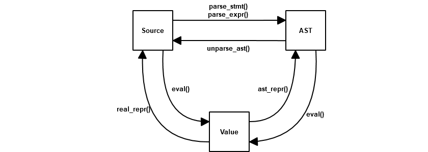
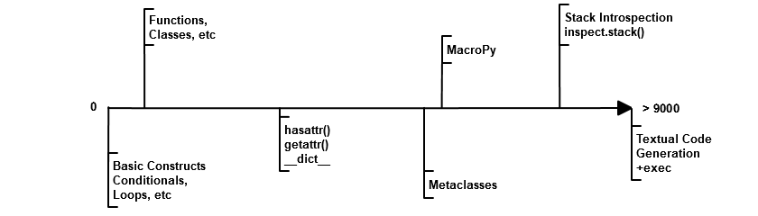

.. -*- coding: utf-8 -*-

================
 MacroPy 1.0.4a
================

.. image:: https://travis-ci.org/azazel75/macropy.svg?branch=master
  :target: https://travis-ci.org/azazel75/macropy

.. warning::

   This is a customized version of the original `MacroPy`__
   updated to work only with Python 3.5+. PyPy is untested.

   As of now the original tests pass but some language features have
   yet to be implemented.

   What follows is an ongoing update of the original documentation and
   therefore may be inaccurate.

__ https://github.com/lihaoyi/macropy

**MacroPy** is an implementation of `Syntactic Macros
<http://tinyurl.com/cmlls8v>`_ in the `Python Programming Language
<http://python.org/>`_. MacroPy provides a mechanism for user-defined
functions (macros) to perform transformations on the `abstract syntax
tree <http://en.wikipedia.org/wiki/Abstract_syntax_tree>`_ (AST) of a
Python program at *import time*. This is an easy way to enhance the
semantics of a Python program in ways which are otherwise impossible,
for example providing an extremely concise way of declaring classes:

.. code:: python

  >>> import macropy.consol)e
  0=[]=====> MacroPy Enabled <=====[]=0
  >>> from macropy.case_classes import macros, case

  >>> @case
  class Point(x, y): pass

  >>> p = Point(1, 2)
  >>> print p.x
  1
  >>> print p
  Point(1, 2)


Try it out in the REPL, it should just work! You can also see the
`docs/examples/using_macros <docs/examples/using_macros>`_ folder for
a minimal example of using MacroPy's existing macros.

MacroPy has been used to implement features such as:

- `Case Classes`_, easy Algebraic Data Types from Scala, and `Enums`_;
- `Quick Lambdas`_ from Scala and Groovy, and the `Lazy`_ and
  `Interned`_ utility macros;
- `String Interpolation`_, a common feature in many programming
  languages;
- `Tracing`_ and `Smart Asserts`_, and `show_expanded`_, to help in
  the debugging effort;
- `MacroPEG`_, Parser Combinators inspired by Scala's,


As well as a number of more experimental macros such as:

- `Pattern Matching`_ from the Functional Programming world
- `Tail-call Optimization`_, preventing unnecessary stack overflows
- `PINQ to SQLAlchemy`_, a shameless clone of LINQ to SQL from C#
- `Pyxl Snippets`_, XML interpolation within your Python code
- `JS Snippets`_, cross compiling snippets of Python into equivalent
  Javascript


Browse the `high-level overview`_, or look at the `Tutorials`_ will go
into greater detail and walk you through

.. _high-level overview: `30,000ft Overview`_

- `Writing your first macro`_
- `Making your macros hygienic`_
- `Exporting your Expanded Code`_

The `Reference`_ documentation contains information about:

- `Data Model`_, what MacroPy gives you to work with;
- `Arguments`_, what a macro is given to do its work;
- `Quasiquotes`_, a quick way to manipulate AST fragments;
- `Walkers`_, a flexible tool to traverse and transform ASTs;
- `Hygiene`_, how to avoid weird bugs related to name
  collisions and shadowing;
- `Expansion Failures`_, what happens when a
  macro doesn't work;
- `Expansion Order`_ of nested macros with a file;
- `Line Numbers`_, or what errors you get when
  something goes wrong;


Or just skip ahead to the `Discussion`_ and `Conclusion
<#macropy-bringing-macros-to-python>`_. We're open to contributions,
so send us your ideas/questions/issues/pull-requests and we'll do our
best to accommodate you! You can ask questions on the `Google Group
<https://groups.google.com/forum/#!forum/macropy>`_ or file bugs on
thee `issues <issues>`_ page. See the `changelist <changes.md>`_ to
see what's changed recently.

MacroPy is tested to run on `CPython 2.7.2
<http://en.wikipedia.org/wiki/CPython>`_ and `PyPy 2.0
<http://pypy.org/>`_, but with only partial support for Python 3.X
(You'll need to clone the `python3 branch
<https://github.com/lihaoyi/macropy/tree/python3>`_ yourself) and no
support for `Jython <http://www.jython.org/>`_. MacroPy is also
available on `PyPI <https://pypi.python.org/pypi/MacroPy>`_, using a
standard `setup.py <setup.py>`_ to manage dependencies, installation
and other things. Check out `this gist
<https://gist.github.com/lihaoyi/5577609>`_ for an example of setting
it up on a clean system.

30,000ft Overview
=================

Macro functions are defined in three

.. code:: python

  from macropy.core.macros import *

  macros = Macros()

  @macros.expr
  def my_expr_macro(tree, **kw):
      ...
      return new_tree

  @macros.block
  def my_block_macro(tree, **kw):
      ...
      return new_tree

  @macros.decorator
  def my_decorator_macro(tree, **kw):
      ...
      return new_tree


The line ``macros = Macros()`` is required to mark the file as providing
macros, and the ``macros`` object then provides the methods ``expr``,
``block`` and ``decorator`` which can be used to decorate functions to
mark them out as the three different kinds of macros.

Each macro function is passed a ``tree``.  The ``tree`` is an ``AST`` object,
the sort provided by Python's `ast module
<http://docs.python.org/2/library/ast.html>`_. The macro is able to do
whatever transformations it wants, and it returns a modified (or even
an entirely new) ``AST`` object which MacroPy will use to replace the
original macro invocation. The macro also takes ``**kw``, which contains
`other useful things`_ which you may need.

These three types of macros are called via:

.. code:: python

  from my_macro_module import macros, my_expr_macro, my_block_macro, my_decorator_macro

  val = my_expr_macro[...]

  with my_block_macro:
      ...

  @my_decorator_macro
  class X():
      ...


Where the line ``from my_macro_module import macros, ...`` is necessary
to tell MacroPy which macros these module relies on. Multiple things
can be imported from each module, but ``macros`` must come first for
macros from that module to be used.

Any time any of these syntactic forms is seen, if a matching macro
exists in any of the packages from which ``macros`` has been imported
from, the abstract syntax tree captured by these forms (the ``...`` in
the code above) is given to the respective macro to handle. The tree
(new, modified, or even unchanged) which the macro returns is
substituted into the original code in-place.

MacroPy intercepts the module-loading workflow, via the functionality
provided by `PEP 302: New Import Hooks
<http://www.python.org/dev/peps/pep-0302/>`_. The workflow is roughly:

- Intercept an import
- Parse the contents of the file into an AST
- Walk the AST and expand any macros that it finds
- Compile the modified AST and resume loading it as a module

.. image:: docs/media/Workflow.png

Note that this means **you cannot use macros in a file that is run
directly**, as it will not be passed through the import hooks. Hence
the minimum viable setup is:

.. code:: python

  # run.py
  import macropy.activate     # sets up macro import hooks
  import other                # imports other.py and passes it through import hooks


  # my_macro_module.py
  from macropy.core.macros import *

  macros = Macros()

  ... define some macros ...


  # other.py
  from macropy.macros.my_macro_module import macros, ...

  ... do stuff with macros ...


Where you run ```run.py`` instead of ``other.py```.  For the same
reason, you cannot directly run MacroPy's own unit tests directly
using ``unittest`` or ``nose``: you need to run the
`macropy/run_tests.py <macropy/run_tests.py>`_ file from the project
root for the tests to run. See the `runnable, self-contained no-op
example <docs/examples/nop>`_ to see exactly what this looks like, or
the example for `using existing macros <docs/examples/using_macros>`_.

MacroPy also works in the REPL:

.. code:: python

  PS C:\Dropbox\Workspace\macropy> python
  Python 2.7 (r27:82525, Jul  4 2010, 07:43:08) [MSC v.1500 64 bit (AMD64)] on win32
  Type "help", "copyright", "credits" or "license" for more information.
  >>> import macropy.console
  0=[]=====> MacroPy Enabled <=====[]=0
  >>> from macropy.tracing import macros, trace
  >>> trace[[x*2 for x in range(3)]]
  range(3) -> [0, 1, 2]
  x*2 -> 0
  x*2 -> 2
  x*2 -> 4
  x*2 for x in range(3) -> [0, 2, 4]
  [0, 2, 4]


This example demonstrates the usage of the `Tracing`_
macro, which helps trace the evaluation of a Python
expression. Although support for the REPL is still experimental, most
examples on this page will work when copied and pasted into the REPL
verbatim. MacroPy also works in the PyPy and `IPython
<http://ipython.org/>`_ REPLs.

Demo Macros
===========

Below are a few example uses of macros that are implemented (together
with test cases!) in the `macropy <macropy>`_ and
`macropy/experimental <macropy/experimental>`_ folders. These are also
the ideal places to go look at to learn to write your own macros:
check out the source code of the `String Interpolation`__ or `Quick
Lambda`__ macros for some small (<30 lines), self contained
examples. Their `unit <macropy/test/string_interp.py>`_ `tests
<macropy/test/quick_lambda.py>`_ demonstrate how these macros are
used.

Feel free to open up a REPL and try out the examples in the console;
simply ``import macropy.console``, and most of the examples should work
right off the bat when pasted in! Macros in this section are also
relatively stable and well-tested, and you can rely on them to work
and not to suddenly change from version to version (as much as can be
said for a two-month-old project!).

__ macropy/string_interp.py
__ macropy/quick_lambda.py

Case Classes
------------

.. code:: python

  from macropy.case_classes import macros, case

  @case
  class Point(x, y): pass

  p = Point(1, 2)

  print str(p) # Point(1, 2)
  print p.x    # 1
  print p.y    # 2
  print Point(1, 2) == Point(1, 2) # True
  x, y = p
  print x, y   # 1 2


`Case classes`__ are
classes with extra goodies:

- Nice ``__str__`` and ``__repr__`` methods autogenerated
- An autogenerated constructor
- Structural equality by default
- A copy-constructor, for creating modified copies of instances
- A ``__slots__`` declaration, to improve memory efficiency
- An ``__iter__`` method, to allow destructuring

__ http://www.codecommit.com/blog/scala/case-classes-are-cool

The reasoning being that although you may sometimes want complex,
custom-built classes with custom features and fancy inheritance, very
(very!) often you want a simple class with a constructor, pretty
``__str__`` and ``__repr__`` methods, and structural equality which
doesn't inherit from anything. Case classes provide you just that,
with an extremely concise declaration:

.. code:: python

  @case
  class Point(x, y): pass


As opposed to the equivalent class, written manually:

.. code:: python

  class Point(object):
      __slots__ = ['x', 'y']
      def __init__(self, x, y):
          self.x = x
          self.y = y

      def __str__(self):
          return "Point(" + self.x + ", " + self.y + ")"

      def __repr__(self):
          return self.__str__()

      def __eq__(self, other):
          return self.x == other.x and self.y == other.y

      def __ne__(self, other):
          return not self.__eq__(other)

      def __iter__(self, other):
          yield self.x
          yield self.y


Whew, what a lot of boilerplate! This is clearly a pain to do, error
prone to deal with, and violates `DRY
<http://en.wikipedia.org/wiki/Don't_repeat_yourself>`_ in an extreme
way: each member of the class (``x`` and ``y`` in this case) has to be
repeated *8 times*, with loads and loads of boilerplate. It is also
*buggy*, and will fail at runtime when the above example is run, so
see if you can spot the bug in it! Given how tedious writing all this
code is, it is no surprise that most python classes do not come with
proper ``__str__`` or useful ``__eq__`` functions! With case classes,
there is no excuse, since all this will be generated for you.

Case classes also provide a convenient *copy-constructor*, which
creates a shallow copy of the case class with modified fields, leaving
the original unchanged:

.. code:: python

  a = Point(1, 2)
  b = a.copy(x = 3)
  print a # Point(1, 2)
  print b # Point(3, 2)


Like any other class, a case class may contain methods in its body:

.. code:: python

  @case
  class Point(x, y):
      def length(self):
          return (self.x ** 2 + self.y ** 2) ** 0.5

  print Point(3, 4).length() # 5.0


or class variables. The only restrictions are that only the
``__init__``, ``__repr__``, ``___str__``, ``__eq__`` methods will be set for
you, and the initializer/class body and inheritance are treated
specially.

Body Initializer
~~~~~~~~~~~~~~~~

.. code:: python

  @case
  class Point(x, y):
      self.length = (self.x**2 + self.y**2) ** 0.5

  print Point(3, 4).length # 5


Case classes allow you to add initialization logic by simply placing
the initialization statements in the class body: any statements within
the class body which are not class or function definitions are taken
to be part of the initializer, and so you can use e.g. the ``self``
variable to set instance members just like in a normal ``__init__``
method.

Any additional assignments to ``self.XXX`` in the body of the class
scope are detected and the ``XXX`` added to the class' ``__slots__``
declaration, meaning you generally don't need to worry about
``__slots__`` limiting what you can do with the class. As long as there
is an assignment to the member somewhere in the class' body, it will
be added to slots. This means if you try to set a member of an
instance via ``my_thing.XXX = ...`` somewhere else, but aren't setting
it anywhere in the class' body, it will fail with an
AttributeError. The solution to this is to simply add a ``self.XXX =
None`` in the class body, which will get picked up and added to its
``__slots__``.

The body initializer also means you cannot set *class* members on a
case class, as it any bare assignments ``XXX = ...`` will get treated as
a local variable assignment in the scope of the class' ``__init__``
method. This is one of several `limitations`_.

Defaults, ``*args`` and ``**kwargs``
~~~~~~~~~~~~~~~~~~~~~~~~~~~~~~~~~~~~

Case classes also provide a syntax for default values:

.. code:: python

  @case
  class Point(x | 0, y | 0):
      pass

  print str(Point(y = 5)) # Point(0, 5)


For ``*args``:

.. code:: python

  @case
  class PointArgs(x, y, [rest]):
      pass

  print PointArgs(3, 4, 5, 6, 7).rest # (5, 6, 7)


and ``**kwargs``:

.. code:: python

  @case
  class PointKwargs(x, y, {rest}):
      pass

  print PointKwargs(1, 2, a=1, b=2).rest # {'a': 1, 'b': 2}


All these behave as you would expect, and can be combined in all the
normal ways. The strange syntax (rather than the normal ``x=0``, ``*args``
or ``**kwargs``) is due to limitations in the Python 2.7 grammar, which
are removed in Python 3.3.

Inheritance
~~~~~~~~~~~

Instead of manual inheritance, inheritance for case classes is defined
by _nesting_, as shown below:

.. code:: python

  @case
  class List():
      def __len__(self):
          return 0

      def __iter__(self):
          return iter([])

      class Nil:
          pass

      class Cons(head, tail):
          def __len__(self):
              return 1 + len(self.tail)

          def __iter__(self):
              current = self

              while len(current) > 0:
                  yield current.head
                  current = current.tail

  print isinstance(List.Cons(None, None), List)    # True
  print isinstance(List.Nil(), List)               # True

  my_list = List.Cons(1, List.Cons(2, List.Cons(3, List.Nil())))
  empty_list = List.Nil()

  print my_list.head              # 1
  print my_list.tail              # List.Cons(2, List.Cons(3, List.Nil()))
  print len(my_list)              # 5
  print sum(iter(my_list))        # 6
  print sum(iter(empty_list))     # 0


This is an implementation of a singly linked `cons list
<http://en.wikipedia.org/wiki/Cons>`_, providing both ``head`` and
``tail`` (`LISP <https://en.wikipedia.org/wiki/LISP>`_'s ``car`` and
``cdr``) as well as the ability to get the ``len``  or ``iter`` for the list.

As the classes ``Nil`` are ``Cons`` are nested within ``List``, both of them
get transformed into case classes which inherit from it. This nesting
can go arbitrarily deep.

Overriding
~~~~~~~~~~

Except for the ``__init__`` method, all the methods provided by case
classes are inherited from ``macropy.case_classes.CaseClass``, and can
thus be overriden, with the overriden method still accessible via the
normal mechanisms:

.. code:: python

  from macropy.case_classes import CaseClass

  @case
  class Point(x, y):
      def __str__(self):
          return "mooo " + CaseClass.__str__(self)

  print Point(1, 2) # mooo Point(1, 2)


The ``__init__`` method is generated, not inherited. For the common
case of adding additional initialization steps after the assignment of
arguments to members, you can use the `body initializer`_ described
above. However, if you want a different modification (e.g. changing
the number of arguments) you can achieve this by manually defining
your own ``__init__`` method:

.. code:: python

  @case
  class Point(x, y):
      def __init__(self, value):
          self.x = value
          self.y = value


  print Point(1) # mooo Point(1, 1)


You cannot access the replaced ``__init__`` method, due to fact that
it's generated, not inherited. Nevertheless, this provides additional
flexibility in the case where you really need it.

.. _not afforded:

Limitations
~~~~~~~~~~~

Case classes provide a lot of functionality to the user, but come with
their own set of limitations:

- **No class members**: a consequence of the `body initializer`_, you
  cannot assign class variables in the body of a class via the ``foo =
  ...`` syntax. However, ``@static`` and ``@class`` methods work fine;

- **Restricted inheritance**: A case class only inherits from
  ``macropy.case_classes.CaseClass``, as well as any case classes it is
  lexically scoped within. There is no way to express any other form
  of inheritance;

- **__slots__**: case classes get ``__slots__`` declarations by
  default. Thus you cannot assign ad-hoc members which are not defined
  in the class signature (the ``class Point(x, y)`` line).

-------------------------------------------------------------------------------

Overall, case classes are similar to Python's `namedtuple`__, but far
more flexible (methods, inheritance, etc.), and provides the
programmer with a much better experience (e.g. no
arguments-as-space-separated-string definition). Unlike ``namedtuple``
, they are flexible enough that they can be used to replace a large
fraction of user defined classes, rather than being relegated to niche
uses.

In the cases where you desperately need additional flexibility `not
afforded`_ by case classes, you can always fall back on normal Python
classes and do without the case class functionality.

__ http://docs.python.org/2/library/collections.html#collections.namedtuple

Enums
-----

.. code:: python

  from macropy.case_classes import macros, enum

  @enum
  class Direction:
      North, South, East, West

  print Direction(name="North") # Direction.North

  print Direction.South.name    # South

  print Direction(id=2)         # Direction.East

  print Direction.West.id       # 3

  print Direction.North.next    # Direction.South
  print Direction.West.prev     # Direction.East

  print Direction.all
  # [Direction.North, Direction.East, Direction.South, Direction.West]


MacroPy also provides an implementation of `Enumerations
<http://en.wikipedia.org/wiki/Enumerated_type>`_, heavily inspired by
the `Java implementation
<http://docs.oracle.com/javase/tutorial/java/javaOO/enum.html>`_ and
built upon `Case Classes`_. These are effectively case
classes with

- A fixed set of instances;
- Auto-generated ``name``,  ``id``, ``next`` and ``prev`` fields;
- Auto-generated ``all``  list, which enumerates all instances;

- A ``__new__`` method that retrieves an existing instance, rather than
  creating new ones

Note that instances of an Enum cannot be created manually: calls such
as ``Direction(name="North")`` or ``Direction(id=2)`` attempt to retrieve
an existing Enum with that property, throwing an exception if there is
none. This means that reference equality is always used to compare
instances of Enums for equality, allowing for much faster equality
checks than if you had used `Case Classes`_.

Definition of Instances
~~~~~~~~~~~~~~~~~~~~~~~

The instances of an Enum can be declared on a single line, as in the
example above, or they can be declared on subsequent lines:

.. code:: python

  @enum
  class Direction:
      North
      South
      East
      West


or in a mix of the two styles:

.. code:: python

  @enum
  class Direction:
      North, South
      East, West


The basic rule here is that the body of an Enum can only contain bare
names, function calls (show below), tuples of these, or function defs:
no other statements are allowed. In turn the bare names and function
calls are turned into instances of the Enum, while function defs
(shown later) are turned into their methods. This also means that
unlike `Case Classes`_, Enums cannot have a `body initializer`_.

Complex Enums
~~~~~~~~~~~~~

.. code:: python

  @enum
  class Direction(alignment, continents):
      North("Vertical", ["Northrend"])
      East("Horizontal", ["Azeroth", "Khaz Modan", "Lordaeron"])
      South("Vertical", ["Pandaria"])
      West("Horizontal", ["Kalimdor"])

      @property
      def opposite(self):
          return Direction(id=(self.id + 2) % 4)

      def padded_name(self, n):
          return ("<" * n) + self.name + (">" * n)

  # members
  print Direction.North.alignment # Vertical
  print Direction.East.continent  # ["Azeroth", "Khaz Modan", "Lordaeron"]

  # properties
  print Direction.North.opposite  # Direction.South

  # methods
  print Direction.South.padded_name(2) # <<South>>


Enums are not limited to the auto-generated members shown above. Apart
from the fact that Enums have no constructor, and no body initializer,
they can contain fields, methods and properties just like `Case
Classes <#case-classes>`_ do. This allows you to associate arbitrary
data with each instance of the Enum, and have them perform as
full-fledged objects rather than fancy integers.

.. _quicklambda:

Quick Lambdas
-------------

.. code:: python

  from macropy.quick_lambda import macros, f, _

  print map(f[_ + 1], [1, 2, 3])    # [2, 3, 4]
  print reduce(f[_ * _], [1, 2, 3]) # 6


Macropy provides a syntax for lambda expressions similar to Scala's
`anonymous functions
<http://www.codecommit.com/blog/scala/quick-explanation-of-scalas-syntax>`_. Essentially,
the transformation is:

.. code:: python

  f[_ * _] -> lambda a, b: a * b


where the underscores get replaced by identifiers, which are then set
to be the parameters of the enclosing ``lambda``.  This works too:

.. code:: python

  print map(f[_.split(' ')[0]], ["i am cow", "hear me moo"])
  # ['i', 'hear']


Quick Lambdas can be also used as a concise, lightweight,
more-readable substitute for ``functools.partial``

.. code:: python

  from macropy.quick_lambda import macros, f
  basetwo = f[int(_, base=2)]
  print basetwo('10010') # 18


is equivalent to

.. code:: python

  import functools
  basetwo = functools.partial(int, base=2)
  print basetwo('10010') # 18


Quick Lambdas can also be used entirely without the `_` placeholders,
in which case they wrap the target in a no argument ``lambda: ...``
thunk:

.. code:: python

  from random import random
  thunk = f[random() * 2 + 3]
  print thunk() # 4.522011062548173
  print thunk() # 4.894243231792029


This cuts out reduces the number of characters needed to make a thunk
from 7 (using ``lambda``) to 2, making it much easier to use thunks to
do things like emulating `by name parameters
<http://locrianmode.blogspot.com/2011/07/scala-by-name-parameter.html>`_. The
implementation of quicklambda is about `30 lines of code
<macropy/quick_lambda.py>`_, and is worth a look if you want to see
how a simple (but extremely useful!) macro can be written.

Lazy
----

.. code:: python

  from macropy.quick_lambda import macros, lazy

  # count how many times expensive_func runs
  count = [0]
  def expensive_func():
      count[0] += 1

  thunk = lazy[expensive_func()]

  print count[0] # 0

  thunk()
  print count[0] # 1
  thunk()
  print count[0] # 1

The ``lazy`` macro is used to create a memoizing thunk. Wrapping an
expression with ``lazy`` creates a thunk which needs to be applied
(e.g. ``thunk()``) in order to get the value of the expression out. This
macro then memoizes the result of that expression, such that
subsequent calls to ``thunk()`` will not cause re-computation.

This macro is a tradeoff between declaring the value as a variable:

.. code:: python

  var = expensive_func()


Which evaluates exactly once, even when not used, and declaring it as
a function:

.. code:: python

  thunk = lambda: expensive_func()


Which no longer evaluates when not used, but now re-evaluates every
single time. With ``lazy``, you get an expression that evaluates 0 or 1
times. This way, you don't have to pay the cost of computation if it
is not used at all (the problems with variables) or the cost of
needlessly evaluating it more than once (the problem with lambdas).

This is handy to have if you know how to compute an expression in a
local scope that may be used repeatedly later. It may depend on many
local variables, for example, which would be inconvenient to pass
along to the point at which you know whether the computation is
necessary. This way, you can simply "compute" the lazy value and pass
it along, just as you would compute the value normally, but with the
benefit of only-if-necessary evaluation.

Interned
--------

.. code:: python

  from macropy.quick_lambda import macros, interned

  # count how many times expensive_func runs
  count = [0]
  def expensive_func():
      count[0] += 1

  def func():
      return interned[expensive_func()]

  print count[0] # 0
  func()
  print count[0] # 1
  func()
  print count[0] # 1


The ``interned`` macro is similar to the `Lazy`_ macro in that
the code within the ``interned[...]`` block is wrapped in a thunk and
evaluated at most once. Unlike the ``lazy`` macro, however, ``interned``
does not created a memoizing thunk that you can pass around your
program; instead, the memoization is done on a *per-use-site* basis.

As you can see in the example above, although ``func`` is called
repeatedly, the ``expensive_func()`` call within the ``interned`` block is
only ever evaluated once. This is handy in that it gives you a
mechanism for memoizing a particular computation without worrying
about finding a place to store the memoized values. It's just memoized
globally (often what you want) while being scoped locally, which
avoids polluting the global namespace with names only relevant to a
single function (also often what you want).

String Interpolation
--------------------

.. code:: python

  from macropy.string_interp import macros, s

  a, b = 1, 2
  print s["{a} apple and {b} bananas"]
  # 1 apple and 2 bananas


Unlike the normal string interpolation in Python, MacroPy's string
interpolation allows the programmer to specify the variables to be
interpolated _inline_ inside the string. The macro ``s``  then takes the
string literal

.. code:: python

  "{a} apple and {b} bananas"


and expands it into the expression:

.. code:: python

  "%s apple and %s bananas" % (a, b)


Which is evaluated at run-time in the local scope, using whatever the
values ``a``  and `b` happen to hold at the time. The contents of the
``{...}`` can be any arbitrary python expression, and is not limited to
variable names:

.. code:: python

  from macropy.string_interp import macros, s
  A = 10
  B = 5
  print s["{A} + {B} = {A + B}"]
  # 10 + 5 = 15


Tracing
-------

.. code:: python

  from macropy.tracing import macros, log
  log[1 + 2]
  # 1 + 2 -> 3
  # 3

  log["omg" * 3]
  # ('omg' * 3) -> 'omgomgomg'
  # 'omgomgomg'


Tracing allows you to easily see what is happening inside your
code. Many a time programmers have written code like

.. code:: python

  print "value", value
  print "sqrt(x)", sqrt(x)


and the ``log()`` macro (shown above) helps remove this duplication by
automatically expanding ``log(1 + 2)`` into ``wrap("(1 + 2)", (1 +
2))``. ``wrap`` then evaluates the expression, printing out the source
code and final value of the computation.

In addition to simple logging, MacroPy provides the ``trace()``
macro. This macro not only logs the source and result of the given
expression, but also the source and result of all sub-expressions
nested within it:

.. code:: python

  from macropy.tracing import macros, trace
  trace[[len(x)*3 for x in ["omg", "wtf", "b" * 2 + "q", "lo" * 3 + "l"]]]
  # "b" * 2 -> 'bb'
  # "b" * 2 + "q" -> 'bbq'
  # "lo" * 3 -> 'lololo'
  # "lo" * 3 + "l" -> 'lololol'
  # ["omg", "wtf", "b" * 2 + "q", "lo" * 3 + "l"] -> ['omg', 'wtf', 'bbq', 'lololol']
  # len(x) -> 3
  # len(x)*3 -> 9
  # len(x) -> 3
  # len(x)*3 -> 9
  # len(x) -> 3
  # len(x)*3 -> 9
  # len(x) -> 7
  # len(x)*3 -> 21
  # [len(x)*3 for x in ["omg", "wtf", "b" * 2 + "q", "lo" * 3 + "l"]] -> [9, 9, 9, 21]
  # [9, 9, 9, 21]


As you can see, ``trace`` logs the source and value of all
sub-expressions that get evaluated in the course of evaluating the
list comprehension.

Lastly, ``trace`` can be used as a block macro:


.. code:: python

  from macropy.tracing import macros, trace
  with trace:
      sum = 0
      for i in range(0, 5):
          sum = sum + 5

  # sum = 0
  # for i in range(0, 5):
  #     sum = sum + 5
  # range(0, 5) -> [0, 1, 2, 3, 4]
  # sum = sum + 5
  # sum + 5 -> 5
  # sum = sum + 5
  # sum + 5 -> 10
  # sum = sum + 5
  # sum + 5 -> 15
  # sum = sum + 5
  # sum + 5 -> 20
  # sum = sum + 5
  # sum + 5 -> 25


Used this way, ``trace`` will print out the source code of every
*statement* that gets executed, in addition to tracing the evaluation
of any expressions within those statements.

Apart from simply printing out the traces, you can also redirect the
traces wherever you want by having a ``log()`` function in scope:

.. code:: python

  result = []

  def log(x):
      result.append(x)


The tracer uses whatever ``log()`` function it finds, falling back on
printing only if none exists. Instead of printing, this ``log()``
function appends the traces to a list, and is used in our unit tests.

We think that tracing is an extremely useful macro. For debugging what
is happening, for teaching newbies how evaluation of expressions
works, or for a myriad of other purposes, it is a powerful tool. The
fact that it can be written as a `100 line macro
<macropy/tracing.py>`_ is a bonus.

Smart Asserts
~~~~~~~~~~~~~


.. code:: python

  from macropy.tracing import macros, require
  require[3**2 + 4**2 != 5**2]
  # Traceback (most recent call last):
  #   File "<console>", line 1, in <module>
  #   File "macropy.tracing.py", line 67, in handle
  #     raise AssertionError("Require Failed\n" + "\n".join(out))
  # AssertionError: Require Failed
  # 3**2 -> 9
  # 4**2 -> 16
  # 3**2 + 4**2 -> 25
  # 5**2 -> 25
  # 3**2 + 4**2 != 5**2 -> False


MacroPy provides a variant on the ``assert`` keyword called
``require``. Like ``assert``, ``require`` throws an ``AssertionError`` if the
condition is false.

Unlike ``assert``, ``require`` automatically tells you what code failed
the condition, and traces all the sub-expressions within the code so
you can more easily see what went wrong. Pretty handy!

``require`` can also be used in block form:

.. code:: python

  from macropy.tracing import macros, require
  with require:
      a > 5
      a * b == 20
      a < 2

  # Traceback (most recent call last):
  #   File "<console>", line 4, in <module>
  #   File "macropy.tracing.py", line 67, in handle
  #     raise AssertionError("Require Failed\n" + "\n".join(out))
  # AssertionError: Require Failed
  # a < 2 -> False


This requires every statement in the block to be a boolean
expression. Each expression will then be wrapped in a ``require()``,
throwing an ``AssertionError`` with a nice trace when a condition fails.

show_expanded
~~~~~~~~~~~~~

.. code:: python

  from ast import *
  from macropy.core.quotes import macros, q
  from macropy.tracing import macros, show_expanded

  print show_expanded[q[1 + 2]]
  # BinOp(left=Num(n=1), op=Add(), right=Num(n=2))


``show_expanded`` is a macro which is similar to the simple ``log`` macro
shown above, but prints out what the wrapped code looks like *after
all macros have been expanded*. This makes it extremely useful for
debugging macros, where you need to figure out exactly what your code
is being expanded into. ``show_expanded`` also works in block form:

.. code:: python

  from macropy.core.quotes import macros, q
  from macropy.tracing import macros, show_expanded, trace

  with show_expanded:
      a = 1
      b = q[1 + 2]
      with q as code:
          print a

  # a = 1
  # b = BinOp(left=Num(n=1), op=Add(), right=Num(n=2))
  # code = [Print(dest=None, values=[Name(id='a', ctx=Load())], nl=True)]


These examples show how the `quasiquote`_ macro works:
it turns an expression or block of code into its AST, assigning the
AST to a variable at runtime for other code to use.

Here is a less trivial example: `case classes`_ are a
pretty useful macro, which saves us the hassle of writing a pile of
boilerplate ourselves. By using ``show_expanded``, we can see what the
case class definition expands into:

.. code:: python

  from macropy.case_classes import macros, case
  from macropy.tracing import macros, show_expanded

  with show_expanded:
      @case
      class Point(x, y):
          pass

  # class Point(CaseClass):
  #     def __init__(self, x, y):
  #         self.x = x
  #         self.y = y
  #         pass
  #     _fields = ['x', 'y']
  #     _varargs = None
  #     _kwargs = None
  #     __slots__ = ['x', 'y']


Pretty neat!

---------------------------------

If you want to write your own custom logging, tracing or debugging
macros, take a look at the `100 lines of code`__ that implements all
the functionality shown above.

__ macropy/tracing.py

MacroPEG Parser Combinators
---------------------------

.. code:: python

  from macropy.peg import macros, peg
  from macropy.quick_lambda import macros, f

  """
  PEG grammar from Wikipedia

  Op      <- "+" / "-" / "*" / "/"
  Value   <- [0-9]+ / '(' Expr ')'
  Expr <- Value (Op Value)*

  Simplified to remove operator precedence
  """
  def reduce_chain(chain):
      chain = list(reversed(chain))
      o_dict = {
          "+": f[_+_],
          "-": f[_-_],
          "*": f[_*_],
          "/": f[_/_],
      }
      while len(chain) > 1:
          a, [o, b] = chain.pop(), chain.pop()
          chain.append(o_dict`o <a, b>`_)
      return chain[0]

  with peg:
      op = '+' | '-' | '*' | '/'
      value = '[0-9]+'.r // int | ('(', expr, ')') // f[_[1]]
      expr = (value, (op, value).rep is rest) >> reduce_chain([value] + rest)

  print expr.parse("123")             # 123
  print expr.parse("((123))")         # 123
  print expr.parse("(123+456+789)")   # 1368
  print expr.parse("(6/2)")           # 3
  print expr.parse("(1+2+3)+2")       # 8
  print expr.parse("(((((((11)))))+22+33)*(4+5+((6))))/12*(17+5)")    # 1804


MacroPEG is an implementation of `Parser Combinators`__, an approach
to building recursive descent parsers, when the task is too large for
`regexes <http://en.wikipedia.org/wiki/Regex>`_ but yet too small for
the heavy-duty `parser generators
<http://en.wikipedia.org/wiki/Comparison_of_parser_generators>`_. MacroPEG
is inspired by Scala's `parser combinator library
<http://www.suryasuravarapu.com/2011/04/scala-parser-combinators-win.html>`_,
utilizing python macros to make the syntax as clean as possible .

__ http://en.wikipedia.org/wiki/Parser_combinator

The above example describes a simple parser for arithmetic
expressions, which roughly follows the `PEG
<http://en.wikipedia.org/wiki/Parsing_expression_grammar>`_
syntax. Note how that in the example, the bulk of the code goes into
the loop that reduces sequences of numbers and operators to a single
number, rather than the recursive-descent parser itself!

Any assignment (``xxx = ...``) within a ``with peg:`` block is transformed
into a ``Parser``. A ``Parser`` comes with a ``.parse(input)`` method, which
returns the parsed result if parsing succeeds and raises a
``ParseError`` in the case of failure. The ``ParseError`` contains a nice
human-readable string detailing exactly what went wrong.

.. code:: python

  json_exp.parse('{"omg": "123", "wtf": , "bbq": "789"}')
    # ParseError: index: 22, line: 1, col: 23
    # json_exp / obj / pair / json_exp
    # {"omg": "123", "wtf": , "bbq": "789"}
    #                       ^
    # expected: (obj | array | string | true | false | null | number)


In addition to ``.parse(input)``, a Parser also contains:

- ``parse_string(input)``, a more program-friendly version of ``parse``
  that returns successes and failures as boxed values (with metadata);

- a ``parse_partial(input)`` method, which is identical to
  ``parse_string``, but does not require the entire ``input`` to be
  consumed, as long as some prefix of the ``input`` string matches. The
  ``remaining`` attribute of the ```Success```  indicates how far into the
  ``input`` string parsing proceeded.

Basic Combinators
~~~~~~~~~~~~~~~~~

Parsers are generally built up from a few common building blocks. The
fundamental atoms include:

- string literals like ``'+'`` match the input to their literal value
  (e.g. '+') and return it as the parse result, or fails if it does
  not match;

- regexes like ``'[0-9]+'.r`` match the regex to the input if possible,
  and return it;
- tuples like ``('(', expr, ')')`` match each of the elements within
  sequentially, and return a list containing the result of each
  element. It fails if any of its elements fails;
- parsers separated by ``|``, for example ``'+' | '-' | '*' | '/'``,
  attempt to match each of the alternatives from left to right, and
  return the result of the first success;
- parsers separated by ``&``, for example ``'[1234]'.r & '[3456]'.r``,
  require both parsers succeed, and return the result of the left
  side;
- ``parser.rep`` attempts to match the ``parser`` 0 or more times,
  returning a list of the results from each successful match;
- ``-parser`` negates the ``parser``: if ``parser`` succeeded (with any
  result), ``-parser`` fails. If ``parser`` failed, ``-parser`` succeeds
  with the result ``""``, the empty string.

Apart from the fundamental atoms, MacroPeg also provides combinators
which are not strictly necessary, but are nevertheless generally
useful in almost all parsing scenarios:

- ``parser.rep1`` attempts to match the ``parser`` 1 or more times,
  returning a list of the results from each successful match. If
  ``parser`` does not succeed at least once, ``parser.rep1``
  fails. Equivalent to ``parser.rep & parser``;
- ``parser.rep_with(other)`` and ``parser.rep1_with(other)`` repeat the
  ``parser`` 0 or more or 1 or more times respectively, except now the
  ``other`` parser is invoked in between invocations of ``parser``. The
  output of ``other`` is discarded, and these methods return a list of
  values similar to ``rep`` and ``rep1``;
- ``parser * n`` attempts to match the ``parser`` exactly ``n`` times,
  returning a list of length ``n`` containing the result of the ``n``
  successes. Fails otherwise;
- ``parser.opt`` matches the ``parser`` 0 or 1 times, returning either
  ``[]`` or ``[result]`` where ``result`` is the result of
  ``parser``. Equivalent to ``parser | Succeed([])``;
- ``parser.join`` takes a parser that returns a list of strings
  (e.g. tuples, ``rep``, ``rep1``, etc.) and returns a parser which
  returns the strings concatenated together. Equivalent to ``parser //
  "".join``.

Transforming values using ``//``
~~~~~~~~~~~~~~~~~~~~~~~~~~~~~~~~

So far, these building blocks all return the raw parse tree: all the
things like whitespace, curly-braces, etc. will still be there. Often,
you want to take a parser e.g.

.. code:: python

  from macropy.peg import macros, peg
  with peg:
      num = '[0-9]+'.r

  print repr(num.parse("123")) # '123'


which returns a string of digits, and convert it into a parser which
returns an ``int`` with the value of that string. This can be done with
the ``//`` operator:

.. code:: python

  from macropy.peg import macros, peg
  with peg:
      num = '[0-9]+'.r // int

  print repr(num.parse("123")) # 123


The ``//`` operator takes a function which will be used to transform the
result of the parser: in this case, it is the function ``int``, which
transforms the returned string into an integer.

Another example is:

.. code:: python

  with peg:
      laugh = 'lol'
      laughs1 = 'lol'.rep1
      laughs2 = laughs1 // "".join

  print laughs1.parse("lollollol") # ['lol', 'lol', 'lol]
  print laughs2.parse("lollollol") # lollollol


Where the function ``"".join"`` is used to join together the list of
results from ``laughs1`` into a single string. As mentioned earlier,
``laughs2`` can also be written as ``laughs2 = laughs1.join``.

Binding Values using ``>>``
~~~~~~~~~~~~~~~~~~~~~~~~~~~

Although ``//`` is sufficient for everyone's needs, it is not always
convenient. In the example above, a ``value`` is defined to be:

.. code:: python

  value = ... | ('(', expr, ')') // (lambda x: x[1])


As you can see, we need to strip off the unwanted parentheses from the
parse tree, and we do it with a ``lambda`` that only selects the middle
element, which is the result of the ``expr`` parser. An alternate way of
representing this is:

.. code:: python

  value = ... | ('(', expr is result, ')') >> result


In this case, the ``is`` keyword is used to bind the result of ``expr`` to
the name ``result``. The ``>>`` ("bind") operator can be used to transform
the parser by only operating on the *bound* results within the
parser. ``>>`` also binds the results of *other parsers* to their
name. Hence the above is equivalent to:

.. code:: python

  value = ... | ('(', expr, ')') >> expr


The ``expr`` on the left refers to the parser named ``expr`` in the ``with
peg:`` block, while the ``expr`` on the right refers to the *results of
the parser named* ``expr`` *in case of a successful parse*. The parser on
the left has to be outside any ``is`` expressions for it to be captured
as above, and so in this line in the above parser:

.. code:: python

  expr = (value, (op, value).rep is rest) >> reduce_chain([value] + rest)


The result of the first ``value`` on the left of ``>>`` is bound to
``value`` on the right, while the second ``value`` is not because it is
within an ``is`` expression bound to the name ``rest``. If you have
multiple parsers of the same name on the left of ``>>``, you can always
refer to each individual explicitly using the ``is`` syntax shown above.

Althought this seems like a lot of shuffling variables around and
meddling with the local scope and semantics, it goes a long way to
keep things neat. For example, a JSON parser may define an array to
be:

.. code:: python

  with peg:
      ...
      # parses an array and extracts the relevant bits into a Python list
       array = ('[', (json_exp, (',', json_exp).rep), space.opt, ']') // (lambda x: [x[1][0]] + [y[1] for y in x[1][1]])
      ...


Where the huge ``lambda`` is necessary to pull out the necessary parts
of the parse tree into a Python list. Although it works, it's
difficult to write correctly and equally difficult to read. Using the
``is`` operator, this can be rewritten as:

.. code:: python

  array = ('[', json_exp is first, (',', json_exp is rest).rep, space.opt, ']') >> [first] + rest


Now, it is clear that we are only interested in the result of the two
``json_exp`` parsers. The ``>>`` operator allows us to use those, while
the rest of the parse tree (``[``, ``,``, etc.) are conveniently
discarded. Of course, one could go a step further and us the
``rep_with`` method which is intended for exactly this purpose:

.. code:: python

  array = ('[', json_exp.rep_with(',') >> arr, space.opt, ']') >> arr


Which arguably looks the cleanest of all!

Cut
~~~

.. code:: python

  from macropy.peg import macros, peg, cut
  with peg:
      expr1 = ("1", "2", "3") | ("1", "b", "c")
      expr2 = ("1", cut, "2", "3") | ("1", "b", "c")

  print expr1.parse("1bc") # ['1', 'b', 'c']
  print expr2.parse("1bc")
  # ParseError: index: 1, line: 1, col: 2
  # expr2
  # 1bc
  #  ^
  # expected: '2'


``cut`` is a special token used in a sequence of parsers, which commits
the parsing to the current sequence. As you can see above, without
``cut``, the left alternative fails and the parsing then attempts the
right alternative, which succeeds. In contrast, with ``expr2``, the
parser is committed to the left alternative once it reaches the ``cut``
(after successfully parsing "1") and thus when the left alternative
fails, the right alternative is not tried and the entire ``parse``
fails.

The purpose of ``cut`` is two-fold:

Increasing performance by removing unnecessary backtracking
+++++++++++++++++++++++++++++++++++++++++++++++++++++++++++

Using JSON as an example: if your parser sees a `{`, begins parsing a
JSON object, but some time later it fails, it does not need to both
backtracking and attempting to parse an Array (``[...``), or a String
(``"...``), or a Number. None of those could possibly succeed, so
cutting the backtracking and failing fast prevents this unnecessary
computation.

Better error reporting.
+++++++++++++++++++++++

For example, if you try to parse the JSON String;

.. code:: javascript

  {        : "failed lol"}


if your JSON parser looks like:

.. code:: python

  with peg:
      ...
      json_exp = obj | array | string | num | true | false | null
      obj = '{', pair.rep_with(",") , space, '}'
      ...


Without ``cut``, the only information you could gain from attempting to
parse that is something like:

.. code::

  index: 0, line: 1, col: 1
  json_exp
  {    : 1, "wtf": 12.4123}
  ^
  expected: (obj | array | string | true | false | null | number)


On the other hand, using a ``cut`` inside the ``object`` parser
immediately after parsing the first ``{``, we could provide a much more
specific error:

.. code::

  index: 5, line: 1, col: 6
  json_exp / obj
  {    : 1, "wtf": 12.4123}
       ^
  expected: '}'


In the first case, after failing to parse ``obj``, the ``json_exp`` parser
goes on to try all the other alternatives. After all to them fail to
parse, it only knows that trying to parse ``json_exp`` starting from
character 0 doesn't work; it has no way of knowing that the
alternative that was "supposed" to work was ``obj``.

In the second case, ``cut`` is inserted inside the ``object`` parser, something like:

.. code:: python

  obj = '{', cut, pair.rep_with(",") , space, '}'


Once the first ``{`` is parsed, the parser is committed to that
alternative. Thus, when it fails to parse ``string``, it knows it cannot
backtrack and can immediately end the parsing. It can now give a much
more specific source location (character 10) as well as better
information on what it was trying to parse (``json / object / string``)

Full Example
~~~~~~~~~~~~


MacroPEG is not limited to toy problems, like the arithmetic
expression parser above. Below is the full source of a JSON parser,
provided in the `unit tests`__:

__ macropy/experimental/test/peg.py

.. code:: python

  from macropy.peg import macros, peg, cut
  from macropy.quick_lambda import macros, f

  def decode(x):
      x = x.decode('unicode-escape')
      try:
          return str(x)
      except:
          return x

  escape_map = {
      '"': '"',
      '/': '/',
      '\\': '\\',
      'b': '\b',
      'f': '\f',
      'n': '\n',
      'r': '\r',
      't': '\t'
  }

  """
  Sample JSON PEG grammar for reference, shameless stolen from
  https://github.com/azatoth/PanPG/blob/master/grammars/JSON.peg

  JSON <- S? ( Object / Array / String / True / False / Null / Number ) S?

  Object <- "{"
               ( String ":" JSON ( "," String ":" JSON )*
               / S? )
           "}"

  Array <- "["
              ( JSON ( "," JSON )*
              / S? )
          "]"

  String <- S? ["] ( [^ " \ U+0000-U+001F ] / Escape )* ["] S?

  Escape <- [\] ( [ " / \ b f n r t ] / UnicodeEscape )

  UnicodeEscape <- "u" [0-9A-Fa-f]{4}

  True <- "true"
  False <- "false"
  Null <- "null"

  Number <- Minus? IntegralPart fractPart? expPart?

  Minus <- "-"
  IntegralPart <- "0" / [1-9] [0-9]*
  fractPart <- "." [0-9]+
  expPart <- ( "e" / "E" ) ( "+" / "-" )? [0-9]+
  S <- [ U+0009 U+000A U+000D U+0020 ]+
  """
  with peg:
          json_doc = (space, (obj | array), space) // f[_[1]]
          json_exp = (space, (obj | array | string | true | false | null | number), space) // f[_[1]]

          pair = (string is k, space, ':', cut, json_exp is v) >> (k, v)
          obj = ('{', cut, pair.rep_with(",") // dict, space, '}') // f[_[1]]
          array = ('[', cut, json_exp.rep_with(","), space, ']') // f[_[1]]

          string = (space, '"', (r'[^"\\\t\n]'.r | escape | unicode_escape).rep.join is body, '"') >> "".join(body)
          escape = ('\\', ('"' | '/' | '\\' | 'b' | 'f' | 'n' | 'r' | 't') // escape_map.get) // f[_[1]]
          unicode_escape = ('\\', 'u', ('[0-9A-Fa-f]'.r * 4).join).join // decode

          true = 'true' >> True
          false = 'false' >> False
          null = 'null' >> None

          number = decimal | integer
          integer = ('-'.opt, integral).join // int
          decimal = ('-'.opt, integral, ((fract, exp).join) | fract | exp).join // float

          integral = '0' | '[1-9][0-9]*'.r
          fract = ('.', '[0-9]+'.r).join
          exp = (('e' | 'E'), ('+' | '-').opt, "[0-9]+".r).join

          space = '\s*'.r


Testing it out with some input, we can see it works as we would
expect:

.. code:: python

  test_string = """
      {
          "firstName": "John",
          "lastName": "Smith",
          "age": 25,
          "address": {
              "streetAddress": "21 2nd Street",
              "city": "New York",
              "state": "NY",
              "postalCode": 10021
          },
          "phoneNumbers": [
              {
                  "type": "home",
                  "number": "212 555-1234"
              },
              {
                  "type": "fax",
                  "number": "646 555-4567"
              }
          ]
      }
  """

  import json
  print json_exp.parse(test_string) == json.loads(test_string)
  # True

  import pprint
  pp = pprint.PrettyPrinter(4)
  pp.pprint(json_exp.parse(test_string))
  #{   'address': {   'city': 'New York',
  #                   'postalCode': 10021.0,
  #                   'state': 'NY',
  #                   'streetAddress': '21 2nd Street'},
  #    'age': 25.0,
  #    'firstName': 'John',
  #    'lastName': 'Smith',
  #    'phoneNumbers': [   {   'number': '212 555-1234', 'type': 'home'},
  #                        {   'number': '646 555-4567', 'type': 'fax'}]}


You can see that ``json_exp`` parses that non-trivial blob of JSON into
an identical structure as Python's in-built ``json`` package. In
addition, the source of the parser looks almost identical to the PEG
grammar it is parsing, shown above. This parser makes good use of the
``//`` and ``>>`` operators to transform the output of its individual
components, as well as using ``rep_with`` method to easily parse the
comma-separated JSON objects and arrays. This parser is almost fully
compliant with the `test cases <http://www.json.org/JSON_checker/>`_
found on the `json.org <www.json.org>`_ website (it doesn't fail, as
it should, for deeply-nested JSON arrays), which isn't bad for 50
lines of code.

As mentioned earlier, MacroPEG parsers also provide exceptions with
nice error messages when the ``parse`` method fails, and the JSON parser
is no exception. Even when parsing larger documents, the error
reporting rises to the challenge:

.. code:: python

  json_exp.parse("""
      {
          "firstName": "John",
          "lastName": "Smith",
          "age": 25,
          "address": {
              "streetAddress": "21 2nd Street",
              "city": "New York",
              "state": "NY",
              "postalCode": 10021
          },
          "phoneNumbers": [
              {
                  "type": "home",
                  "number": "212 555-1234"
              },
              {
                  "type": "fax",
                  "number": 646 555-4567"
              }
          ]
      }
  """)

  # ParseError: index: 456, line: 19, col: 31
  # json_exp / obj / pair / json_exp / array / json_exp / obj
  #                 "number": 646 555-4567"
  #                               ^
  # expected: '}'


Pretty neat! This full example of a JSON parser demonstrates what
MacroPEG provides to a programmer trying to write a parser:

- Excellent error reporting
- Simple AST processing, on the fly
- An extremely clear PEG-like syntax
- Extremely concise parser definitions

Not bad for an implementation that spans `350 lines of code
<macropy/peg.py>`_!

Experimental Macros
===================

Below are a selection of macros which demonstrate the cooler aspects
of MacroPy, but are not currently stable or tested enough that we
would be comfortable using them in production code.

Pattern Matching
----------------

.. code:: python

  from macropy.case_classes import macros, case
  from macropy.experimental.pattern import macros, switch

  @case
  class Nil():
      pass

  @case
  class Cons(x, xs):
      pass

  def reduce(op, my_list):
      with switch(my_list):
          if Cons(x, Nil()):
              return x
          elif Cons(x, xs):
              return op(x, reduce(op, xs))

  print reduce(lambda a, b: a + b, Cons(1, Cons(2, Cons(4, Nil()))))
  # 7
  print reduce(lambda a, b: a * b, Cons(1, Cons(3, Cons(5, Nil()))))
  # 15
  print reduce(Nil(), lambda a, b: a * b)
  # None


Pattern matching allows you to quickly check a variable against a
series of possibilities, sort of like a `switch statement
<http://en.wikipedia.org/wiki/Switch_statement>`_ on steroids. Unlike
a switch statement in other languages (Java, C++), the ``switch`` macro
allows you to match against the *inside* of a pattern: in this case,
not just that ``my_list`` is a ``Cons`` object, but also that the ``xs``
member of ``my_list`` is a ``Nil`` object. This can be nested arbitrarily
deep, and allows you to easily check if a data-structure has a
particular "shape" that you are expecting. Out of convenience, the
value of the leaf nodes in the pattern are bound to local variables,
so you can immediately use ``x`` and ``xs`` inside the body of the
if-statement without having to extract it (again) from ``my_list``.

The ``reduce`` function above (an simple, cons-list specific
implementation of `reduce
<http://docs.python.org/2/library/functions.html#reduce>`_) takes a
Cons list (defined using `case classes`_) and quickly
checks if it either a ``Cons`` with a ``Nil`` right hand side, or a ``Cons``
with something else. This is converted (roughly) into:

.. code:: python

  def reduce(my_list, op):
      if isinstance(my_list, Cons) and isinstance(my_list.xs, Nil):
          x = my_list.x
          return x
      elif isinstance(my_list, Cons):
          x = my_list.x
          xs = my_list.xs
          return op(x, reduce(xs, op))


Which is significantly messier to write, with all the ``isinstance``
checks cluttering up the code and having to manually extract the
values you need from ``my_list`` after the ``isinstance`` checks have
passed.

Another common use case for pattern matching is working with tree
structures, like ASTs. This macro is a stylized version of the MacroPy
code to identify ``with ...:`` macros:

.. code:: python

  def expand_macros(node):
      with switch(node):
          if With(Name(name)):
              return handle(name)
          else:
              return node


Compare it to the same code written manually using if-elses:

.. code:: python

  def expand_macros(node):
      if isinstance(node, With) \
              and isinstance(node.context_expr, Name) \
              and node.context_expr.id in macros.block_registry:
          name = node.context_expr.id

              return handle(name)
      else:
          return node


As you can see, matching against ``With(Name(name))`` is a quick and
easy way of checking that the value in ``node`` matches a particular
shape, and is much less cumbersome than a series of conditionals.

It is also possible to use pattern matching outside of a ``switch``, by
using the ``patterns`` macro. Within ``patterns``, any left shift (``<<``)
statement attempts to match the value on the right to the pattern on
the left, allowing nested matches and binding variables as described
earlier.

.. code:: python

  from macropy.experimental.pattern import macros, patterns
  from macropy.case_classes import macros, case

  @case
  class Rect(p1, p2): pass

  @case
  class Line(p1, p2): pass

  @case
  class Point(x, y): pass

  def area(rect):
      with patterns:
          Rect(Point(x1, y1), Point(x2, y2)) << rect
          return (x2 - x1) * (y2 - y1)

  print area(Rect(Point(1, 1), Point(3, 3))) # 4


If the match fails, a ``PatternMatchException`` will be thrown.

.. code:: python

  print area(Line(Point(1, 1), Point(3, 3)))
  # macropy.macros.pattern.PatternMatchException: Matchee should be of type <class 'scratch.Rect'>


Class Matching Details
~~~~~~~~~~~~~~~~~~~~~~

When you pattern match ``Foo(x, y)`` against a value ``Foo(3, 4)``, what
happens behind the scenes is that the constructor of ``Foo`` is
inspected.  We may find that it takes two parameters ``a`` and ``b``.  We
assume that the constructor then contains lines like: ```python self.a
= a self.b = b ``` We don't have access to the source of Foo, so this
is the best we can do.  Then ``Foo(x, y) << Foo(3, 4)`` is transformed
roughly into

.. code:: python

  tmp = Foo(3,4)
  tmp_matcher = ClassMatcher(Foo, [NameMatcher('x'), NameMatcher('y')])
  tmp_matcher.match(tmp)
  x = tmp_matcher.getVar('x')
  y = tmp_matcher.getVar('y')


In some cases, constructors will not be so standard.  In this case, we
can use keyword arguments to pattern match against named fields.  For
example, an equivalent to the above which doesn't rely on the specific
implementation of th constructor is ``Foo(a=x, b=y) << Foo(3, 4)``.
Here the semantics are that the field ``a`` is extracted from ``Foo(3,4)``
to be matched against the simple pattern ``x``.  We could also replace
``x`` with a more complex pattern, as in ``Foo(a=Bar(z), b=y) <<
Foo(Bar(2), 4)``.


Custom Patterns
~~~~~~~~~~~~~~~

It is also possible to completely override the way in which a pattern
is matched by defining an ``__unapply__`` class method of the class
which you are pattern matching.  The 'class' need not actually be the
type of the matched object, as in the following example borrowed from
Scala.  The ``__unapply__`` method takes as arguments the value being
matched, as well as a list of keywords.

The method should then return a tuple of a list of positional matches,
and a dictionary of the keyword matches.

.. code:: python

  class Twice(object):
      @classmethod
      def __unapply__(clazz, x, kw_keys):
          if not isinstance(x, int) or x % 2 != 0:
              raise PatternMatchException()
          else:
              return ([x/2], {})

  with patterns:
      Twice(n) << 8
      print n     # 4


Tail-call Optimization
----------------------

.. code:: python

  from macropy.experimental.tco import macros, tco

  @tco
  def fact(n, acc=0):
      if n == 0:
          return acc
      else:
          return fact(n-1, n * acc)

  print fact(10000)  # doesn't stack overflow
  # 28462596809170545189064132121198688901...


`Tail-call Optimization`__ is a technique which will optimize away the
stack usage of functions calls which are in a tail
position. Intuitively, if a function **A** calls another function
**B**, but does not do any computation after **B** returns (i.e. **A**
returns immediately when **B** returns), we don't need to keep around
the `stack frame <http://en.wikipedia.org/wiki/Call_stack>`_ for
**A**, which is normally used to store where to resume the computation
after **B** returns. By optimizing this, we can prevent really deep
tail-recursive functions (like the factorial example above) from
`overflowing the stack
<http://en.wikipedia.org/wiki/Stack_overflow>`_.

__ http://en.wikipedia.org/wiki/Tail_call


The ``@tco`` decorator macro doesn't just work with tail-recursive
functions, but also with any generic tail-calls (of either a function
or a method) via `trampolining`_, such this mutually
recursive example:

.. code:: python

  from macropy.experimental.tco import macros, tco

  class Example(object):

      @tco
      def odd(n):
      if n < 0:
          return odd(-n)
      elif n == 0:
          return False
      else:
          return even(n - 1)

      @tco
      def even(n):
          if n == 0:
              return True
          else:
              return odd(n-1)

  print Example().even(100000)  # No stack overflow
  # True


Note that both ``odd`` and ``even`` were both decorated with ``@tco``.  All
functions which would ordinarily use too many stack frames must be
decorated.

Trampolining
~~~~~~~~~~~~

How is tail recursion implemented?  The idea is that if a function ``f``
would return the result of a recursive call to some function ``g``, it
could instead return ``g``, along with whatever arguments it would have
passed to ``g``.  Then instead of running ``f`` directly, we run
``trampoline(f)``, which will call ``f``, call the result of ``f``, call the
result of that ``f``, etc. until finally some call returns an actual
value.

A transformed (and simplified) version of the tail-call optimized
factorial would look like this

.. code:: python

  def trampoline_decorator(func):
      def trampolined(*args):
          if not in_trampoline():
              return trampoline(func, args)
          return func(*args)
      return trampolined

  def trampoline(func, args):
    _enter_trampoline()
    while True:
          result = func(*args)
          with patterns:
              if ('macropy-tco-call', func, args) << result:
                  pass
              else:
                  if ignoring:
                      _exit_trampoline()
                      return None
                  else:
                      _exit_trampoline()
                      return result

  @trampoline_decorator
  def fact(n, acc):
      if n == 0:
          return 1
      else:
          return ('macropy-tco-call', fact, [n-1, n * acc])

.. _pinq:

PINQ to SQLAlchemy
------------------

.. code:: python

  from macropy.experimental.pinq import macros, sql, query, generate_schema
  from sqlalchemy import *

  # prepare database
  engine = create_engine("sqlite://")
  for line in open("macropy/experimental/test/world.sql").read().split(";"):
      engine.execute(line.strip())

  db = generate_schema(engine)

  # Countries in Europe with a GNP per Capita greater than the UK
  results = query[(
      x.name for x in db.country
      if x.gnp / x.population > (
          y.gnp / y.population for y in db.country
          if y.name == 'United Kingdom'
      ).as_scalar()
      if (x.continent == 'Europe')
  )]
  for line in results: print line
  # (u'Austria',)
  # (u'Belgium',)
  # (u'Switzerland',)
  # (u'Germany',)
  # (u'Denmark',)
  # (u'Finland',)
  # (u'France',)
  # (u'Iceland',)
  # (u'Liechtenstein',)
  # (u'Luxembourg',)
  # (u'Netherlands',)
  # (u'Norway',)
  # (u'Sweden',)


PINQ (Python INtegrated Query) to SQLAlchemy is inspired by `C#'s LINQ
to SQL <http://msdn.microsoft.com/en-us/library/bb386976.aspx>`_. In
short, code used to manipulate lists is lifted into an AST which is
then cross-compiled into a snippet of `SQL
<http://en.wikipedia.org/wiki/SQL>`_. In this case, it is the ``query``
macro which does this lifting and cross-compilation. Instead of
performing the manipulation locally on some data structure, the
compiled query is sent to a remote database to be performed there.

This allows you to write queries to a database in the same way you
would write queries on in-memory lists, which is really very nice. The
translation is a relatively thin layer of over the `SQLAlchemy Query
Language <http://docs.sqlalchemy.org/ru/latest/core/tutorial.html>`_,
which does the heavy lifting of converting the query into a raw SQL
string:. If we start with a simple query:

.. code:: python

  # Countries with a land area greater than 10 million square kilometers
  print query[((x.name, x.surface_area) for x in db.country if x.surface_area > 10000000)\
  # [(u'Antarctica', Decimal('13120000.0000000000')), (u'Russian Federation', Decimal('17075400.0000000000'))]


This is to the equivalent SQLAlchemy query:

.. code:: python

  print engine.execute(select([country.c.name, country.c.surface_area]).where(country.c.surface_area > 10000000)).fetchall()


To verify that PINQ is actually cross-compiling the python to SQL, and
not simply requesting everything and performing the manipulation
locally, we can use the ``sql`` macro to perform the lifting of the
query without executing it:

.. code:: python

  query_string = sql[((x.name, x.surface_area) for x in db.country if x.surface_area > 10000000)]
  print type(query_string)
  # <class 'sqlalchemy.sql.expression.Select'>
  print query_string
  # SELECT country_1.name, country_1.surface_area
  # FROM country AS country_1
  # WHERE country_1.surface_area > ?

As we can see, PINQ converts the python list-comprehension into a
SQLAlchemy ``Select``, which when stringified becomes a valid SQL
string. The ``?``  are there because SQLAlchemy uses `parametrized
queries`__, and
doesn't interpolate values into the query itself.

__ http://en.wikipedia.org/wiki/Prepared_statement

Consider a less trivial example: we want to find all countries in
europe who have a `GNP per Capita`__ greater than
the United Kingdom. This is the SQLAlchemy code to do so:

__ http://en.wikipedia.org/wiki/Gross_national_product

.. code:: python

  query = select([db.country.c.name]).where(
      db.country.c.gnp / db.country.c.population > select(
          [(db.country.c.gnp / db.country.c.population)]
      ).where(
              db.country.c.name == 'United Kingdom'
      ).as_scalar()
  ).where(
      db.country.c.continent == 'Europe'
  )


The SQLAlchemy query looks pretty odd, for somebody who knows python
but isn't familiar with the library. This is because SQLAlchemy cannot
"lift" Python code into an AST to manipulate, and instead have to
construct the AST manually using python objects. Although it works
pretty well, the syntax and semantics of the queries is completely
different from python.

Already we are bumping into edge cases: the ``db.country`` in the nested
query is referred to the same way as the ``db.country`` in the outer
query, although they are clearly different! One may wonder, what if,
in the inner query, we wish to refer to the outer query's values?
Naturally, there will be solutions to all of these requirements. In
the end, SQLAlchemy ends up effectively creating its own mini
programming language, with its own concept of scoping, name binding,
etc., basically duplicating what Python already has but with messier
syntax and subtly different semantics.

In the equivalent PINQ code, the scoping of which ``db.country`` you are
referring to is much more explicit, and in general the semantics are
identical to a typical python comprehension:

.. code:: python

  query = sql[(
      x.name for x in db.country
      if x.gnp / x.population > (
          y.gnp / y.population for y in db.country
          if y.name == 'United Kingdom'
      ).as_scalar()
      if (x.continent == 'Europe')
  )]


As we can see, rather than mysteriously referring to the ``db.country``
all over the place, we clearly bind it in two places: once to the
variable ``x`` in the outer query, once to the variable ``y`` in the inner
query. Overall, we make use of Python's syntax and semantics (scoping,
names, etc.) rather than having to re-invent our own, which is a big
win for anybody who already understands Python.

Executing either of these will give us the same answer:

.. code:: python

  print query
  # SELECT country_1.name
  # FROM country AS country_1
  # WHERE country_1.gnp / country_1.population > (SELECT country_2.gnp / country_2.population AS anon_1
  # FROM country AS country_2
  # WHERE country_2.name = ?) AND country_1.continent = ?

  results = engine.execute(query).fetchall()

  for line in results: print line
  # (u'Austria',)
  # (u'Belgium',)
  # (u'Switzerland',)
  # (u'Germany',)
  # (u'Denmark',)
  # (u'Finland',)
  # (u'France',)
  # (u'Iceland',)
  # (u'Liechtenstein',)
  # (u'Luxembourg',)
  # (u'Netherlands',)
  # (u'Norway',)
  # (u'Sweden',)


Although PINQ does not support the vast capabilities of the SQL
language, it supports a useful subset, like ``JOINs``:

.. code:: python

  # The number of cities in all of Asia
  query = sql[(
      func.count(t.name)
      for c in db.country
      for t in db.city
      if t.country_code == c.code
      if c.continent == 'Asia'
  )]
  print query
  # SELECT count(city_1.name) AS count_1
  # FROM city AS city_1, country AS country_1
  # WHERE city_1.country_code = country_1.code AND country_1.continent = ?

  result = engine.execute(query).fetchall()

  print result
  [(1766,)]


As well as ``ORDER BY``, with ``LIMIT`` and ``OFFSET``:

.. code:: python

  # The top 10 largest countries in the world by population
  query = sql[
      (c.name for c in db.country)
      .order_by(c.population.desc())
      .limit(10)
  ]

  print query
  # SELECT country_1.name
  # FROM country AS country_1
  # ORDER BY country_1.population DESC
  # LIMIT ? OFFSET ?

  res = engine.execute(query).fetchall()
  for line in res:
      print line
  # (u'China',)
  # (u'India',)
  # (u'United States',)
  # (u'Indonesia',)
  # (u'Brazil',)
  # (u'Pakistan',)
  # (u'Russian Federation',)
  # (u'Bangladesh',)
  # (u'Japan',)
  # (u'Nigeria',)


In general, apart from the translation of generator expressions (and
their guards) into ``SELECT`` an ``WHERE`` clauses, the rest of the
functionality of SQL (like the ``.order_by()``, ``.limit()``,
etc. functions shown above) is accessed as in the `SQLAlchemy
Expression Language`__. See the `unit tests`__ for a fuller set of
examples of what PINQ can do, or browse the SQLAlchemy docs mentioned
earlier.

__ http://docs.sqlalchemy.org/ru/latest/core/tutorial.html#ordering-grouping-limiting-offset-ing
__ https://github.com/lihaoyi/macropy/blob/master/macropy/experimental/test/pinq.py

PINQ demonstrates how easy it is to use macros to lift python snippets
into an AST and cross-compile it into another language, and how nice
the syntax and semantics can be for these embedded DSLs. PINQ's entire
implementation comprises about `100 lines of code`__, which really
isn't much considering how much it does for you!

__ https://github.com/lihaoyi/macropy/blob/master/macropy/experimental/pinq.py

Pyxl Snippets
-------------

.. code:: python

  from macropy.experimental.pyxl_strings import macros, p

  image_name = "bolton.png"
  image = p['']

  text = "Michael Bolton"
  block = p['<div>{image}{text}</div>']

  element_list = [image, text]
  block2 = p['<div>{element_list}</div>']

  assert block2.to_string() == '<div>Michael Bolton</div>'


`Pyxl <https://github.com/dropbox/pyxl>`_ is a way of integrating XML
markup into your Python code. By default, pyxl hooks into the python
UTF-8 decoder in order to transform the source files at load-time. In
this, it is similar to how MacroPy transforms source files at import
time.

A major difference is that Pyxl by default leaves the HTML fragments
directly in the source code:

.. code:: python

  image_name = "bolton.png"
  image = 

  text = "Michael Bolton"
  block = <div>{image}{text}</div>

  element_list = [image, text]
  block2 = <div>{element_list}</div>


While the MacroPy version requires each snippet to be wrapped in a
``p["..."]`` wrapper. This [three-line-of-code macro
<https://github.com/lihaoyi/macropy/blob/master/macropy/experimental/pyxl_strings.py>`_
simply uses pyxl as a macro (operating on string literals), rather
than hooking into the UTF-8 decoder. In general, this demonstrates how
easy it is to integrate an "external" DSL into your python program:
MacroPy handles all the intricacies of hooking into the interpreter
and intercepting the import workflow. The programmer simply needs to
provide the source-to-source transformation, which in this case was
already provided.


JS Snippets
------------

.. code:: python

  from macropy.experimental.javascript import macros, pyjs

  code, javascript = pyjs[lambda x: x > 5 and x % 2 == 0]

  print code
  # <function <lambda> at 0x0000000003515C18>

  print javascript
  # $def(function $_lambda(x) {return $b.bool($b.do_ops(x, '>', 5)) && $b.bool($b.do_ops($b.mod(x, 2), '==', 0));})

  for i in range(10):
      print i, code(i), self.exec_js_func(javascript, i)

  # 0 False False
  # 1 False False
  # 2 False False
  # 3 False False
  # 4 False False
  # 5 False False
  # 6 True True
  # 7 False False
  # 8 True True
  # 9 False False


JS Snippets is a macro that allows you to mark out sections of code
that will be cross-compiled into Javascript at module-import
time. This cross-compilation is done using `PJs
<https://github.com/jabapyth/PJs>`_. The generated Javascript is
incredibly ugly, thanks in part to the fact that in order to preserve
semantics in the presence of features that Python has but JS lacks
(such as `operator overloading
<http://en.wikipedia.org/wiki/Operator_overloading>`_), basically
every operation in the Javascript program has to be virtualized into a
method call. The translation also breaks down around the fringes of
the Python language.

Nonetheless, as the above example demonstrates, the translation is
entirely acceptable for simple logic. Furthermore, with macros,
marking out snippets of Python code to be translated is as simple as
prepending either:

- ``js``, if you only want to translate the enclosed python expression
  into Javascript;
- ``pyjs``, if you want both the original expression as well as the
  translated Javascript (as in the example above). This is given to
  you as a tuple.

``pyjs`` is particularly interesting, because it brings us closer to the
holy grail of HTML form validation: having validation run on both
client and server, but still only be expressed once in the code
base. With ``pyjs``, it is trivial to fork an expression (such as the
conditional function shown above) into both Python and Javascript
representations. Rather than using a `menagerie
<https://developer.mozilla.org/en-US/docs/Web/Guide/HTML/Forms/Data_form_validation?redirectlocale=en-US&redirectslug=HTML%2FForms%2FData_form_validation>`_
of `ad-hoc <http://docs.jquery.com/Plugins/validation>`_ `mini-DSLs
<https://code.google.com/p/validation-js/wiki/MainDocumentation>`_,
this lets you write your validation logic in plain Python.

As mentioned earlier, JS Snippets isn't very robust, and the
translation is full of bugs:

.. code:: python

  # these work
  assert self.exec_js(js[10]) == 10
  assert self.exec_js(js["i am a cow"]) == "i am a cow"

  # these literals are buggy, and it seems to be PJs' fault
  # ??? all the results seem to turn into strings ???
  assert self.exec_js(js(3.14)) == 3.14 # Fails
  assert self.exec_js(js[[1, 2, 'lol']]) == [1, 2, 'lol'] # Fails
  assert self.exec_js(js[{"moo": 2, "cow": 1}]) == {"moo": 2, "cow": 1} # Fails

  # set literals aren't supported so this throws an exception at macro-expansion time
  # self.exec_js(js[{1, 2, 'lol'}])


Even as such basic things fail, other, more complex operations work
flawlessly:

.. code:: python

  script = js[sum([x for x in range(10) if x > 5])]
  print script
  # "$b.sum($b.listcomp([$b.range(10)], function (x) {return x;}, [function (x) { return $b.do_ops(x, '>', 5); }]))"
  print self.exec_js(script)
  # 30


Here's another, less trivial use case: cross compiling a function that
searches for the `prime numbers
<http://en.wikipedia.org/wiki/Prime_number>`_:

.. code:: python

  code, javascript = pyjs[lambda n: [
      x for x in range(n)
      if 0 == len([
          y for y in range(2, x-2)
          if x % y == 0
      ])
  ]]
  print code(20)
  # [0, 1, 2, 3, 4, 5, 7, 11, 13, 17, 19]
  print self.exec_js_func(javascript, 20)
  # [0, 1, 2, 3, 4, 5, 7, 11, 13, 17, 19]


These examples are all taken from the `unit tests`__.

__ macropy/experimental/test/js_snippets.py

Like `PINQ to SQLAlchemy`_, JS Snippets
demonstrates the feasibility, the convenience of being able to mark
out sections of code using macros, to be cross-compiled into another
language and run remotely. Unlike PINQ, which is built on top of the
stable, battle-tested and widely used `SQLAlchemy
<http://www.sqlalchemy.org/>`_ library, JS Snippets is built on top of
an relatively unknown and untested Python to Javascript
cross-compiler, making it far from production ready.

Nonetheless, JS Snippets demonstrate the promise of being able to
cross-compile bits of your program and being able to run parts of it
remotely. The code which performs the integration of PJs and MacroPy
is a scant `25 lines long <macropy/experimental/js_snippets.py>`_. If
a better, more robust Python to Javascript cross-compiler appears some
day, we could easily make use of it to provide a stable, seamless
developer experience of sharing code between (web) client and server.


Tutorials
=========

This section contains step-by-step guides to get started writing
macros using MacroPy:

- `Writing your First Macro`_
- `Making your Macros Hygienic`_
- `Exporting your Expanded Code`_

These tutorials proceed through a serious of examples, many of which
are available in the `docs/examples <docs/examples>`_ folder.

Writing Your First Macro
------------------------

Now, we will go through what it takes to write a simple macro, with
some `self-contained examples <docs/examples>`_. To begin, we need
three files

.. code:: python

  # run.py
  # target.py
  # macro_module.py


As mentioned earlier, you cannot use macros in the ``__main__`` module
(the file that is run directly via ``python ...``) and so we have to
have a separate bootstrap file ``run.py``, which will then execute
``target.py``, which contains macros defined in ``macro_module.py``.

.. code:: python

  # run.py
  import macropy.activate
  import target

  # target.py
  # macro_module.py


Now, let us define a simple macro, in ``macro_module.py``

.. code:: python

  # run.py
  import macropy.activate
  import target

  # target.py
  from macro_module import macros, expand

  print expand[1 + 2]

  # macro_module.py
  from macropy.core.macros import *

  macros = Macros()

  @macros.expr
  def expand(tree, **kw):
      return tree


Running this via ``python run.py`` will print out ``3``; so far
``expand`` is a simple no-op macro which does not do anything to the
tree it is passed. This macro is provided in `docs/examples/nop
<docs/examples/nop>`_ if you want to try it out yourself; you can run
it from the project root via ``python docs/examples/nop/run.py``.

The ``**kw`` serves to absorb all the arguments that you did not
declare. The macro can take additional arguments (not shown here)
which are documented `below`_. Alternately, you can just
take a look at what the ``**kw`` dictionary contains.

The line

.. code:: python

  from macro_module import macros, expand


is necessary to declare what macros you want to use (``expand``), and
which module you want to load them from ``macro_module``. Aliases also
work:

.. code:: python

  from macro_module import macros, expand as my_alias

  print my_alias[1 + 2]


As you would expect. Import-alls like ``from macro_module import *`` do
**not** work.

At this point, you can print out the tree you are receiving in various
forms just to see what you're getting:

.. code:: python

  # macro_module.py
  from macropy.core.macros import *

  macros = Macros()

  @macros.expr
  def expand(tree, **kw):
      print tree
      print real_repr(tree)
      print unparse(tree)
      return tree


When you run ``run.py``, This will print:

.. code:: python

  <_ast.BinOp object at 0x000000000206BBA8>
  BinOp(Num(1), Add(), Num(2))
  (1 + 2)
  3


As you can see, the AST objects don't have a nice ``__repr__``, but if
you use the MacroPy function ``real_repr``, you can see that it's made
up of the ``BinOp`` ``Add``, which adds the two numbers ``Num(1)`` and
``Num(2)``. Unparsing it into source code via ``unparse()`` gives you
``(1 + 2)``, which is what you would expect. In general, unparsing may
not give you exactly the original source, but it should be
semantically equivalent when executed. Take a look at the `data model
<#data-model>`_ to see what other useful conversions are available.

One (trivial) example of modifying the tree is to simply replace it
with a new tree, for example:

.. code:: python

  # macro_module.py
  from macropy.core.macros import *

  macros = Macros()

  @macros.expr
  def expand(tree, **kw):
      return Num(100)

When you run ``run.py``, this will print out ``100``, as the original
expression ``(1 + 2)`` has now been replaced by the literal
``100``. Another possible operation would be to replace the expression
with the square of itself:

.. code:: python

  # macro_module.py
  from macropy.core.macros import *

  macros = Macros()

  @macros.expr
  def expand(tree, **kw):
      newtree = BinOp(tree, Mult(), tree)
      return newtree


This will replace the expression ``(1 + 2)`` with ``((1 + 2) * (1 + 2))``;
you can similarly print out newtree via ``unparse`` or ``real_repr`` to
see what's it looks like.

Using Quasiquotes
~~~~~~~~~~~~~~~~~

Building up the new tree manually, as shown above, works reasonably
well. However, it can quickly get unwieldy, particularly for more
complex expressions. For example, let's say we wanted to make ``expand``
wrap the expression ``(1 + 2)`` in a lambda, like ``lambda x: x *
(1 + 2) + 10``. Ignore, for the moment, that this transform is not very
useful. Doing so manually is quite a pain:

.. code:: python

  # macro_module.py
  from macropy.core.macros import *

  macros = Macros()

  @macros.expr
  def expand(tree, **kw):
      return Lambda(arguments([Name("x", Param())], None, None, []), BinOp(BinOp(Name('x', Load()), Mult(), tree), Add(), Num(10)))


This works, and when you run ``run.py`` it prints out:

.. code:: python

  <function <lambda> at 0x00000000020A3588>


Because now ``target.py`` is printing out a lambda function. If we
modify ``target.py`` to call the expanded ``lambda`` with an argument:

.. code:: python

  # target.py
  from macro_module import macros, expand

  func = expand[1 + 2]
  print func(5)


It prints ``25``, as you would expect.

`Quasiquotes`_ are a special structure that lets you
quote sections of code as ASTs, letting us substitute in sections
dynamically. Quasiquotes let us turn the above code into:

.. code:: python

  # macro_module.py
  from macropy.core.macros import *
  from macropy.core.quotes import macros, q, ast

  macros = Macros()

  @macros.expr
  def expand(tree, **kw):
      return q[lambda x: x * ast[tree] + 10]


the ``q[...]`` syntax means that the section following it is quoted as
an AST, while the unquote ``ast[...]`` syntax means to place the *value*
of ``tree`` into that part of the quoted AST, rather than simply the
node ``Name("tree")``. Running ``run.py``, this also prints ``25``. See
[docs/examples/quasiquote <docs/examples/quasiquote>`_ for the
self-contained code for this example.

Another unquote ``u`` allow us to dynamically include the value ``10``
in the AST at run time:

.. code:: python

  # macro_module.py
  from macropy.core.macros import *
  from macropy.core.quotes import macros, q, ast, u

  macros = Macros()

  @macros.expr
  def expand(tree, **kw):
      addition = 10
      return q[lambda x: x * ast[tree] + u[addition]]


This will insert the a literal representing the value of ``addition``
into the position of the ``u[addition]``, in this case ``10``. This *also*
prints 25. For a more detailed description of how quoting and
unquoting works, and what more you can do with it, check out the
documentation for [Quaasiquotes <#quasiquotes>`_.

Apart from using the ``u`` and ``ast`` unquotes to put things into the
AST, good old fashioned assignment works too:

.. code:: python

  # macro_module.py
  from macropy.core.macros import *
  from macropy.core.quotes import macros, q

  macros = Macros()

  @macros.expr
  def expand(tree, **kw):
      newtree = q[lambda x: x * None + 10]
      newtree.body.left.right = tree          # replace the None in the AST with the given tree
      return newtree


If you run this, it will also print ``25``.

Walking the AST
~~~~~~~~~~~~~~~

Quasiquotes make it much easier for you to manipulate sections of
code, allowing you to quickly put together snippets that look however
you want. However, they do not provide any support for a very common
use case: that of recursively traversing the AST and replacing
sections of it at a time.

Now that you know how to make basic macros, I will walk you through
the implementation of a less trivial (and extremely useful!) macro:
`quicklambda`_.

If we look at what `quicklambda`_ does, we see want
to take code which looks like this:

.. code:: python

  f[_ + (1 * _)]


and turn it into:

.. code:: python

  (arg0 + (1 * arg1))


and wrap it in a lambda to give:

.. code:: python

  lambda arg0, arg1: (arg0 + (1 * arg1))


Let's accomplish the first transform first: we need to replace all the
``_`` with variables ``arg0``, ``arg1``, etc.. To do this, we need to
recurse over the AST in order to search for the uses of ``_``. A simple
attempt may be:

.. code:: python

  # macro_module.py

  from macropy.core.macros import *

  macros = Macros()

  @macros.expr
  def f(tree, **kw):
      names = ('arg' + str(i) for i in xrange(100))

      def rec(tree):
          if type(tree) is Name and tree.id == '_':
              tree.id = names.next()
          if type(tree) is BinOp:
              rec(tree.left)
              rec(tree.right)
          if type(tree) is List:
              map(rec, tree.elts)
          if type(tree) is UnaryOp:
              rec(tree.operand)
          if type(tree) is BoolOp:
              map(rec, tree.values)
          ...

      newtree = rec(tree)
      return newtree


Note that we use ``f`` instead of ``expand``. Also note that writing out
the recursion manually is pretty tricky, there are a ton of cases to
consider, and it's easy to get wrong. It turns out that this behavior,
of walking over the AST and doing something to it, is an extremely
common operation, common enough that MacroPy provides the ``Walker``
class to do this for you:

.. code:: python

  # macro_module.py
  from macropy.core.macros import *

  macros = Macros()

  @macros.expr
  def f(tree, **kw):
      names = ('arg' + str(i) for i in xrange(100))

      @Walker
      def underscore_search(tree, **kw):
          if type(tree) is Name and tree.id == '_':
              tree.id = names.next()

      newtree = underscore_search.recurse(tree)
      print unparse(newtree) # (arg0 + (1 * arg1))
      return newtree


This snippet of code is equivalent to the one earlier, except that
with a `Walker`_, you only need to specify the AST nodes you are
interested in (in this case ``Name``) and the Walker will do the
recursion automatically. As you can see, when we print out the
unparsed newtree, we can see that the transformed code looks like what
we expect. You could also use the `show_expanded`_ macro in
``target.py`` to see what it looks like:

.. code:: python

  # target.py
  from macro_module import macros, f
  from macropy.tracing import macros, show_expanded

  with show_expanded:
      my_func = f[_ + (1 * _)]
  # my_func = (arg0 + (1 * arg1))


Verifying that the code indeed is what we expect.

When run, this code then fails with a::

  NameError: name 'arg0' is not defined

At runtime, because the names we put into the tree (``arg0`` and ``arg1``)
haven't actually been defined in ``target.py``! We will see how we can
fix that.

More Walking
~~~~~~~~~~~~

The function being passed to the Walker can return a variety of
things. In this case, let's say we want to collect the names we
extracted from the ``names`` generator, so we can use them to populate
the arguments of the ``lambda``.

The Walker function request the ``collect`` argument, and call
``collect(item)`` to have the ``Walker`` aggregate them all in one large
list which you can extract by using ``recurse_collect`` instead of
``recurse``:

.. code:: python

  from macropy.core.macros import *
  from macropy.core.quotes import macros, q, u

  macros = Macros()

  @macros.expr
  def f(tree, **kw):
      names = ('arg' + str(i) for i in xrange(100))

      @Walker
      def underscore_search(tree, collect, **kw):
          if isinstance(tree, Name) and tree.id == "_":
              name = names.next()
              tree.id = name
              collect(name)
              return tree

      new_tree, used_names = underscore_search.recurse_collect(tree)
      print used_names # ['arg0', 'arg1']
      return new_tree


Now we have available both the ``new_tree`` as well as a list of
``used_names``. When we print out ``used_names``, we see it is the names
that got substituted in place of the underscores within the AST. If
you're wondering what other useful things are hiding in the ``**kw``,
check out the section on `Walkers`_.

This still fails at runtime, but now all we need now is to wrap
everything in a ``lambda``, set the arguments properly:

.. code:: python

  from macropy.core.macros import *
  from macropy.core.quotes import macros, q, u

  _ = None  # makes IDE happy

  macros = Macros()

  @macros.expr
  def f(tree, **kw):
      names = ('arg' + str(i) for i in xrange(100))

      @Walker
      def underscore_search(tree, **kw):
          if isinstance(tree, Name) and tree.id == "_":
              name = names.next()
              tree.id = name
              return tree, collect(name)

      tree, used_names = underscore_search.recurse_collect(tree)

      new_tree = q[lambda: ast[tree]]
      new_tree.args.args = [Name(id = x) for x in used_names]
      print unparse(new_tree) # (lambda arg0, arg1: (arg0 + (1 * arg1)))
      return new_tree


And we're done! The printed ``new_tree`` looks exactly like what we
want. The original code:

.. code:: python

  # target.py
  from macro_module import macros, f

  print f[_ + (1 * _)]


spits out::

  <function <lambda> at 0x000000000203D198>

Showing we have successfully replaced all the underscores with
variables and wrapped the expression in a lambda! Now when we try to
run it:

.. code:: python

  # target.py
  from macro_module import macros, f

  my_func = f[_ + (1 * _)]
  print my_func(10, 20) # 30


It works! We can also use it in some less trivial cases, just to
verify that it indeed does what we want:

.. code:: python

  # target.py
  print reduce(f[_ + _], [1, 2, 3])  # 6
  print filter(f[_ % 2 != 0], [1, 2, 3])  # [1, 3]
  print map(f[_  * 10], [1, 2, 3])  # [10, 20, 30]


Mission Accomplished! You can see the completed self-contained example
in `docs/examples/full <docs/examples/full>`_. This macro is also
defined in our library in `macropy/quick_lambda.py
<macropy/quick_lambda.py>`_, along with a suite of `unit tests`__. It
is also used throughout the implementation of the other macros.

__ macropy/test/quick_lambda.py

Making your Macros Hygienic
---------------------------

In `Writing your First Macro`_, we went
through how the use basic tools such as quasiquotes and Walkers in
order to perform simple AST transforms. In this section, we will go
through the shortcomings of doing the naive transforms, and how to use
hygiene to make your macros more robust.

`Hygienic <http://en.wikipedia.org/wiki/Hygienic_macro>`_ macros are
macros which will not accidentally `shadow
<http://en.wikipedia.org/wiki/Variable_shadowing>`_ an identifier, or
have the identifiers they introduce shadowed by user code. For
example, the `quicklambda`_ macro takes this:

.. code:: python

  func = f[_ + 1]
  print func(1)
  # 2


And turns it into a lambda expression. If we did it naively, like we
did in the `tutorials`_, we may expand it into this:

.. code:: python

  func = lambda arg0: arg0 + 1
  print func(1)
  # 2


However, if we introduce a variable called ``arg0`` in the enclosing scope:

.. code:: python

  arg0 = 10
  func = f[_ + arg0]
  print func(1)
  # 2
  # should print 11


It does not behave as we may expect; we probably want it to produce
``11``. this is because the ``arg0`` identifier introduced by the ``f``
macro shadows the ``arg0`` in our enclosing scope. These bugs could be
hard to find, since renaming variables could make them appear or
disappear. Try executing the code in
`docs/examples/hygiene/hygiene_failures
<docs/examples/hygiene/hygiene_failures>`_ and to see this for your
self.

gen_sym
~~~~~~~

There is a way out of this: if you create a new variable, but use an
identifier that has not been used before, you don't stand the risk of
accidentally shadowing something you didn't intend to. To help with
this, MacroPy provides the ``gen_sym`` function, which you can acquire
by adding an extra parameter named ``gen_sym`` to your macro definition:

.. code:: python

  @macros.expr
  def f(tree, gen_sym, **kw):
      ...
      new_name = gen_sym()
      ... use new_name ...


``gen_sym`` is a function which produce a new identifier (as a string)
every time it is called. This is guaranteed to produce a identifier
that does not appear anywhere in the original source code, or have
been produced by an earlier call to ``gen_sym``. You can thus use these
identifiers without worrying about shadowing an identifier someone was
using; the full code for this is given in
`docs/examples/hygiene/gen_sym <docs/examples/hygiene/gen_sym>`_, so
check it out and try executing it to see it working

Hygienic Quasiquotes
~~~~~~~~~~~~~~~~~~~~

Let's look at another use case: the implementation of the various
`tracing`_ macros. These macros generally can't rely solely
on AST transforms, but also require runtime support in order to
operate. Consider a simple ``log`` macro:

.. code:: python

  # macro_module.py
  from macropy.core.macros import *
  from macropy.core.quotes import macros, q, u

  macros = Macros()

  @macros.expr
  def log(tree, exact_src, **kw):
      new_tree = q[wrap(u[exact_src(tree)], ast[tree])]
      return new_tree

  def wrap(txt, x):
      print txt + " -> " + repr(x)
      return x


This macro aims to perform a conversion like:

.. code:: python

  log[1 + 2 + 3] -> wrap("1 + 2 + 3", 1 + 2 + 3)


Where the ``wrap`` function then prints out both the source code and the
``repr`` of the logged expression. This is but a single example of the
myriad of things that expanded macros may need at run time.

Naively performing this transform runs into problems:

.. code:: python

  from macro_module import macros, log


  log[1 + 2 + 3]
  # NameError: name 'wrap' is not defined


This is because although ``wrap`` is available in ``macro_module.py``, it
is not available in ``test.py``. Hence the expanded code fails when it
tries to reference ``wrap``. There are several ways which this can be
accomplished:

Manual Imports
~~~~~~~~~~~~~~

.. code:: python

  # test.py
  from macro_module import macros, log, wrap

  log[1 + 2 + 3]
  # 1 + 2 + 3 -> 6


You can simply import ``wrap`` from ``macro_module.py`` into ``test.py``,
along with the ``log`` macro itself. This way, the expanded code has a
``wrap`` function that it can call. Although this works in this example,
it is somewhat fragile in the general case, as the programmer could
easily accidentally create a variable named ``wrap``, not knowing that
it was being used by ``log`` (after all, you can't see it used anywhere
in the source code!), causing it to fail:

.. code:: python

  # test.py
  from macro_module import macros, log, wrap

  wrap = "chicken salad"

  log[1 + 1]
  # TypeError: 'str' object is not callable


Alternately, the programmer could simply forget to import it, for the
same reason:

.. code:: python

  # test.py
  from macro_module import macros, log

  log[1 + 1]
  # NameError: name 'wrap' is not defined


which gives a rather confusing error message: ``wrap`` is not defined?
From the programmer's perspective, ``wrap`` isn't used at all! These
very common pitfalls mean you should probably avoid this approach in
favor of the latter two.

``hq``
~~~~~~

.. code:: python

  # macro_module.py
  from macropy.core.macros import *
  from macropy.core.hquotes import macros, hq, u

  macros = Macros()

  @macros.expr
  def log(tree, exact_src, **kw):
      new_tree = hq[wrap(u[exact_src(tree)], ast[tree])]
      return new_tree

  def wrap(txt, x):
      print txt + " -> " + repr(x)
      return x

.. code:: python

  # test.py
  from macro_module import macros, log

  wrap = 3 # try to confuse it

  log[1 + 2 + 3]
  # 1 + 2 + 3 -> 6
  # it still works despite trying to confuse it with `wrap`


The important changes in this snippet, as compared to the previous,
are:

- The removal of ``wrap`` from the import statement.
- Replacement of ``q`` with ``hq``

``hq`` is the hygienic quasiquote macro. Unlike traditional quasiquotes
(``q``), ``hq`` jumps through some hoops in order to ensure that the
``wrap`` you are using inside the ``hq[...]`` expression really-truly
refers to the ``wrap`` that is in scope *at the macro definition point*,
not at tbe macro expansion point (as would be the case using the
normal ``q`` macro). The end-result is that ``wrap`` refers to the ``wrap``
you want in ``macro_module.py``, and not whatever ``wrap`` happened to be
defined in ``test.py``. See [docs/examples/hygiene/hygienic_quasiquotes
<docs/examples/hygiene/hygienic_quasiquotes>`_ to see it working.

In general, ``hq`` allows you to refer to anything that is in scope
where ``hq`` is being used. Apart from module-level global variables and
functions, this includes things like locally scoped variables, which
will be properly saved so they can be referred to later even when the
macro has completed:

.. code:: python

  # macro_module.py
  @macros.block
  def expand(tree, gen_sym, **kw):
      v = 5
      with hq as new_tree:
          return v
      return new_tree

.. code:: python

  # test.py
  def run():
      x = 1
      with expand:
          pass

  print run() # prints 5


In this case, the value of ``v`` is captured by the ``hq``, such that even
when ``expand`` has returned, it can still be used to return ``5`` to the
caller of the ``run()`` function.

Breaking Hygiene
~~~~~~~~~~~~~~~~

By default, all top-level names in the ``hq[...]`` expression (this
excludes things like the contents of ``u[]`` ``name[]`` ``ast[]`` unquotes)
are hygienic, and are bound to the variable of that name at the macro
definition point. This means that if you want a name to bind to some
variable *at the macro expansion point*, you can always manually break
hygiene by using the ``name[]`` or ``ast[]`` unquotes. The ``hq`` macro also
provides an ``unhygienic[...]`` unquote just to streamline this common
requirement:

.. code:: python

  @macros.block
  def expand(tree, gen_sym, **kw):
      v = 5
      with hq as new_tree:
          # all these do the same thing, and will refer to the variable named
          # 'v' whereever the macro is expanded
          return name["v"]
          return ast[Name(id="v")]
          return unhygienic[v]
      return new_tree


Although all these do the same thing, you should prefer to use
``unhygienic[...]`` as it makes the intention clearer than using
``name[...]`` or ``ast[...]`` with hard-coded strings.

``expose_unhygienic``
~~~~~~~~~~~~~~~~~~~~~

Going back to the ``log`` example:

.. code:: python

  # macro_module.py
  from macropy.core.macros import *
  from macropy.core.hquotes import macros, hq, u, unhygienic

  macros = Macros()

  @macros.expr
  def log(tree, exact_src, **kw):
      new_tree = hq[wrap(unhygienic[log_func], u[exact_src(tree)], ast[tree])]
      return new_tree


  def wrap(printer, txt, x):
      printer(txt + " -> " + repr(x))
      return x

  @macros.expose_unhygienic
  def log_func(txt):
      print txt


``expose_unhygienic`` is a hybrid between manual importing and
``hq``. Like manual importing, decorating functions with
``expose_unhygienic`` causes them to be imported under their
un-modified name, meaning they can shadow and be shadowed by other
identifiers in the macro-expanded code. Like ``expose``, it does not
require the source file using the macros to put the identifier in the
import list. This helps match what users of the macro expect: since
the name doesn't ever appear anywhere in the source, it doesn't make
sense for the macro to require the name being imported to work.

In this example, the ``log`` macro uses ``expose_unhygienic`` on a
``log_func`` function. The macro-expanded code by default will capture
the ``log_func`` function imported from ``macro_module.py``, which
prints the log to the console:

.. code:: python

  # test.py
  from macro_module import macros, log

  log[1 + 1]
  # 1 + 1 -> 2


But a user can intentionally shadow ``log_func`` in order to redirect
the logging, for example to a list

.. code:: python

  # test.py
  from macro_module import macros, log

  buffer = []
  def log_func(txt):
      buffer.append(txt)

  log[1 + 2 + 3]
  log[1 + 2]
  # doesn't print anything

  print buffer
  # ['1 + 2 + 3 -> 6', '1 + 2 -> 3']


See `docs/examples/hygiene/unhygienic
<docs/examples/hygiene/unhygienic>`_ to see this example in action. In
general, ``expose_unhygienic`` is useful when you want the macro to
use a name that can be intentionally shadowed by the programmer using
the macro, allowing the programmer to implicitly modify the behavior
of the macro via this shadowing.

----------------------------------------

This section has covered how to use the various tools available
(``gen_sym``, ``hq``, ``expose_unhygienic``) in order to carefully control
the scoping and variable binding in the code generated by macros. See
the section on `Hygiene`_ for a more detailed explanation
of what's going on behind the scenes.

.. _exported:

Exporting your Expanded Code
----------------------------

Although MacroPy is designed to work seamlessly on-line, seamlessly
translating your code on the fly as it gets imported, without having
to trouble the programmer with a multi-stage expansion/execution
process. However, there are use reasons for performing an explicit
expansion:

- **performance**: walking the AST takes time, which may grow
  unbearable as the amount of code grows large. Pre-compiling (or at
  least caching) the macro-expanded code would save some frustration;

- **deployment**: you may be deploying your code in a Python
  environment where MacroPy doesn't function (e.g. Jython), or you may
  want to package your code as a library without forcing your users to
  have a dependency on MacroPy;

- **debugging**: although MacroPy provides tools to help figure out
  what's happening when things go wrong (e.g. `show_expanded`) it may
  sometimes to easier just to take a compile source dump of the entire
  source-tree after macro expansion so you can debug it directly,
  rather than through the expansion process.

MacroPy allows you to hook into the macro-expansion process via the
``macropy.exporter`` variable, which comes with three bundled values
which can satisfy these constraints:

- `NullExporter()`_: this is the default exporter,
  which does nothing;

- `SaveExporter(target, root)`_: this saves
  a copy of your code tree (rooted at ``root``), with macros expanded,
  in the ``target`` directory. This is a convenient way of exporting the
  entire source tree with macros expanded;

- `PycExporter()`_: this emulates the normal ``.pyc``
  compilation and caching based on file ``mtime``. This is a convenient
  transparent-ish cache to avoid needlessly performing macro-expansion
  repeatedly.

NullExporter()
~~~~~~~~~~~~~~

This is the default Exporter, and although it does not do anything, it
illustrates the general contract of what an Exporter must look like:

.. code:: python

  class NullExporter(object):
      def find(self, file, pathname, description, module_name, package_path):
          pass

      def export_transformed(self, code, tree, module_name, file_name):
          pass


In short, it has two methods: ``find`` and ``export_transformed``:

- ``find`` is called after a file has been loaded and the use of
  macros have been detected inside. It can either return ``None``, in
  which case macro-expansion goes ahead, or a ``module`` object, in
  which case macro-expansion is simply skipped and the returned
  ``module`` object is used instead;

- ``export_transformed`` is called after macro-expansion has been
  successfully completed (It is not triggered on failures). Whatever
  it returns doesn't matter.

The arguments to these methods are relatively self explanatory, but
feel free to inject ``print`` statements into ``NullExporter`` if you
want to see what's what.

SaveExporter(target, root)
~~~~~~~~~~~~~~~~~~~~~~~~~~

This exporter is activated immediately after the initial ``import
macropy.activate`` statement, via:

.. code:: python

  import macropy.activate
  macropy.exporter = SaveExporter("exported", ".")


It creates a copy of your source tree (rooted at ``root``) in the
``target`` directory, and any file which is macro-expanded will have its
expanded representation saved in that directory. For example, if you
have a project::

  run.py
  my_macro.py
  file.py
  stuff/
      thing.py


Assuming ``run.py`` is the entry point containing the ``import
macropy.activate`` statement, we need to:

- modify it, as shown above, to contain the ``macropy.exporter =
  SaveExporter(..., ...)`` line;
- run it, via ``python run.py`` or similar.

::

  run.py
  my_macro.py
  file.py
  stuff/
      thing.py
  saved/
      run.py
      my_macro.py
      file.py
      stuff/
          thing.py


Where all macros within the files in the ``saved/`` subdirectory which
were executed in the course of execution have been expanded. You can
verify this by removing the ``import macropy.activate`` and
``macropy.exporter = ...`` lines from ``saved/run.py`` (Thereby disabling
MacroPy) and executing ``saved/run.py`` directly. Everything should run
as normal, demonstrating that all macros have been expanded the
dependencies on MacroPy's import hooks and AST transformations have
been removed.

Note that *only macros in files which get expanded in the execution of
the program will have their expanded versions saved*. This allows you
to control which files you want to perform the
macro-expansion-and-save on: for example, most projects have utility
scripts which cannot be imported from the root, or example files which
are similarly not directly importable.

In most cases, activating the ``SaveExporter`` and executing your test
suite should cause all files necessary to be imported, expanded and
saved. If you need more customization, you could easily create a
script that performs exactly the imports you need, or `imports all
modules in a folder`__, or any other behavior your want.

__ http://stackoverflow.com/questions/1057431/loading-all-modules-in-a-folder-in-python

Pre-expanding the MacroPy Test Suite
~~~~~~~~~~~~~~~~~~~~~~~~~~~~~~~~~~~~

The following example can be used to expand-and-save MacroPy's own
test suite, such that it can be run without macros:

.. code:: python

  # run_tests.py
  import unittest
  import macropy.activate
  from macropy.core.exporters import SaveExporter
  macropy.exporter = SaveExporter("exported", ".")
  import macropy.test

  unittest.TextTestRunner().run(macropy.test.Tests)


MacroPy's test suite clearly makes *extremely extensive* use of
macros. Nevertheless, activating ``SaveExporter`` before running the
test suite makes a copy of the entire source-tree with all macros
expanded; inspecting any of the previously-macro-using files in the
newly-created ``exported/`` directory demonstrates that the macros have
really, truly, been expanded:

.. code:: python

  # exported/macropy/string_interp.py
  from pickle import loads as sym1
  import re
  from macropy.core.macros import *
  from macropy.core.hquotes import macros, u, ast_list
  macros = Macros()

  @macros.expr
  def s(tree, **kw):
      captured = []
      new_string = ''
      chunks = re.split('{(.*?)}', tree.s)
      for i in range(0, len(chunks)):
          if ((i % 2) == 0):
              new_string += chunks[i]
          else:
              new_string += '%s'
              captured += [chunks[i]]
      result = BinOp(left=ast_repr(new_string), op=Mod(), right=Call(func=Captured(tuple, 'tuple'), args=[List(elts=map(parse_expr, captured))], keywords=[], starargs=None, kwargs=None))
      return result


We can disable MacroPy's runtime transformations completely by
removing the import hook:

.. code:: python

  # exported/macropy/__init__.py
  import sys
  import core.import_hooks
  import core.exporters
  import os
  # sys.meta_path.append(core.import_hooks.MacroFinder)
  __version__ = "0.2.0"
  exporter = core.exporters.NullExporter()


And when we run the saved, macro-expanded, macro-less version via ``cd
exported; python run_tests.py``::

  ----------------------------------------------------------------------
  Ran 76 tests in 0.150s

  FAILED (failures=4, errors=1)


A few minor failures, mainly in the error-message/line-numbers tests,
as the pre-expanded code will have different line numbers than the
just-in-time-expanded ASTs. Nonetheless, on the whole it works.

------------------------------------------------

The SaveExporter should be of great help to any library-author who
wants to use Macros internally (e.g. `case classes`_ to simplify class
declarations, or `MacroPEG`_ to write a parser) but does not want to
saddle users of the library with having to activate import hooks, or
wants to run the code in an environment where such functionality is
not supported (e.g. Jython).

By using the ``SaveExporter``, the macro-using code is expanded into
plain Python, and although it may rely on MacroPy as a library
(e.g. the ``CaseClass`` class in `macropy/experimental/peg.py
<macropy/experimental/peg.py>`_) it won't need any of MacroPy's
import-code-intercepting AST-transforming capabilities at run-time.

PycExporter()
~~~~~~~~~~~~~

The PycExporter makes MacroPy perform the same ``*.pc -> *.pyc`` caching
that the normal Python import process does. This can be activated via:

.. code:: python

  import macropy.activate
  macropy.exporter = PycExporter()


The macro-expansion process takes significantly longer than normal
imports, and this may be helpful if you have a large number of large
files using macros and you want to save having to re-expand them every
execution.

Although ``PycExporter`` automatically does the recompilation of the
macro-expanded files when they are modified, it notably *does not* do
recompilation of the macro-expanded files when *the macros* are
modified. This means that ``PycExporter`` is not useful when doing
development on the macros themselves, since the output files will not
get properly recompiled when the macros change. For now it is best to
simply use the `NullExporter()`_ when messing with your
macros, and only using the `PycExporter()`_ when your
macros are stable and you are working on the target code.


Reference
=========

This section contains reference documentation on various facets of
MacroPy:

Data Model
----------

As mentioned earlier, MacroPy uses PEP 302 for much of its
functionality. It looks out in particular for the syntactic forms
(``import macros, ...``, ``my_macro[...]``, ``with my_macro:``,
``@my_macro``) to decide which parts of the AST need to be expanded by
which macros. MacroPy uses the inbuilt Python infrastructure for
`parsing the source`__ and `representing it as an AST`__. You should
familiarize yourself with the classes which make up the Python AST,
since you will be interacting with them a great deal while writing
macros.

__ http://docs.python.org/2/library/ast.html#ast.parse
__ http://docs.python.org/2/library/ast.html#abstract-grammar

Once you have an AST, there are a few possible forms that code can
take:

- a **String**;
- an **AST**;
- a computed **Value**.

This map maps out how to convert from form to form:



Except for ``eval``, these are all functions defined in the
`macropy/core/__init__.py <macropy/core/__init__.py>`_. For instance,
in order to convert from a AST back into source code (for example if
you want to print out the code which is being run), you would use the
``unparse()`` method. These transformations will be used throughout this
documentation, to convert from one form to another or to print out the
AST for inspection.

``parse_stmt(src)`` & ``parse_expr(src)``
~~~~~~~~~~~~~~~~~~~~~~~~~~~~~~~~~~~~~~~~~

Thin wrappers around `ast.parse <...>`_, these functions simplify the
common case where you want to convert a code snippet into a list of
``stmt`` or a single ``expr``.

``unparse(tree)``
~~~~~~~~~~~~~~~~~

This function performs the conversion of the Python AST back into
semantically equivalent source code; using ``parse_stmt`` or
``parse_expr`` on the generated should return the original AST.

Although the generated code preserves semantic equivalence, this
function does not preserve ``lineno``, ``col_offset`` or syntactic
equivalence in general.  Hence your indentation may change, there may
be extra parentheses added, etc..  The code is not obfuscated (It's
typically straightforward to see what its doing, even with the
syntactic changes) but you will not get back the exact original
source.

``exact_src(tree)``
~~~~~~~~~~~~~~~~~~~

This function differs from ``unparse`` in that instead of generating
source code from the AST, it searches the original source of the file
being macro-expanded for the exact original source code which
generated this AST, using the ``lineno`` and ``col_offset`` as a
guide. This means that it will generally fail on synthetic ASTs (which
will not have a matching snippet in the source code) and raise an
``ExactSrcException``. Unlike the rest of these functions, which are
global, ``exact_src`` is provided to your macro as an `argument`_ as
the ``exact_src`` for the same AST could vary between macro
expansions.

``real_repr``
~~~~~~~~~~~~~

A combination of ``repr`` and ``ast.dump``, this function generally
does the right thing in converting arbitrary values into Python source
code which can be evaluated to re-create those values.

``ast_repr``
~~~~~~~~~~~~

Similar to ``real_repr``, ``ast_repr`` directly generates a Python AST
instead of generating strings. This AST can be unparsed and evaled, or
just directly evaled, to re-create the original value.

``eval``
~~~~~~~~

Unlike the rest of the functions listed here, ``eval`` is the
standard Python function provided as a builtin. It evaluates either
source code or an AST to produce a value.

.. _argument:
.. _below:
.. _other useful things:

Arguments
---------

Any macro which is called receives a number of things from MacroPy in
order to perform its duties (the syntax transformation). A simple
macro may just require

.. code:: python

  @macros.expr
  def my_simple_macro(tree, **kw):
      ...


While a more complex macro may require more of the functionality
provided by MacroPy:

.. code:: python

  @macros.expr
  def my_complex_macro(tree, args, gen_sym, target, **kw):
      ...


These additional arguments given to the macro as keyword
arguments. The macro can declare the arguments as part of its
parameter list in order to use it directly, otherwise it gets chucked
into the ``**kw`` dict at the end of the macro's parameter list. This
section details what each argument means and why it is useful.

``tree``
~~~~~~~~

This is, the AST provided to the macro, which it can
transform/replace. It contains the code captured by the macro, which
varies depending on the macro used:

- The right hand side of an **expression macro**: ``my_macro(A + B)``
  captures the tree for ``(A + B)``;

- The body of a **block macro**:

  .. code:: python

    with my_macro:
        do_stuff()
        return blah


will capture the statements in the body of the ``with``: in this case a
list containing the AST for ``do_stuff()`` and ``return blah``.

- the entire class or function definition for a **decorator macro**,
  including *any decorators below the macro itself*:

  .. code:: python

    @dec
    @my_macro
    @inner_dec
    class Cls():
        blah


Captures the AST for:

.. code:: python

  @inner_dec
  class Cls():
      blah


``args``
~~~~~~~~

Macros can take addition arguments when invoked, apart from the
primary tree that it receives. For example a macro can be invoked as
follows:

.. code:: python

  my_macro(a)[...]

  with my_macro(a):
      ...

  @my_macro(a)
  def func():
      ...


In these cases, ``args`` contains a list of additional arguments, a
length-1 list containing the AST for ``a``. Multiple arguments works
as you would expect, although named arguments, ``*args`` and
``**kwargs`` are not supported. This is used in `pattern matching`_'s
switch macro to indicate what value to switch on.

``gen_sym``
~~~~~~~~~~~

As `described below`_, ``gen_sym`` provides a mechanism for
creating identifiers that are guaranteed not to clash with any other
identifier in the same source file. ``gen_sym`` is a 0-argument
function, which when called via:

.. code:: python

  gen_sym()


Will produce a new identifier (as a string) which does not exist in
the source code, and has not been provided before. This is used in the
(quick lambda macro)[#quick-lambda) to ensure that the new arguments
do not collide.

``target``
~~~~~~~~~~

This argument is only provided for **block macros**. It provides a way
to capture the bound name in the ``with`` statement:

.. code:: python

  with my_macro as blah:
      ...


``target`` will contain the AST for ``blah``. This is used in the
`quasiquotes`_ macro.

``exact_src``
~~~~~~~~~~~~~

This is a function that attempts to retrieve the source code of the
target AST, exactly as written in the source code. This is in contrast
to ``unparse``, which produces semantically correct code that may
differ in syntax from what was originally parsed, for example it may
have extra parentheses, be missing comments, and have the whitespace
and layout modified, and a variety of other syntactic changes:

.. code:: python

  (1 + 2 + 3 + 4) -> (((1 + 2) + 3) + 4)
  "lol", 'rofl' -> ('lol', 'rofl')


In contrast ``exact_src(tree)`` promises that you get exactly what was
written in the source code, down to the choice of single quotes vs
double quotes:

.. code:: python

  "lol", 'rofl' -> "lol", 'rofl'


It does this by analyzing the ``lineno`` and ``col_offset`` values on
the AST it is passed, comparing those against the known values within
the source file the AST originates from and making a best-effort
attempt to extract the corresponding snippet of code. This obviously
only really works on ASTs that originated directly from the source
code, and will fail on ASTs you synthesized manually.

``expand_macros``
~~~~~~~~~~~~~~~~~

``expand_macros`` is a function that can be called by a macro to
expand any macros in the target AST. For example, the ``tracing``
module's ``show_expanded`` macro uses it to print out what the
captured AST looks like after expansion:

.. code:: python

  @macros.expr
  def show_expanded(tree, expand_macros, **kw):
      expanded_tree = expand_macros(tree)
      new_tree = q[wrap_simple(log, u[unparse(expanded_tree)], ast[expanded_tree])]
      return new_tree


Note that macro expansion *mutates the tree being expanded*. In the
case of the ``show_expanded`` macro, it doesn't really matter (since
the tree was going to get expanded anyway). However, if you want to
preserve the original AST for any reason, you should `deepcopy
<http://docs.python.org/2/library/copy.html#copy.deepcopy>`_ the
original AST and do your expansion on the copy.

.. _quasiquote:

Quasiquotes
-----------

.. code:: python

  from macropy.core.quotes import macros, q, name, ast

  a = 10
  b = 2
  tree = q[1 + u[a + b]]
  print ast.dump(tree)
  #BinOp(Num(1), Add(), Num(12))


Quasiquotes are the foundation for many macro systems, such as that
found in `LISP`_. Quasiquotes save
you from having to manually construct code trees from the nodes they
are made of. For example, if you want the code tree for

.. LISP: http://en.wikipedia.org/wiki/LISP

.. code:: python

  (1 + 2)


Without quasiquotes, you would have to build it up by hand:

.. code:: python

  tree = BinOp(Num(1), Add(), Num(2))


But with quasiquotes, you can simply write the code ``(1 + 2)``, quoting
it with ``q`` to lift it from an expression (to be evaluated) to a tree
(to be returned):

.. code:: python

  tree = q[1 + 2]


Furthermore, quasiquotes allow you to _unquote_ things: if you wish to
insert the **value** of an expression into the tree, rather than the
**tree** making up the expression, you unquote it using ``u``. In the
example above:

.. code:: python

  tree = q[1 + u[a + b]]
  print ast.dump(tree)
  #BinOp(Num(1), Add(), Num(12))


the expression ``(a + b)`` is unquoted. Hence ``a + b`` gets evaluated
to the value of ``12``, which is then inserted into the tree, giving
the final tree.

Apart from interpolating values in the AST, you can also interpolate:

Other ASTs
~~~~~~~~~~

.. code:: python

  a = q[1 + 2]
  b = q[ast[a] + 3]
  print ast.dump(b)
  #BinOp(BinOp(Num(1), Add(), Num(2)), Add(), Num(3))


This is necessary to join together ASTs directly, without converting
the interpolated AST into its `repr`. If we had used the `u`
interpolator, it fails with an error

Names
~~~~~

.. code:: python

  n = "x"
  x = 1
  y = q[name[n] + name[n]]
  print ast.dump(y)
  #BinOp(Name('x'), Add(), Name('x'))


This is convenient in order to interpolate a string variable as an
identifier, rather than interpolating it as a string literal. In this
case, I want the syntax tree for the expression ``x + x``, and not
``'x' + 'x'``, so I use the ``name`` macro to unquote it.

Overall, quasiquotes are an incredibly useful tool for assembling or
manipulating the ASTs, and are used in the implementation in all of
the following examples. See the `String Interpolation
<macropy/string_interp.py>`_ or `Quick Lambda
<macropy/quick_lambda.py>`_ macros for short, practical examples of
their usage.

.. _walker:

Walkers
-------

The Walker is a uniform abstraction to use for recursively traversing
a Python AST. Defined in `macropy/core/walkers.py
<macropy/core/walkers.py>`_, it is used throughout MacroPy, both in
the core logic as well as the implementation of most of the macros.

In its most basic form, a Walker is used as follows:

.. code:: python

  @Walker
  def transform(tree, **kw):
      ...
      return new_tree


This walker applies the ``transform`` function to every node in the AST
it recurses over, and is called via:

.. code:: python

  new_tree = transform.recurse(old_tree)


The ``transform`` function can either mutate the given ``tree``
(e.g. by changing its attributes, swapping out children, etc.) or
replace it by returning a new one (like in the example
above). Returning ``None`` leaves the tree as-is without replacing it
(although it still could have been mutated).

Apart from receiving and returning a ``tree``, the ``transform``
function can receive a range of other arguments. By default, these all
go into the ``**kw``, but can be explicitly declared for ease of use:

.. code:: python

  @Walker
  def transform(tree, ctx, set_ctx, **kw):
      ... do stuff with ctx ...
      set_ctx(...)
      return new_tree


This section documents what each one does.

``ctx``
~~~~~~~

The Walker allows the programmer to provide a *context*:

.. code:: python

  @Walker
  def transform(tree, ctx, **kw):
      ... do stuff with ctx ...
      return new_tree

  new_tree = transform.recurse(old_tree)
  new_tree = transform.recurse(old_tree, init_ctx)


If the ``transform`` function takes an additional argument, it will be
given the ``init_ctx`` that is passed in as the second argument to the
``.recurse()`` method (default ``None``).

``set_ctx``
~~~~~~~~~~~

Apart from using the ``ctx`` passed in to the ``recurse`` method,
``transform`` can request for the ``set_ctx`` function:

.. code:: python

  @Walker
  def transform(tree, ctx, set_ctx, **kw):
      ... do stuff with ctx ...
      set_ctx(new_ctx)
      return new_tree

This will cause all children of the current ``tree`` to receive
``new_ctx`` as their ``ctx`` argument.

``collect``
~~~~~~~~~~~

The Walker provides an easy way for the programmer to aggregate data
as it recurses over the AST. This is done by requesting the
``collect`` argument:

.. code:: python

  @Walker
  def transform(tree, collect, **kw):
      ...
      collect(value)
      return new_tree

  new_tree, collected = transform.recurse_collect(old_tree)
  collected = transform.collect(old_tree)


Using the ``recurse_collect`` instead of the ``recurse`` method to return
both the new ``tree`` as well as the collected data, as a list. This is
a simple way of aggregating values as you traverse the AST.

``stop``
~~~~~~~~

Lastly, the Walker provides a way to end the recursion, via the
``stop`` function:

.. code:: python

  @Walker
  def transform(tree, stop, **kw):
      ...
      if ...:
          return new_tree
      else:
          stop()


Calling ``stop`` prevents the ``Walker`` from recursing over the children
of the current node. This is useful, for example, if you know that the
current node's AST subtree does not contain anything of interest to
you and wish to save some computation. Another use case would be if
you wish to delimit your transformation: if you want any code within a
certain construct to be passed over by ``transform``, you can simply
have ``transform`` return ``stop`` when it sees that construct.

A Flexible Tool
~~~~~~~~~~~~~~~

The ``transform`` function can take any combination of the above
arguments. For example, you could have a walker such as:

.. code:: python

  @Walker
  def transform(tree, ctx, set_ctx, collect, stop, **kw):
      ...
      return new_tree

  new_tree, collected = transform.recurse_collect(old_tree, initial_ctx)


This provides it a large amount of versatility, and lets you use the
``Walker`` to recursively traverse and transform Python ASTs in
interesting ways. If you inspect the source code of the macros in the
`macropy <macropy>`_ and `macropy/experimental
<macropy/experimental>`_ folders, you will see most of them make
extensive use of Walkers in order to concisely perform their
transformations. If you find yourself needing a recursive traversal,
you should think hard about why you cannot use a Walker before writing
the recursion yourself.

.. _described below:


Hygiene
-------

MacroPy provides a number of tools for writing Hygienic macros:

``gen_sym``
~~~~~~~~~~~

``gen_sym`` is a function MacroPy provides to your macro as an
`argument`_ that generates a new, un-used name every time
it is called:

.. code:: python

  from macropy.core.macros import *

  macros = Macros()

  @macros.expr
  def f(tree, gen_sym, **kw):
      print gen_sym() # sym0
      print gen_sym() # sym1
      print gen_sym() # sym2
      print gen_sym() # sym3
      # skipping sym4 because it's already used in the target file
      print gen_sym() # sym5


This works by first scanning the entire macro-using file to see which
names are currently in use, and thereafter providing names which do
not appear on that list. This should generally work, for a name that
is neither defined nor referenced in a file is almost certainly not
used. However, due to Python's dynamic nature, this cannot be
guaranteed, and there are cases where ``gen_sym`` will fail:

.. code:: python

  # module_a.py
  from macro_module import macros, my_macro

  with my_macro: # a macro which uses gen_sym()
      ...

.. code:: python

  # module_b.py
  import module_a
  module_a.sym0 = 10
  ...
  do_stuff_with(module_a.sym0)


In this case, a separate file ``module_b`` is using ``module_a`` as a
convenient namespace to store the value 10. ``module_a`` has no way of
knowing this, and ``gen_sym`` does not see ``sym0`` used anywhere in
that file, and so assumes ``sym0`` is safe to use. If ``my_macro``
ends up writing to and reading from ``sym0`` in module-scope, this
could cause ``my_macro``'s and ``module_b``'s read/writes to conflict,
resulting in the weird bugs that ``gen_sym`` is meant to
avoid. Another unfortunate scenario is:

.. code:: python

  # module_a.py
  sym0 = 10

.. code:: python

  # module_b.py
  from module_a import *
  from macro_module import macros, my_macro

  with my_macro: # a macro which uses gen_sym()
      ...

.. code:: python

  # module_c.py
  from module_b import sym0
  do_stuff_with(sym0)


Again, due to the nature of ``import *``, ``module_c`` can rely on ``sym0``
being present in ``module_b`` while ``module_b`` itself is completely
unaware.

These edge cases are unavoidable, but luckily this sort of code is
frowned upon in general (not just in Python!). Although Python's
philosophy of "We're all adults" means that it's always possible to go
out of your way and cause ``gen_sym`` to fail, this is the case for
other code too, and in practice this should not be a problem.

Hygienic Quasiquotes
~~~~~~~~~~~~~~~~~~~~

Hygienic quasiquotes, created using the ``hq[...]`` macro, are
quasiquotes who automatically bind identifiers from the lexical scope
of the macro definition, rather than from that of the macro expansion
point. Thus, in the following ``log`` macro:

.. code:: python

  # macro_module.py
  from macropy.core.macros import *
  from macropy.core.hquotes import macros, hq, u

  macros = Macros()

  @macros.expr
  def log(tree, exact_src, **kw):
      new_tree = hq[wrap(u[exact_src(tree)], ast[tree])]
      return new_tree

  def wrap(txt, x):
      print txt + " -> " + repr(x)
      return x

.. code:: python

  # test.py
  from macro_module import macros, log

  wrap = 3 # try to confuse it

  log[1 + 2 + 3]
  # 1 + 2 + 3 -> 6
  # it still works despite trying to confuse it with ``wraps``


We can be sure that the ``wrap`` we referred to inside the ``hq[...]``
macro is guaranteed to be the ``wrap`` you see in ``macro_module.py``,
and not some other ``wrap`` that a user may have created in
``test.py``.

This is accomplished by having the ``hq[...]`` macro expand each
identifier, roughly, via:

.. code:: python

  hq[wrap]
  q[name[hygienic_self_ref].macros.registered[u[macros.register(%s)]]]


Where ``hygienic_self_ref`` is a special identifier (found in
`macropy/core/macros.py <macropy/core/macros.py>`_ which tells MacroPy
to insert an identifier referring back to the module of the
currently-executing macro.

Using ``wrap`` as an example, ``hq`` uses ``macros.register`` to save
the current value of ``wrap``. ``macros.register`` returns an index,
which can be used to retrieve it later. ``hq`` then, using the
identifier which takes the place of ``hygienic_self_ref``, returns a
code snippet that will look up the correct ``macros.registered`` at
run-time and retrieve the value. This effectively saves every
identifier seen by the ``hq`` macro and provides it to the
macro-expanded code.

One thing to note is that ``hq`` pickles all captured names and saves
them in the expanded module, which unpickles them for usage. This is
done in order to ensure consistency of behavior with `exported`_ code,
but it comes with a small number of caveats:

- unpickleable values (e.g. module objects, nested functions, lambdas)
  can't be captured in a ``hq``;

- Values get copied in the pickling/unpickling process. If a macro's
  ``hq`` capture the same mutable object when the macro is used to
  expand different modules, each module gets its own version of that
  mutable object.

Although this behavior is slightly unintuitive, in general they should
only affect you in the edge cases. In the vast majority of use cases,
you will not bump into these issues at all, and when you do, they are
easy enough to work around.

``expose_unhygienic``
~~~~~~~~~~~~~~~~~~~~~

Annotating something with ``@expose_unhygienic`` simply synthesizes an
import in the macro-expanded module to pull in the name from the
macro's own module. E.g. in the case of the ``log`` macro, it converts

.. code:: python

  from macro_module import macros, log


into

.. code:: python

  from macro_module import macros, log, log_func


Thus, the imported name (``log_func``) is subject to shadowing and name
collisions just like any other import, with the caveat that unlike
other imports, ``log_func`` doesn't appear anywhere in the source code
of the macro-expanded module! This adds a certain amount of potential
implicitness, and thus confusion to the system. On the other hand, the
implicitness is a boon in cases like the ``log`` macro, where forcing
the user to explicitly pass in the ``log_func`` into every invocation of
``log[...]`` gets tiring extremely quickly. ``@expose_unhygienic`` is
therefore best use sparingly, and only after thinking carefully about
whether the convenience is worth the added confusion.

-------------------------------------------------------------------------------

In general, MacroPy does not enforce hygiene on the macros you write;
it is entirely possible to write macros which require manual
importing, or whose identifiers collide with identifiers in the
macro-expanded file with unpredictable results. At any time, the
entire AST of the Python code fragment is directly available to you,
and you can stich together raw quasiquotes any way you like.

Nonetheless, by providing ``gen_sym`` and the ``hq`` hygienic
quasiquote macro, MacroPy makes it trivially easy to have
hygiene. ``gen_sym`` provides a way of creating temporary names which
are guaranteed not to collide with names already in use, and hygienic
quasiquotes take it a step further and allow you to directly reference
anything in scope at the macro definition point without having to
worry about things like name collisions or fiddling with
imports. These tools should be sufficient to make your macros
hygienic, and are used throughout the suite of macros bundled with
MacroPy.


Expansion Failures
------------------

.. code:: python

  >>> import macropy.console
  0=[]=====> MacroPy Enabled <=====[]=0
  >>> from macropy.case_classes import macros, enum
  >>> @enum
  ... class X:
  ...     1 + 2
  ...
  Traceback (most recent call last):
    File "<console>", line 1, in <module>
    File "macropy\core\failure.py", line 13, in raise_error
      raise ex
  MacroExpansionError: Can't have `(1 + 2)` in body of enum

Macros can fail for a variety of reasons. Chief among them is that the
macro contains a bug, which causes an uncaught exception to occur at
run-time, but there are other scenarios, for example the user of the
macro violating the contract of that macro. In the above example, the
``enum`` macro only allows instance definitions and method definitions
in the body of the enumeration, and the macro therefore fails with a
helpful error message to allow the user to rectify the problem.

The errors thrown by failed macros are just normal exceptions, and can
be caught just like any others:

.. code:: python

  >>> try:
  ...     @enum
  ...     class X:
  ...         1 + 2
  ... except:
  ...     print "caught!"
  ...
  caught!


Macros that fail "naturally", e.g. because of an uncaught exception,
have an added benefit: their error message will contain the stack
trace of both the original error (deep within the code of the macro)
and the point where the macro was used, to help in the debugging
effort:

.. code:: python

  # macropy/core/test/failure_macro.py
  from macropy.core.failure import MacroExpansionError
  from macropy.core.macros import *

  macros = Macros()

  @macros.expr
  def f(tree, gen_sym, **kw):
      raise Exception("i am a cow")

.. code:: python

  >>> from macropy.core.test.failure_macro import macros, f
  >>> def failing_func():
  ...     return f[10]
  ...
  >>> failing_func()
  Traceback (most recent call last):
    File "<console>", line 1, in <module>
    File "<console>", line 2, in failing_func
    File "macropy\core\failure.py", line 13, in raise_error
      raise ex
  MacroExpansionError: i am a cow
  Caused by Macro-Expansion Error:
  Traceback (most recent call last):
    File "macropy\core\macros.py", line 117, in expand_if_in_registry
      **dict(kwargs.items() + file_vars.items())
    File "macropy\core\macros.py", line 28, in __call__
      return self.func(*args, **kwargs)
    File "macropy\core\test\failure_macro.py", line 8, in f
      raise Exception("i am a cow")
  Exception: i am a cow


Implementation of Failures
~~~~~~~~~~~~~~~~~~~~~~~~~~

MacroPy accomplishes this by performing a wrapping a catch-all block
around every macro invocation. This block intercepts the exception,
and rather than allowing it to terminate the import process,
serializes and returns a snippet in place of the expanded AST (the
expansion failed afterall) that will re-raise the exception at
run-time. This is what allows the magical transfer of exceptions from
expansion-time to run-time, so they can be dealt with by normal means
at the macro call-site instead of bubbling up from the import-site of
the error-inducing file.

MacroPy also appends the expansion-time stack-trace of the exception
onto the exception's ``message``, providing much more information to
help the programmer debug the problem. In order to avoid swamping the
programmer with irrelevant details when the macro's failure is
expected, MacroPy special cases macros of the form:

.. code:: python

  AssertionError("...")


That is, ``AssertionError`` with a non-empty ``message``, to ignore the
expansion-time stack trace and only provide the run-time stack trace
when the exception is finally thrown. This means that the macro-writer
can use statements like:

.. code:: python

  assert False, "Can't have `%s` in body of enum" % unparse(stmt).strip("\n")


To provide friendly, custom error messages to the macro-user in the
cases where the failure of the macro was anticipated.

Expansion Order
---------------

Macros are expanded in an outside-in order, with macros higher up in
the AST being expanded before their children. Hence, if we have two
macros inside each other, such as:

.. code:: python

  from macropy.quick_lambda import macros, f
  from macropy.tracing import macros, trace
  trace[map(f[_ + 1], [1, 2, 3])]
  # f[_ + 1] -> <function <lambda> at 0x00000000021F9128>
  # _ + 1 -> 2
  # _ + 1 -> 3
  # _ + 1 -> 4
  print map(f[_ + 1], [1, 2, 3]) -> [2, 3, 4]
  # [2, 3, 4]
  >>>


As you can see, the ``trace`` macro is expanded first, and hence the
when it prints out the expressions being executed, we see the
un-expanded ``f[_ + 1]`` rather than the expanded ``(lammbda arg0:
arg0 + 1)``. After the tracing is inserted, the ``f`` is finally
expanded into a ``lambda`` and the final output of this expression is
``[2, 3, 4]``.

If your macro needs to perform an operation *after* all macros in its
sub-tree have been expanded, simply use the `expand_macros
<#expand_macros>`_ function on the sub-tree. This recursively expands
all the macros in that sub-tree before returning, after which your
macro can then do what it needs to do. The implementation of the
``show_expanded`` macro illustrates this:

.. code:: python

  @macros.expr
  def show_expanded(tree, expand_macros,  **kw):
      expanded_tree = expand_macros(tree)
      new_tree = hq[wrap_simple(unhygienic[log], u[unparse(expanded_tree)], ast[expanded_tree])]
      return new_tree


Line Numbers
------------

MacroPy makes a best-effort attempt to preserve the line numbers
inside the macro-expanded code; generally, line numbers which are not
within macros should be unchanged:

.. code:: python

  # target.py
  from my_macros import macros, expand

  with expand:
      x = x + 1

  raise Exception("lol")


  # my_macros.py
  from macropy.core.macros import *

  macros = Macros()

  @macros.block
  def expand(tree, **kw):
      import copy
      return tree.body * 10


This prints:

.. code:: python

  Traceback (most recent call last):
    File "target.py", line 22, in <module>
      raise e
  Exception: lol


As you can see, even though the line ``x = x + 1`` is expanded into 10
equivalent lines, the traceback for the ``Exception("lol")`` is
unchanged. On the other hand, if the exception happens within the
macro expanded code:

.. code:: python

  #target.py
  from macropy.core.test.macros.line_number_macro import macros, expand

  y = 0
  with expand:
      x = x - 1
      y = 1 / x


The error messages can be rather silly:

.. code:: python

  Traceback (most recent call last):
    File "target.py", line 2311, in <module>
  ZeroDivisionError: integer division or modulo by zero


Line 2311! In a 7 line file! This may improve in the future, but
that's the current state of error reporting in MacroPy.

Discussion
==========

Writing macros is not easy, to say the least. Thus, although you could
theoretically "do whatever the hell you want" when writing macros, you
probably don't want to. Instead, you should `minimize`_ what the
macros do, `avoid them`_ entirely when not necessary, be concious of
the amount of `magic`_ you introduce and think hard
about `what, exactly`_ you want to do with them.

.. _minimize:

Minimize Macro Magic
--------------------

This may seem counter-intuitive, but just because you have the ability
to do AST transformations does not mean you should use it! In fact,
you probably should do as little as is humanely possible in order to
hand over control to traditional functions and objects, who can then
take over.

For example, let us look at the `Parser Combinators`_ macro, shown in
the examples above. You may look at the syntax:

.. code:: python

  value = '[0-9]+'.r // int | ('(', expr, ')') // f[_[1]]
  op = '+' | '-' | '*' | '/'
  expr = (value is first, (op, value).rep is rest) >> reduce_chain([first] + rest)


And think this may be an ideal situation to go all-out, just handle
the whole thing using AST transforms and do some code-generation to
create a working parser! It turns out, the ``peg`` module does none of
this. It has about 30 lines of code which does a very shallow
transform from the above code into:

.. code:: python

  value = Named(lambda: Raw('[0-9]+').r // int | Seq(Raw('('), expr, Raw(')')) // (lambda x: x[1]), "value")
  op = Named(lambda: Raw('+') | Raw('-') | Raw('*') | Raw('/'), "op")
  expr = Named(lambda: Seq(Named(lambda: value, "first"), Named(Seq(op, value).rep, "rest")) >> (lambda first, rest: reduce_chain([first] + rest)), "expr")


That's the extent of the macro! It just wraps the raw strings in
``Raw``, tuples in ``Seq`` instances, converts the ``a is b`` syntax
into ``a.bind_to("b")`` and wraps each assignement in a named, lazy
parser to facilitate error reporting and to allow circular references
between them. The rest, all the operators ``|`` ``//`` ``>>``, the
``.r`` syntax for regexes and ``.rep`` syntax for repetitions, that's
all just implemented on the ``Raw`` objects using plain-old operator
overloading and properties.

Why do this, instead of simply implementing the behavior of ``|``
``//`` and friends as macros? There are a few reasons

- **maintainability**: tree transforms are messy, methods and
  operators are pretty simple. If you want to change what ``.r`` does,
  for example, you'll have a much easier time if it's a ``@property``
  rather than some macro-defined transform;

- **consistency**: methods already have a great deal of pre-defined
  semantics built in: how the arguments are evaluated (eagerly, left
  to right, by-value), whether they can be assigned to or
  monkey-patched. All this behavior is what people already come to
  expect when programming in Python. By greatly limiting the macro
  transforms, you leave the rest up to the Python language which will
  behave as people expect.

It's not just the `Parser Combinators`_ which
work like this; `PINQ`_, `Tracing`_,
`Pattern Matching`_ all work like this, doing the
minimal viable transform and delegating the functionality to objects
and functions as soon as possible.

.. _avoid them:

No Macros Necessary
-------------------

Python is a remarkably dynamic language. Not only that, but it is also
a relatively *large* language, containing many things already built
in. A large amount of feedback has been received from the online
community, and among it suggestions to use macros for things such as:

- before and After function advice: code snippets to hook into the
  function call process;
- Auto parallelizing functions, which run in a forked process

This `stackoverflow question
<http://stackoverflow.com/questions/764412/python-macros-use-cases>`_
also explores the use cases of Macros in Python, and comes up with a
large number of unimaginative suggestions:

- An ``unless blah:`` statement, equivalent to an ``if not blah:``
- A ``repeat`` macro, to replace for-loops
- A ``do while`` loop

The last three examples are completely banal: they really don't add
anything, don't make anything easier, and add a lot of indirection to
no real gain. The first two suggestions, on the other hand, sound
impressive, but are actually entirely implementable without Macros.

Function Advice
~~~~~~~~~~~~~~~

Function advice, part of `AOP
<http://en.wikipedia.org/wiki/Aspect-oriented_programming>`_, is a
technique of register code snippets to run before or after function
calls occur. These could be used for debugging (printing whenever a
function is run), caching (intercepting the arguments and returning
the value from a cache if it already exists), authentication (checking
permissions before the function runs) and a host of other use cases.

Although in the Java world, such a technique requires high-sorcery
with `AspectJ <http://www.eclipse.org/aspectj/>`_ and other tools, in
Python these are as simple as defining a decorator. For example, here
is a decorator that logs invocations and returns of a generic python
function:

.. code:: python

  def trace(func):
      def new_func(*args, **kwargs):
          print "Calling", func.func_name, "with", args, kwargs
          result = func(*args, **kwargs)
          print "func.func_name, "returned", result
          return result
      return new_func

  @trace
  my_func(arg0, arg1):
      ... do stuff ...


Similar things could be done for the other use cases mentioned. This
is not a complete example (it would need a ``functools.wraps`` or
similar to preserve the ``argspec`` etc.) but the point is that
writing such a decorator really is not very difficult. No macros
necessary!

Auto-Parallelization
~~~~~~~~~~~~~~~~~~~~

Another suggestion was to make a decorator macro that ships the code
within the function into a separate process to execute. While this
sounds pretty extreme, it really is not that difficult, for in Python
you can easily introspect a function object and retrieve it's ``code``
attribute. This can pretty easily `be pickled and sent to a child
process`__ to be executed there. Perhaps you may want some sort of
Future container to hold the result, or some nice helpers for
fork-join style code, but these are all just normal python functions:
no macros necessary!

__ http://stackoverflow.com/questions/1253528/is-there-an-easy-way-to-pickle-a-python-function-or-otherwise-serialize-its-cod

--------------------------------------

Thus, you can accomplish a lot of things in Python without using
macros. If you need to pass functions around, you can do so without
macros. Similarly, if you want to introspect a function and see how
many arguments it takes, you can go ahead using
``inspect``. ``getattr``, ``hasattr`` and friends are sufficient for
all sorts of reflective metaprogramming, dynamically setting and
getting attributes. Beyond that, you have the abilities to access the
``locals`` an ``globals`` dictionaries, reflecting on the call stack
via ``inspect.stack()`` and ``eval`` or execing source
code. Whether this is a good idea is another question.

.. _magic:

Levels of Magic
---------------

MacroPy is an extreme measure; there is no doubting that. Intercepting
the raw source code as it is being imported, parsing it and performing
AST transforms just before loading it is not something to be taken
lightly! However, macros are not the most extreme thing that you can
do! If you look at an Magic Scale for the various things you can do in
Python, it may look something like this:



Where basic language constructs are at **0** in the scale of magic,
functions and classes can be mildly confusing. ``hasattr`` and
``getattr`` are at another level, letting you treat things objects as
dictionaries and do all sorts of incredibly dynamic things.

I would place MacroPy about on par with Metaclasses in terms of their
magic-level: pretty knotty, but still ok. Past that, you are in the
realm of ``stack.inspect()``, where your function call can look at
*what files are in the call stack* and do different things depending
on what it sees! And finally, at the **Beyond 9000** level of magic,
is the act of piecing together code via string-interpolation or
concatenation and just calling ``eval`` or ``exec`` on the whole blob,
maybe at import time, maybe at run-time.

Skeletons in the Closet
~~~~~~~~~~~~~~~~~~~~~~~

Many profess to shun the higher levels of magic "I would *never* do
textual code generation!" you hear them say. "I will do things the
simple, Pythonic way, with minimal magic!". But if you dig a little
deeper, and see the code they use on a regular basis, you may notice
some ``namedtuple`` in their code base. Looking up the `implementation
of namedtuple
<http://hg.python.org/cpython/file/2.7/Lib/collections.py#l234>`_
brings up this:

.. code:: python

  template = '''class %(typename)s(tuple):
      '%(typename)s(%(argtxt)s)' \n
      __slots__ = () \n
      _fields = %(field_names)r \n
      def __new__(_cls, %(argtxt)s):
          'Create new instance of %(typename)s(%(argtxt)s)'
          return _tuple.__new__(_cls, (%(argtxt)s)) \n
      @classmethod
      def _make(cls, iterable, new=tuple.__new__, len=len):


Runtime code-generation as strings! It turns out they piece together
the class declaration textually and then just ``exec`` the whole
lot. Similar things take place in the new ``Enum`` that's going to enter
the standard library. `Case Classes`_ may be magical,
but are they really any worse than the status quo?

Beyond Python, you have the widely used `.NET
<http://en.wikipedia.org/wiki/.NET_Framework>`_'s `T4 Text Templates
<http://msdn.microsoft.com/en-us/library/bb126445.aspx>`_ and `Ruby on
Rails <http://rubyonrails.org/>`_ code-generation tools. This
demonstrates that in any language, there will be situations where
dynamic generation/compilation/execution of source code begin to look
attractive, or even necessary. In these situations, syntactic macros
provide a safer, easier to use and more maintainable alternative to
this kind of string-trickery.

.. _what, exactly:

Whither MacroPy
---------------

When, then, do you need macros? We believe that the macros shown above
are a compelling set of functionality that would be impossible without
macros. The things that macros do roughly falls into the following
categories:

- `Boilerplate Shaving`_;
- `Source Reflection`_;
- `Mobile Code`_.

Boilerplate Shaving
~~~~~~~~~~~~~~~~~~~

`Parser Combinators`_, `Quick Lambdas`_ and `Case Classes`_ are
examples *of boilerplate shaving*, where macros are used to reduce the
amount of boilerplate necessary to perform some logic below the level
that can be achieved by traditional means of abstraction (methods,
operator overloading, etc.). With the Parser Combinators, for example,
the macro transform that is performed is `extremely simple and
superficial`_. This is also the case with the other boilerplate
shaving macros.

In these macros, the boilerplate that the macro removes is trivial but
extremely important. Looking again at the `Parser Combinator`_
transformation, it is clear that removing the boilerplate is a huge
improvement: rather than having to dig through the code to figure out
what happens, the PEG-like structure of the code jumps right out at
you making it far easier to see, at a glance, what is going on.

.. _extremely simple and superficial:
.. _Parser Combinator: `minimize macro magic`_

Source Reflection
~~~~~~~~~~~~~~~~~

Source reflection is the use of macros to take the source code of the
program and making it available for inspection at run-time. For
example, if we re-examine the error-reporting example from `MacroPEG`_:

.. _MacroPEG:
.. _Parser Combinators: `macropeg parser combinators`_

.. code:: python

  json_exp.parse('{"omg": "123", "wtf": , "bbq": "789"}')
  # ParseError: index: 22, line: 1, col: 23
  # json_exp / obj / pair / json_exp
  # {"omg": "123", "wtf": , "bbq": "789"}
  #                       ^
  # expected: (obj | array | string | true | false | null | number)


We can see that MacroPEG is able to place the names of each parser in
the `ParseError`'s error message. This of course is very handy when
debugging your parsers, as well as being useful in debugging malformed
input.

One question that you may ask is, how is MacroPEG able to access the
names of each parser, given that the name of each parser is only
provided in its variable name? Recall that MacroPEG parsers are
defined as follows:

.. code:: python

  with peg:
      json_exp = (space, (obj | array | string | true | false | null | number), space) // f[_[1]]
      obj = ...
      array = ...
      string = ...
      ...


The answer is that MacroPEG captures the variable-name of each parser
and passes it to the parser's constructor, performing a transform
similar to:

.. code:: python

  obj = ... -> obj = Named(..., "obj")


By doing this, now you are able to get sensible error messages when
using your parsers, without having to manually label each parser with
a name in addition to the variable to which it's assigned.

Apart from MacroPEG, the `Tracing`_ macros also operates on the same
principle, capturing the source code of each snippet as a string that
is passed to the code at run-time for printing. This is something
which is impossible to do using normal Python code, and the only
answer is the repetitive definition of each variable, statement or
expression together with its string representation, a task which is
extremely tedious to perform by hand.

Mobile Code
~~~~~~~~~~~

Macros such as `PINQ`_, `JS Snippets`_, `Tracing`_ and potential
extensions such as the `Fork-Join <issues/25>`_ macros are all about
using macros to shuttle code between domains, while still allowing it
to be written together in a single code base. PINQ and JS Snippets are
all about taking sections of a Python program and executing it either
on a remote database or in a browser, while the Tracing macro ships
sections of code into the console for debugging purposes and the
Fork-Join macro would shuttle sections of code between Python
processes in order to run them in parallel.

This idea of *mobile code* is not commonly seen in most domains; more
often, code written in a single file is run in a single place, and if
you want to write a distributed system, you'll need to manually break
up your code even though conceptually it all belongs
together. Allowing you to have a single code-base and
semi-transparently (translucently?) ship the code to somewhere else to
run would be a big step forward.

------------------------------

Note how none of these macros are simple things like do-while loops or
alternate syntaxes for if-else statements; these categories of macros
perform useful functions, often completely impossible without macros,
and have to be carefully crafted so as to minimize the confusion
caused by the macro transformation.

MacroPy: Bringing Macros to Python
==================================

Macros are always a contentious issue. On one hand, we have the
`Lisp`_ community, which seems to using macros for everything. On the
other hand, most mainstream programmers shy away from them, believing
them to be extremely powerful and potentially confusing, not to
mention extremely difficult to execute.

With MacroPy, we believe that we have a powerful, flexible tool that
makes it trivially easy to write AST-transforming macros with any
level of complexity. We have a `compelling suite of use cases
<#examples>`_ demonstrating the utility of such transforms, and all of
it runs perfectly fine on alternative implementations of Python such
as PyPy.

Credits
=======

MacroPy was initially created as a final project for the `MIT
<http://web.mit.edu/>`_ class `6.945: Adventures in Advanced Symbolic
Programming <http://groups.csail.mit.edu/mac/users/gjs/6.945/>`_,
taught by `Gerald Jay Sussman
<http://groups.csail.mit.edu/mac/users/gjs/>`_ and `Pavel Panchekha
<http://pavpanchekha.com/>`_. Inspiration was taken from project such
as `Scala Macros <http://scalamacros.org/>`_, `Karnickel
<https://pypi.python.org/pypi/karnickel>`_ and `Pyxl
<https://github.com/dropbox/pyxl>`_.

The MIT License (MIT)

Copyright (c) 2013, `Li Haoyi <https://github.com/lihaoyi>`_, `Justin
Holmgren <https://github.com/jnhnum1>`_

Permission is hereby granted, free of charge, to any person obtaining a copy
of this software and associated documentation files (the "Software"), to deal
in the Software without restriction, including without limitation the rights
to use, copy, modify, merge, publish, distribute, sublicense, and/or sell
copies of the Software, and to permit persons to whom the Software is
furnished to do so, subject to the following conditions:

The above copyright notice and this permission notice shall be included in
all copies or substantial portions of the Software.

THE SOFTWARE IS PROVIDED "AS IS", WITHOUT WARRANTY OF ANY KIND, EXPRESS OR
IMPLIED, INCLUDING BUT NOT LIMITED TO THE WARRANTIES OF MERCHANTABILITY,
FITNESS FOR A PARTICULAR PURPOSE AND NONINFRINGEMENT. IN NO EVENT SHALL THE
AUTHORS OR COPYRIGHT HOLDERS BE LIABLE FOR ANY CLAIM, DAMAGES OR OTHER
LIABILITY, WHETHER IN AN ACTION OF CONTRACT, TORT OR OTHERWISE, ARISING FROM,
OUT OF OR IN CONNECTION WITH THE SOFTWARE OR THE USE OR OTHER DEALINGS IN
THE SOFTWARE.
